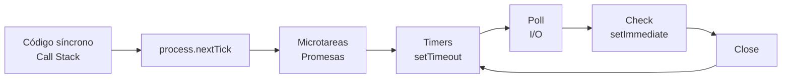

# Módulo 01 — Node.js: JavaScript del lado del servidor

---

## 1. Conceptos principales

### 1.1 Qué es Node.js (y qué NO es)

**Node.js** es un **entorno de ejecución (runtime)** de JavaScript construido sobre el motor **V8** de Google Chrome. Permite ejecutar JavaScript **fuera del navegador**, directamente sobre el sistema operativo.

| Término | Qué es | Qué NO es |
|---|---|---|
| **JavaScript** | El lenguaje (especificación ECMAScript). | No sabe leer archivos ni abrir puertos por sí solo. |
| **V8** | El motor que compila y ejecuta JS a código máquina. | No provee APIs de sistema. |
| **Node.js** | Runtime = V8 + **libuv** (I/O asíncrona, thread pool) + **Core Modules** (`fs`, `http`, `path`...). | No es un lenguaje, ni un framework, ni un servidor web. |
| **npm** | Gestor de paquetes (registro + CLI) que viene con Node. | No es Node en sí. |
| **Express** (módulo 04) | Framework construido **sobre** el módulo `http` de Node. | No reemplaza a Node; lo necesita. |

La distinción clave: en el **navegador** existen `window`, `document` y el DOM; en **Node** no existen. En su lugar aparecen `process`, `global`/`globalThis`, `__dirname` (en CommonJS) y acceso al sistema de archivos y a la red.

### 1.2 Modelo de ejecución: un hilo, I/O no bloqueante

Node ejecuta tu código JavaScript en **un único hilo (single-threaded)**. Lo que le permite atender miles de conexiones simultáneas es el **modelo de I/O no bloqueante orientado a eventos**:

- **I/O bloqueante (síncrono):** el hilo se detiene hasta que la operación (leer un archivo, consultar una base de datos) termina. Mientras tanto, nadie más es atendido.
- **I/O no bloqueante (asíncrono):** Node delega la operación al sistema operativo o al **thread pool** de libuv, sigue ejecutando otras tareas, y cuando la operación termina se encola su **callback** para procesarlo.

```js
const fs = require('node:fs');

// Bloqueante: el hilo queda detenido hasta terminar la lectura
const data = fs.readFileSync('./datos.txt', 'utf-8');

// No bloqueante: se delega la lectura y el hilo sigue libre
fs.readFile('./datos.txt', 'utf-8', (err, data) => { /* se ejecuta después */ });
```

> Regla de servidor: **nunca** usar métodos `*Sync` dentro del manejo de una petición HTTP. Un solo `readFileSync` lento congela a *todos* los usuarios conectados.

### 1.3 Event Loop (Ciclo de eventos)

El **Event Loop** es el bucle que mantiene vivo al proceso de Node mientras haya trabajo pendiente. Sus componentes:

- **Call Stack:** donde se ejecuta el código síncrono, una función a la vez.
- **Cola de eventos / Callback Queue:** callbacks listos para ejecutarse (I/O terminada, timers vencidos).
- **Microtask Queue:** callbacks de Promesas (`.then`, `await`) y `process.nextTick`. **Tienen prioridad**: se vacían por completo antes de pasar a la siguiente fase del loop.
- **Fases del loop:** `timers` (`setTimeout`, `setInterval`) → `pending callbacks` → `poll` (I/O) → `check` (`setImmediate`) → `close callbacks`.



Orden práctico de ejecución: **síncrono → `nextTick` → Promesas → timers → I/O → `setImmediate`**.

El proceso de Node tiene un **ciclo de vida**: *inicio* (se cargan módulos y globales) → *ejecución* (se procesa el script y el Event Loop) → *finalización* (cuando no quedan tareas pendientes ni servidores escuchando, el proceso termina solo). Por eso un script simple termina, pero un servidor HTTP queda "colgado": tiene un *listener* activo.

### 1.4 Módulos en Node

Un **módulo** es un archivo con su propio **ámbito (scope)**: lo que declarás adentro no contamina al resto, salvo que lo **exportes**.

| Tipo | Origen | Cómo se usa |
|---|---|---|
| **Core Modules** | Vienen con Node: `fs`, `path`, `http`, `os`, `events`, `crypto`. | `require('node:fs')` (el prefijo `node:` es recomendado). |
| **Local Modules** | Archivos `.js` que vos escribís. | `require('./utils/math.js')` (ruta relativa obligatoria). |
| **Third-party Modules** | Paquetes de npm. | `npm install paquete` y luego `require('paquete')`. |

En este módulo trabajamos con el sistema **CommonJS** (`require` / `module.exports`), el sistema original de Node. En el **módulo 02** migraremos a **ES Modules**.

```js
// utils/math.js
const sumar = (a, b) => a + b;
module.exports = { sumar };

// app.js
const { sumar } = require('./utils/math.js');
console.log(sumar(2, 3)); // 5
```

### 1.5 npm y `package.json`

- `npm init -y` crea el `package.json`: el **manifiesto** del proyecto (nombre, scripts, dependencias).
- `npm install express` agrega una dependencia a `dependencies` y descarga el código en `node_modules/`.
- `npm install -D nodemon` agrega una **dependencia de desarrollo** (`devDependencies`).
- `package-lock.json` fija las versiones **exactas** instaladas: garantiza que todos los integrantes del equipo instalen lo mismo.
- `node_modules/` **nunca** se sube a Git (va en `.gitignore`); se regenera con `npm install`.
- `scripts` permite atajos: `"dev": "node --watch app.js"` → `npm run dev`.

### 1.6 Objetos globales que vas a usar

| Global | Uso |
|---|---|
| `process.argv` | Array con los argumentos de la terminal. `[0]` = ruta de node, `[1]` = ruta del script, `[2]` en adelante = tus argumentos. |
| `process.env` | Variables de entorno (puertos, claves). Siempre son **strings**. |
| `process.exit(code)` | Termina el proceso. `0` = éxito, distinto de `0` = error. |
| `__dirname` / `__filename` | Ruta de la carpeta/archivo actual (solo en CommonJS). |

### 1.7 Servidor HTTP nativo

Un **servidor** es un programa que escucha peticiones (**requests**) en un **puerto** y devuelve respuestas (**responses**). El módulo `http` permite crear uno sin dependencias:

```js
const http = require('node:http');

const server = http.createServer((req, res) => {
  if (req.method === 'GET' && req.url === '/saludo') {
    res.writeHead(200, { 'Content-Type': 'application/json' });
    return res.end(JSON.stringify({ mensaje: 'Hola' }));
  }
  res.writeHead(404, { 'Content-Type': 'application/json' });
  res.end(JSON.stringify({ error: 'Ruta no encontrada' }));
});

server.listen(3000, () => console.log('Servidor en http://localhost:3000'));
```

Con `http` puro, **todo es manual**: comparar `req.method` y `req.url`, parsear el body por fragmentos (*chunks*), serializar JSON, setear headers. Esa fricción es exactamente lo que resuelve Express.

### 1.8 Errores comunes

| Error | Causa | Solución |
|---|---|---|
| `ReferenceError: document is not defined` | Usar APIs del navegador en Node. | Node no tiene DOM; usar `fs`, `http`, etc. |
| `Cannot find module './utils/math'` | Ruta mal escrita o sin `./`. | Las rutas locales empiezan con `./` o `../`. |
| `EADDRINUSE: address already in use :::3000` | Ya hay otro proceso en ese puerto. | Cerrar el proceso anterior (`Ctrl + C`) o cambiar el puerto. |
| El servidor responde pero el navegador queda "cargando" | Nunca se llamó a `res.end()`. | Toda petición debe terminar con exactamente **una** respuesta. |
| `ERR_HTTP_HEADERS_SENT` | Se respondió dos veces (falta un `return`). | `return res.end(...)` en cada rama. |
| Resultado `undefined` al leer un archivo | Usar el valor de una operación asíncrona antes de que termine. | Usar callback, `.then()` o `await`. |
| `'5' + 3 === '53'` con datos de `process.argv` | Los argumentos de terminal son **strings**. | Convertir con `Number()` y validar con `Number.isNaN()`. |

### 1.9 Cómo construir la lógica de un programa en Node

1. **Entrada:** ¿de dónde vienen los datos? (`process.argv`, un archivo, una petición HTTP).
2. **Validación:** ¿los datos son del tipo y formato esperado? Si no, cortar con un mensaje claro.
3. **Procesamiento:** funciones **puras** y pequeñas, separadas en módulos locales (fáciles de testear).
4. **Salida:** consola, archivo o respuesta HTTP con su código de estado.
5. **Asincronía:** toda I/O (archivos, red, base de datos) es asíncrona → pensar en *qué pasa mientras espero*.

---

## 2. Ejercicio fácil — "Calculadora de terminal"

**Qué vas a practicar:** crear un proyecto con npm, módulos locales (`require` / `module.exports`) y leer argumentos con `process.argv`.

### Consigna

1. Creá una carpeta `calculadora/` y ejecutá `npm init -y` adentro.
2. Creá el archivo `operaciones.js` con 4 funciones: `sumar`, `restar`, `multiplicar` y `dividir`. Exportalas con `module.exports`.
   - `dividir` debe devolver `null` si el divisor es `0`.
3. Creá `app.js` que:
   - Lea 3 argumentos desde la terminal: `operacion`, `a` y `b`.
   - Convierta `a` y `b` a número.
   - Si alguno no es un número válido, muestre `Error: los valores deben ser números` y termine con `process.exit(1)`.
   - Si la operación no existe, muestre `Error: operación no válida`.
   - Si todo está bien, muestre `Resultado: X`.
4. Agregá en `package.json` el script `"start": "node app.js"`.

### Pistas

- `process.argv.slice(2)` te devuelve solamente *tus* argumentos.
- Un objeto puede funcionar como "menú" de operaciones: `const ops = { sumar, restar, ... }` y luego `ops[operacion]`.

### Cómo probarlo

Creá `test.js` y ejecutalo con `node test.js`. Si no aparece nada en consola, **todo pasó**:

```js
const { sumar, restar, multiplicar, dividir } = require('./operaciones.js');

console.assert(sumar(2, 3) === 5, 'sumar falló');
console.assert(restar(10, 4) === 6, 'restar falló');
console.assert(multiplicar(3, 4) === 12, 'multiplicar falló');
console.assert(dividir(10, 2) === 5, 'dividir falló');
console.assert(dividir(5, 0) === null, 'dividir por cero debe devolver null');
```

Y desde la terminal:

| Comando | Salida esperada |
|---|---|
| `node app.js sumar 5 3` | `Resultado: 8` |
| `node app.js dividir 9 0` | `Resultado: null` (o un mensaje tuyo explicándolo) |
| `node app.js sumar 5 hola` | `Error: los valores deben ser números` |
| `node app.js potencia 2 3` | `Error: operación no válida` |

---

## 3. Ejercicio medio — "Gestor de notas por consola"

**Qué vas a practicar:** el Event Loop, el módulo `fs/promises`, `async/await` y **persistir datos** en un archivo JSON.

### Parte A — Predecí el orden (sin ejecutar)

Escribí en un comentario el orden en que se imprimen los números. **Después** ejecutalo y compará. Explicá con tus palabras cada diferencia.

```js
console.log('1');
setTimeout(() => console.log('2'), 0);
setImmediate(() => console.log('3'));
Promise.resolve().then(() => console.log('4'));
process.nextTick(() => console.log('5'));
console.log('6');
```

### Parte B — CLI de notas

Construí un programa `notas.js` que guarde notas en `notas.json`.

1. Creá un módulo `storage.js` con dos funciones **asíncronas**:
   - `leerNotas()`: lee `notas.json` y devuelve un array. **Si el archivo no existe, devuelve `[]`** (no debe romper).
   - `guardarNotas(notas)`: escribe el array en `notas.json` con formato legible (`JSON.stringify(notas, null, 2)`).
2. Creá un módulo `notasService.js` con:
   - `agregar(titulo)`: crea `{ id, titulo, creada }` donde `id` es el id más alto + 1 (o `1` si no hay notas) y `creada` es la fecha en formato ISO.
   - `listar()`: devuelve todas las notas.
   - `eliminar(id)`: elimina por id. Devuelve `true` si la encontró y `false` si no.
3. `notas.js` interpreta los comandos de la terminal:

| Comando | Comportamiento |
|---|---|
| `node notas.js agregar "Comprar pan"` | `Nota 1 agregada` |
| `node notas.js listar` | Muestra cada nota como `[1] Comprar pan` o `No hay notas` |
| `node notas.js eliminar 1` | `Nota 1 eliminada` o `No existe la nota 1` |
| `node notas.js` (sin comando) | `Comandos disponibles: agregar, listar, eliminar` |

### Reglas

- Usá `require('node:fs/promises')` y `await`. **Prohibido** usar `readFileSync` / `writeFileSync`.
- Envolvé el flujo principal en `try/catch` y mostrá un mensaje amigable si algo falla.
- El título no puede estar vacío.

### Pistas

- Si el archivo no existe, `fs.readFile` lanza un error con `error.code === 'ENOENT'`. Atrapalo y devolvé `[]`.
- Para calcular el próximo id: `Math.max(0, ...notas.map(n => n.id)) + 1`.

### Cómo probarlo

Ejecutá esta secuencia y verificá cada salida:

```bash
node notas.js listar               # No hay notas
node notas.js agregar "Estudiar Node"   # Nota 1 agregada
node notas.js agregar "Hacer el TP"     # Nota 2 agregada
node notas.js listar               # [1] Estudiar Node  /  [2] Hacer el TP
node notas.js eliminar 1           # Nota 1 eliminada
node notas.js eliminar 1           # No existe la nota 1
node notas.js agregar "Repasar"    # Nota 3 agregada  (el id NO se reutiliza)
```

Verificación de persistencia: cerrá la terminal, abrí otra y ejecutá `node notas.js listar`. Las notas siguen ahí.

---

## 4. Ejercicio difícil — "API de notas con `http` nativo"

**Qué vas a practicar:** crear un servidor HTTP **sin frameworks**, manejar rutas, métodos, códigos de estado, leer el body de una petición y reutilizar tus módulos del ejercicio medio.

> Este ejercicio es intencionalmente "incómodo". Vas a sentir en carne propia por qué existe Express.

### Consigna

Creá `server.js` que reutilice `storage.js` y `notasService.js` del ejercicio medio y exponga esta API en el puerto `3000`:

| Método | Ruta | Respuesta exitosa | Errores |
|---|---|---|---|
| `GET` | `/notas` | `200` + array de notas | — |
| `GET` | `/notas/:id` | `200` + la nota | `404` si no existe, `400` si el id no es un entero positivo |
| `POST` | `/notas` | `201` + la nota creada | `400` si el body no es JSON válido o falta `titulo` |
| `DELETE` | `/notas/:id` | `200` + `{ "mensaje": "Nota eliminada" }` | `404` si no existe |
| Cualquier otra | — | — | `404` + `{ "error": "Ruta no encontrada" }` |

### Requisitos técnicos

1. Todas las respuestas son JSON con el header `Content-Type: application/json`.
2. Creá una función auxiliar `enviarJSON(res, status, data)` para no repetir código.
3. Creá una función `leerBody(req)` que devuelva una **Promesa** con el body ya parseado. El body llega en fragmentos:
   ```js
   req.on('data', (chunk) => { /* acumular */ });
   req.on('end', () => { /* parsear y resolver */ });
   ```
   Si `JSON.parse` falla, la promesa debe rechazarse y el servidor responder `400`.
4. Para rutas con id, extraelo de `req.url` (por ejemplo con `req.url.split('/')`).
5. Validá el `titulo`: debe ser un string y tener al menos 3 caracteres (sin contar espacios al inicio y al final).
6. Todo el manejador debe estar envuelto en `try/catch`: ante un error inesperado responder `500` con `{ "error": "Error interno del servidor" }` y registrar el detalle con `console.error`.
7. Script en `package.json`: `"dev": "node --watch server.js"`.

### Desafío extra (opcional)

- Agregá `PUT /notas/:id` para editar el título.
- Leé el puerto desde `process.env.PORT` con `3000` como valor por defecto.

### Cómo probarlo

Con el servidor corriendo (`npm run dev`), usá Thunder Client / Postman o `curl`:

| # | Petición | Status esperado | Body esperado |
|---|---|---|---|
| 1 | `GET /notas` | `200` | `[]` o las notas existentes |
| 2 | `POST /notas` body `{"titulo":"Aprender http"}` | `201` | `{ "id": ..., "titulo": "Aprender http", ... }` |
| 3 | `POST /notas` body `{"titulo":"ab"}` | `400` | mensaje de error |
| 4 | `POST /notas` body `esto no es json` | `400` | mensaje de error |
| 5 | `GET /notas/1` | `200` | la nota 1 |
| 6 | `GET /notas/999` | `404` | `{ "error": ... }` |
| 7 | `GET /notas/abc` | `400` | `{ "error": ... }` |
| 8 | `DELETE /notas/1` | `200` | `{ "mensaje": "Nota eliminada" }` |
| 9 | `DELETE /notas/1` (otra vez) | `404` | `{ "error": ... }` |
| 10 | `PATCH /notas` | `404` | `{ "error": "Ruta no encontrada" }` |

```bash
curl -i -X POST http://localhost:3000/notas -H "Content-Type: application/json" -d "{\"titulo\":\"Aprender http\"}"
```

**Criterio de aprobación:** las 10 pruebas dan el status esperado y el servidor **nunca** se cae (si se cae con algún input, hay un error sin manejar).
