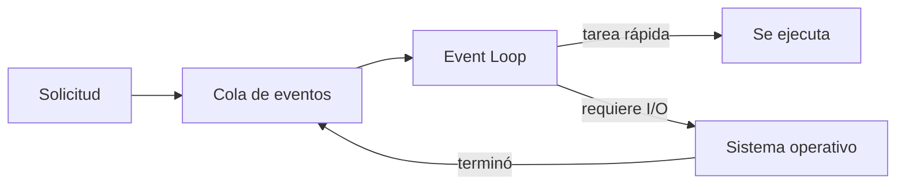

# Módulo 01 — Node.js: JavaScript del lado del servidor

> Material del profesor: `material/TLPI-2025-UNIDAD-4-1.pptx`

---

## 1. Conceptos principales

### 1.1 Qué es Node.js

**Node.js** es un **entorno de ejecución (runtime)** de JavaScript basado en el motor **V8** de Google Chrome. Fue creado en 2009 por **Ryan Dahl** para construir aplicaciones web rápidas y escalables usando JavaScript **en el servidor**, con un modelo de entrada/salida **no bloqueante**.

Antes de Node, JavaScript solo corría dentro del navegador. Node permite ejecutarlo directamente sobre el sistema operativo: leer archivos, abrir puertos, conectarse a bases de datos.

| Término | Qué es | Qué NO es |
|---|---|---|
| **JavaScript** | El lenguaje. | No sabe leer archivos ni abrir puertos por sí solo. |
| **V8** | El motor que ejecuta el código JavaScript. | No provee acceso al sistema. |
| **Node.js** | Runtime = V8 + acceso al sistema (archivos, red) + módulos integrados. | No es un lenguaje ni un framework. |
| **npm** | Gestor de paquetes que viene con Node. | No es Node en sí. |
| **Express** (módulo 04) | Framework para crear servidores, construido **sobre** Node. | No reemplaza a Node: lo necesita. |

En el **navegador** existen `window`, `document` y el DOM. En **Node** no existen: en su lugar hay `process`, acceso a archivos y a la red.

**Ventajas:** JavaScript en cliente y servidor, modelo no bloqueante (muchas conexiones a la vez), ecosistema enorme de paquetes (npm), multiplataforma, alto rendimiento (V8).
**Desventajas:** no es ideal para tareas de cálculo intensivo, riesgo de usar paquetes de terceros de baja calidad, curva de aprendizaje de la programación asíncrona.

### 1.2 Peticiones bloqueantes y no bloqueantes

| | **Bloqueante (síncrona)** | **No bloqueante (asíncrona)** |
|---|---|---|
| Qué pasa | El programa **se detiene** hasta que la operación termina. | El programa **sigue ejecutándose** mientras la operación se resuelve en segundo plano. |
| Cuándo llega la respuesta | En el presente: espera el resultado. | En el futuro: no espera el resultado. |
| Efecto en un servidor | Mientras espera, **nadie más es atendido**. | Puede atender muchas solicitudes simultáneamente. |

En Node, las operaciones de entrada/salida (leer un archivo, consultar una base de datos) se **delegan** a un *thread pool* o al sistema operativo. Cuando terminan, se avisa al hilo principal para que procese la respuesta.

```js
const fs = require('node:fs');

// Bloqueante: el programa espera acá hasta terminar de leer
const texto = fs.readFileSync('./datos.txt', 'utf-8');

// No bloqueante: se pide la lectura y el programa sigue
fs.readFile('./datos.txt', 'utf-8', (error, texto) => {
  // esta función (callback) se ejecuta cuando la lectura termina
});
```

### 1.3 El ciclo de eventos (Event Loop)

El **ciclo de eventos** es el bucle que Node ejecuta continuamente mientras la aplicación está en marcha. Sus componentes:

- **Bucle de eventos (event loop):** recibe los eventos y ejecuta sus callbacks.
- **Cola de eventos (event queue):** donde esperan los eventos que todavía no se procesaron, en orden de llegada.
- **Fases del proceso:** timers (`setTimeout`), entrada/salida (I/O), comprobación (check), cierre (close).

**Cómo funciona:**
1. Node espera solicitudes y eventos.
2. Cuando llega una, agrega la tarea a la cola de eventos.
3. El event loop toma la siguiente tarea y la procesa sin bloquear.
4. Si requiere I/O (archivo, base de datos), la delega al sistema operativo.
5. Mientras espera, sigue procesando otras tareas.
6. Cuando la I/O termina, su callback vuelve a la cola para ser procesado.



**Ciclo de vida de un proceso:** *inicio* (se ejecuta `node archivo.js`, se cargan módulos) → *ejecución* → *finalización* (cuando no quedan tareas pendientes). Por eso un script común termina solo, pero un **servidor** queda en ejecución: está esperando solicitudes.

### 1.4 Módulos

Un **módulo** es un archivo de código reutilizable con su **propio ámbito**: lo que se declara adentro no afecta a otros archivos, salvo que se **exporte**. Permiten separar el código en archivos y carpetas (mejor organización, reutilización y mantenimiento).

| Tipo | Qué son | Ejemplo |
|---|---|---|
| **Integrados (Core Modules)** | Vienen con Node. No se instalan. | `fs`, `path`, `http`, `os`, `crypto` |
| **Locales (Local Modules)** | Archivos que escribe el desarrollador. | `./utils/saludos.js` |
| **Externos (Third-party Modules)** | Paquetes de otros desarrolladores, publicados en npm. | `express`, `sequelize`, `dotenv` |

En este módulo se usa el sistema original de Node, **CommonJS**: `module.exports` para exportar y `require()` para importar. En el **módulo 02** se reemplaza por **ES Modules** (`import`/`export`), que es lo que exigen los trabajos prácticos.

```js
// utils/saludos.js  → módulo local
const saludar = (nombre) => `Hola, ${nombre}`;
module.exports = { saludar };

// app.js
const os = require('node:os');                    // módulo integrado
const { saludar } = require('./utils/saludos.js'); // módulo local (ruta con ./)

console.log(saludar('Ada'), 'desde', os.platform());
```

### 1.5 npm y `package.json`

**npm** es el administrador de paquetes de Node: descarga, instala y elimina las dependencias del proyecto.

| Comando / archivo | Para qué sirve |
|---|---|
| `npm init -y` | Crea el `package.json`. |
| `package.json` | **Manifiesto** del proyecto: nombre, scripts y dependencias. |
| `npm install express` | Descarga el paquete en `node_modules/` y lo anota en `dependencies`. |
| `node_modules/` | Código de las dependencias. **Nunca se sube a Git**: se regenera con `npm install`. |
| `package-lock.json` | Fija las versiones exactas instaladas. Sí se sube a Git. |
| `.gitignore` | Lista lo que Git debe ignorar (`node_modules/`, `.env`). |
| `"scripts"` | Atajos: `"dev": "node --watch app.js"` → `npm run dev` (reinicia al guardar). |

### 1.6 Variables de entorno: `process.env` y `dotenv`

Hay datos que **no deben escribirse en el código**: el puerto, las credenciales de la base de datos, claves secretas. Node los lee desde **variables de entorno** con `process.env`.

El paquete externo **`dotenv`** carga esas variables desde un archivo `.env`:

```env
PORT=3000
APP_NAME=Mi API
```

```js
require('dotenv').config();       // carga el .env en process.env
console.log(process.env.PORT);    // '3000' → siempre es un string
```

- `.env` va en `.gitignore` (tiene datos privados).
- Se sube un `.env.example` con las mismas claves **sin valores**, para que otros sepan qué completar.

### 1.7 Qué es un servidor

Un **servidor** es un software que **escucha solicitudes** (requests) de clientes (navegadores, apps) en un **puerto** y les **devuelve respuestas** (responses). Usos comunes en desarrollo web: servir páginas y recursos, procesar solicitudes HTTP, gestionar sesiones, autenticar usuarios, procesar pagos.

Node incluye el módulo integrado `http` para crear uno:

```js
const http = require('node:http');

const server = http.createServer((req, res) => {
  if (req.url === '/api/saludo') {
    res.writeHead(200, { 'Content-Type': 'application/json' });
    return res.end(JSON.stringify({ mensaje: 'Hola' }));
  }
  res.writeHead(404, { 'Content-Type': 'application/json' });
  res.end(JSON.stringify({ mensaje: 'Ruta no encontrada' }));
});

server.listen(3000, () => console.log('Servidor en http://localhost:3000'));
```

Con `http` todo es manual (comparar URLs, convertir a JSON, escribir headers). En el módulo 04, **Express** simplifica exactamente eso.

### 1.8 Errores comunes

| Error | Causa | Solución |
|---|---|---|
| `ReferenceError: document is not defined` | Usar el DOM en Node. | Node no tiene DOM. |
| `Cannot find module './utils/saludos'` | Ruta mal escrita o sin `./`. | Los módulos locales empiezan con `./` o `../`. |
| `ReferenceError: os is not defined` (o `sumar is not defined`) | Se escribió `require('node:os')` **sin guardar** lo que devuelve. `require` no crea variables: devuelve lo que el módulo exporta. | `const os = require('node:os');` y `const { sumar } = require('./utils/calculos.js');` |
| `Cannot find module 'dotenv'` | El paquete no está instalado. | `npm install dotenv`. |
| `process.env.PORT` es `undefined` | No se cargó `dotenv` o el `.env` no está en la raíz. | Llamar a `dotenv` al inicio y revisar la ubicación del `.env`. |
| `EADDRINUSE: address already in use :::3000` | Ya hay un proceso usando ese puerto. | Cerrar el anterior (`Ctrl + C`) o cambiar el puerto. |
| El navegador queda "cargando" | El servidor nunca respondió (`res.end`). | Toda solicitud debe recibir una respuesta. |

### 1.9 Dónde vas a usar esto en los trabajos prácticos

- `npm init` y `npm install express sequelize mysql2 ...` para crear el proyecto e instalar dependencias.
- `package.json` con el script `"dev": "node --watch app.js"`.
- `.env` (`PORT`, `DB_HOST`, `JWT_SECRET`...) + `.env.example` + `.gitignore` con `node_modules/` y `.env`.
- Entender que el servidor queda escuchando solicitudes y que las consultas a la base de datos son **asíncronas**.

---

## 2. Ejercicio fácil — "Mis primeros módulos"

**Qué vas a practicar:** crear un proyecto con npm, módulos **locales** e **integrados** con `require` / `module.exports`.

**En el proyecto real:** así se separa el código en archivos. En el TP cada carpeta (`routes`, `controllers`, `models`) es un conjunto de módulos locales.

### Consigna

1. Creá la carpeta `mis-modulos/` y ejecutá `npm init -y` adentro.
2. Creá `utils/calculos.js` con dos funciones y exportalas con `module.exports`:
   - `sumar(a, b)`
   - `calcularIva(precio)` → devuelve el precio con 21 % agregado.
3. Creá `app.js` que:
   - Importe tus funciones con `require('./utils/calculos.js')`.
   - Importe el módulo integrado `os` y muestre el sistema operativo (`os.platform()`).
   - Muestre en consola el resultado de `sumar(10, 5)` y de `calcularIva(1000)`.
4. Agregá en `package.json` el script `"start": "node app.js"` y ejecutalo con `npm start`.

### Cómo probarlo

`npm start` debe mostrar algo como:

```
Sistema: win32
Suma: 15
Precio con IVA: 1210
```

Creá `test.js` y ejecutalo con `node test.js`. En cada línea, el valor **obtenido** tiene que coincidir con el **esperado**:

```js
const { sumar, calcularIva } = require('./utils/calculos.js');
const os = require('node:os');

console.log(`sumar(10, 5) → esperado: 15 | obtenido: ${sumar(10, 5)}`);
console.log(`calcularIva(1000) → esperado: 1210 | obtenido: ${calcularIva(1000)}`);
console.log(`os.platform() → esperado: un texto (win32, linux...) | obtenido: ${os.platform()}`);
```

---

## 3. Ejercicio medio — "Paquetes externos y variables de entorno"

**Qué vas a practicar:** instalar un módulo **externo** con npm, entender `node_modules`, `package-lock.json` y `.gitignore`, y leer configuración desde un `.env`.

**En el proyecto real:** es exactamente cómo se configura el TP: `.env` con `PORT`, `DB_NAME`, `JWT_SECRET`, y un `.gitignore` que protege esos datos.

### Consigna

1. Proyecto nuevo `config-app/` con `npm init -y`.
2. Instalá `dotenv`. Revisá qué se agregó en `package.json` y qué apareció en la carpeta.
3. Creá un `.env` con:
   ```env
   PORT=3000
   APP_NAME=Gestor de Personajes
   MODO=desarrollo
   ```
4. Creá `.env.example` con las mismas claves pero **sin valores**.
5. Creá `.gitignore` con `node_modules/` y `.env`.
6. Creá `app.js` que cargue `dotenv` y muestre:
   ```
   Aplicación: Gestor de Personajes
   Puerto: 3000
   Modo: desarrollo
   ```
   Si `PORT` no existe en el `.env`, debe mostrar `3000` como valor por defecto (`process.env.PORT || 3000`).
7. Agregá el script `"dev": "node --watch app.js"` y ejecutalo con `npm run dev`.

### Preguntas para responder (en un comentario al final de `app.js`)

1. ¿Qué tiene adentro `node_modules/`? ¿Por qué no se sube a GitHub?
2. Borrá `node_modules/` y ejecutá `npm install`. ¿Qué pasó y por qué funcionó?
3. ¿Por qué se sube `.env.example` pero no `.env`?

### Cómo probarlo

| # | Acción | Resultado esperado |
|---|---|---|
| 1 | `npm run dev` | Se muestran los 3 valores del `.env`. |
| 2 | Con `npm run dev` corriendo, cambiá `MODO=produccion` en el `.env` y guardá `app.js` | Se reinicia y muestra el nuevo valor. |
| 3 | Borrá la línea `PORT` del `.env` | Muestra `Puerto: 3000` igual. |
| 4 | `git init` y `git status` | **No** aparecen `.env` ni `node_modules/`. |

---

## 4. Ejercicio difícil — "Bloqueante vs no bloqueante y primer servidor"

**Qué vas a practicar:** ver con tus propios ojos la diferencia entre código bloqueante y no bloqueante, y crear un servidor con el módulo integrado `http`.

**En el proyecto real:** las consultas a la base de datos del TP son operaciones no bloqueantes (por eso vas a usar `async/await`), y el servidor que vas a crear con Express funciona igual que este, pero con mucho menos código.

### Parte A — Predecí el orden

Creá `datos.txt` con cualquier texto y este archivo `orden.js`:

```js
const fs = require('node:fs');

console.log('1. Inicio');

const contenido = fs.readFileSync('./datos.txt', 'utf-8');
console.log('2. Lectura bloqueante terminada');

fs.readFile('./datos.txt', 'utf-8', () => {
  console.log('3. Lectura NO bloqueante terminada');
});

setTimeout(() => {
  console.log('4. Pasaron 0 ms');
}, 0);

console.log('5. Fin del script');
```

1. **Antes de ejecutarlo**, escribí en un comentario el orden en que creés que se imprimen los mensajes.
2. Ejecutalo y compará.
3. Explicá con tus palabras: ¿por qué `5` aparece antes que `3` y `4`? ¿Qué parte del ciclo de eventos lo explica?

### Parte B — Servidor con `http`

Creá `server.js` (podés reutilizar el `.env` del ejercicio medio) que escuche en `process.env.PORT` y responda **en JSON**:

| Ruta | Status | Respuesta |
|---|---|---|
| `/` | `200` | `{ "mensaje": "Servidor funcionando" }` |
| `/api/personajes` | `200` | Un array con 3 personajes `{ id, nombre }` |
| Cualquier otra | `404` | `{ "mensaje": "Ruta no encontrada" }` |

Agregá el script `"server": "node --watch server.js"`.

### Cómo probarlo

1. `npm run server` → en la consola aparece `Servidor en http://localhost:3000`.
2. En el navegador o en Thunder Client / Postman:

| Petición | Status esperado |
|---|---|
| `GET http://localhost:3000/` | `200` |
| `GET http://localhost:3000/api/personajes` | `200` con 3 personajes |
| `GET http://localhost:3000/api/otra-cosa` | `404` |

3. Pregunta final (en un comentario): ¿por qué `server.js` **no termina** como `orden.js`, sino que queda ejecutándose?
