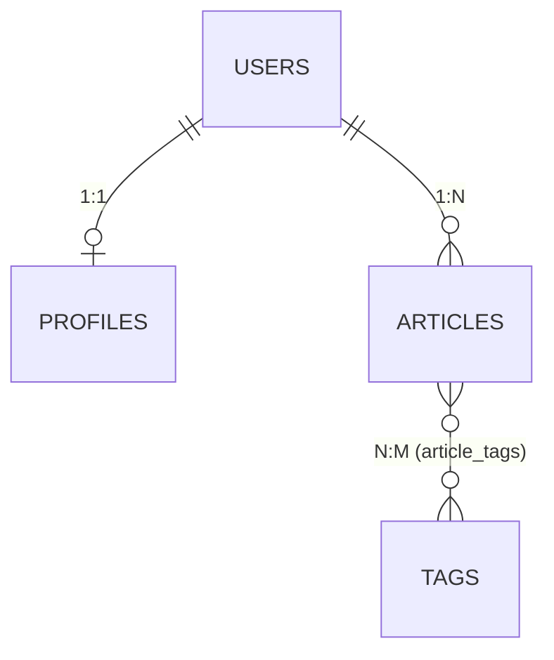

# Módulo 03 — Sequelize: persistencia de datos con MySQL

> Material del profesor: `material/TLPI-2025-UNIDAD-4-3.pptx`, `material/Relaciones en Sequelize (1).pdf`, `material/02_Práctica de Relaciones Sequelize.pdf`

---

## 1. Conceptos principales

### 1.1 Persistencia de datos y bases de datos relacionales

La **persistencia de datos** es la capacidad de un sistema para guardar información de forma duradera, **incluso después de que la aplicación se apague o se reinicie**. Un arreglo en memoria (como `src/data/personajes.js` de la Práctica de Express) se **pierde** cada vez que el servidor se reinicia: por eso se usa una **base de datos**.

Una **base de datos relacional** (MySQL) guarda la información en **tablas que se relacionan entre sí**:

| Concepto | Qué es | Ejemplo |
|---|---|---|
| **Tabla** | Representa una **entidad**. | `users` |
| **Fila / registro** | Una **instancia** de esa entidad. | El usuario con id 3. |
| **Columna** | Un **atributo** con un tipo de dato. | `email VARCHAR(100)` |
| **Primary Key (PK)** | Identificador único de cada fila. | `id` |
| **Foreign Key (FK)** | Columna que **apunta** a la PK de otra tabla. Así se relacionan las tablas. | `articles.user_id → users.id` |

Se manipulan con **SQL** mediante cuatro operaciones básicas: `INSERT` (crear), `SELECT` (leer), `UPDATE` (actualizar), `DELETE` (eliminar).

### 1.2 Qué es Sequelize

**Sequelize** es una librería de JavaScript (un **ORM**) que permite trabajar con bases de datos SQL **usando métodos de JavaScript en lugar de escribir SQL**. Funciona con MySQL, PostgreSQL, SQLite y SQL Server.

```js
// SQL:        SELECT * FROM users WHERE email = 'ada@mail.com' LIMIT 1;
// Sequelize:
const user = await UserModel.findOne({ where: { email: 'ada@mail.com' } });
```

| Pieza | Responsabilidad |
|---|---|
| **MySQL** | El motor que **guarda** los datos. |
| **mysql2** | El **driver**: conecta Node con MySQL. Sequelize lo necesita instalado. |
| **Sequelize** | Traduce métodos de JavaScript a SQL y filas a objetos. |

**Funciones principales:** modelos (representan tablas), consultas (CRUD), migraciones (cambios controlados en la estructura) y validación de datos.
**Ventajas:** simplifica la interacción con la base de datos, se integra con el modelo asíncrono de Node, soporta varias bases de datos con la misma API.
**Desventajas:** curva de aprendizaje, puede ser más lento que SQL puro en consultas complejas, requiere mantenimiento.

### 1.3 Conexión: `src/config/database.js`

```bash
npm install sequelize mysql2
```

```env
DB_HOST=localhost
DB_USER=root
DB_PASSWORD=
DB_NAME=mi_base
```

```js
// src/config/database.js
import { Sequelize } from 'sequelize';

export const sequelize = new Sequelize(
  process.env.DB_NAME,
  process.env.DB_USER,
  process.env.DB_PASSWORD,
  {
    host: process.env.DB_HOST,
    dialect: 'mysql',
  }
);

export const connectDB = async () => {
  try {
    await sequelize.authenticate(); // prueba la conexión
    await sequelize.sync();         // crea las tablas que no existan
    console.log('Conexión a la base de datos establecida');
  } catch (error) {
    console.error('No se pudo conectar a la base de datos:', error);
    process.exit(1);
  }
};
```

- La **base de datos** (`CREATE DATABASE mi_base;`) se crea una vez a mano en MySQL. Las **tablas** las crea Sequelize con `sync()`.
- `sync({ force: true })` **borra y recrea** las tablas (se pierden los datos). Solo para pruebas.

### 1.4 Modelos: `src/models/`

Un **modelo** representa una tabla. Se define con `sequelize.define(nombre, atributos, opciones)`:

```js
// src/models/user.model.js
import { DataTypes } from 'sequelize';
import { sequelize } from '../config/database.js';

export const UserModel = sequelize.define('User', {
  // el id (PK autoincremental) se crea solo
  username: {
    type: DataTypes.STRING(20),
    allowNull: false,
    unique: true,
  },
  email: {
    type: DataTypes.STRING(100),
    allowNull: false,
    unique: true,
  },
  role: {
    type: DataTypes.ENUM('user', 'admin'),
    allowNull: false,
    defaultValue: 'user',
  },
});
```

| Tipo | Equivale a | Uso |
|---|---|---|
| `DataTypes.STRING(n)` | `VARCHAR(n)` | Textos cortos. |
| `DataTypes.TEXT` | `TEXT` | Textos largos (contenido, biografía). |
| `DataTypes.INTEGER` | `INT` | Números enteros, FK. |
| `DataTypes.BOOLEAN` | `TINYINT(1)` | Verdadero / falso. |
| `DataTypes.DATE` | `DATETIME` | Fechas. |
| `DataTypes.ENUM('a', 'b')` | `ENUM` | Valores permitidos fijos (roles, estados). |

| Opción del atributo | Qué hace |
|---|---|
| `allowNull: false` | Campo obligatorio. |
| `unique: true` | No se puede repetir. |
| `defaultValue` | Valor si no se envía. |

Por defecto Sequelize agrega las columnas `createdAt` y `updatedAt` (opción `timestamps: true`).

### 1.5 Consultas (CRUD)

Todos los métodos son **asíncronos**: se usan con `await` dentro de `try/catch`.

| Operación | Método | Devuelve |
|---|---|---|
| Crear | `Model.create({ ... })` | El registro creado. |
| Leer todos | `Model.findAll({ where })` | Un arreglo (vacío si no hay). |
| Leer por id | `Model.findByPk(id)` | El registro o **`null`**. |
| Leer uno | `Model.findOne({ where })` | El registro o **`null`**. |
| Actualizar | `registro.update({ ... })` | El registro actualizado. |
| Eliminar | `registro.destroy()` | — |

```js
const user = await UserModel.findByPk(1);
if (!user) {
  console.log('No existe');           // findByPk devolvió null
} else {
  await user.update({ role: 'admin' });
}

const admins = await UserModel.findAll({
  where: { role: 'admin' },
  attributes: ['id', 'username'],      // solo estas columnas
});
```

### 1.6 Relaciones (asociaciones)

Sequelize soporta los tres tipos de relaciones con cuatro métodos. Cada método indica **dónde va la clave foránea (FK)**:

| Método | Significado | Ejemplo | Dónde va la FK |
|---|---|---|---|
| `hasOne` | "Este modelo **tiene un**..." | User tiene un Profile. | En `profiles.user_id` |
| `belongsTo` | "Este modelo **pertenece a**..." | Profile pertenece a User. | En `profiles.user_id` |
| `hasMany` | "Este modelo **tiene muchos**..." | User tiene muchos Articles. | En `articles.user_id` |
| `belongsToMany` | "Muchos de este con muchos de otro." | Article ↔ Tag. | En una **tabla intermedia**: `article_tags.article_id` y `article_tags.tag_id` |

**Reglas para recordar:**
- `hasOne` + `belongsTo` = **1:1** → la FK va donde dice `belongsTo`.
- `hasMany` + `belongsTo` = **1:N** → la FK va donde dice `belongsTo`.
- `belongsToMany` + `belongsToMany` = **N:M** → necesita **tabla intermedia**.



**Configuración de cada relación:**
- `foreignKey`: nombre exacto de la FK, en **snake_case** y minúsculas (`user_id`, `article_id`).
- `as`: **alias** de la relación. Se usa **igual** en las consultas con `include`.
- Las relaciones se declaran **en pares** (`hasOne` con `belongsTo`, `hasMany` con `belongsTo`, dos `belongsToMany`). Sequelize solo reconoce la relación desde el modelo donde se definió: sin el par, no se puede consultar en el otro sentido.

**Tabla intermedia como modelo propio.** Para N:M se crea un modelo para la tabla intermedia (con su propio `id`) y se lo pasa en `through`:

```js
// src/models/articleTag.model.js
export const ArticleTagModel = sequelize.define('ArticleTag', {
  article_id: { type: DataTypes.INTEGER, allowNull: false },
  tag_id: { type: DataTypes.INTEGER, allowNull: false },
}, {
  indexes: [{ unique: true, fields: ['article_id', 'tag_id'] }], // evita duplicados
});
```

### 1.7 Dónde se definen las relaciones

Las relaciones se definen en **un único archivo**, **después** de crear todos los modelos. Si cada modelo importara a otro para relacionarse, se generarían **dependencias circulares** (un archivo espera a otro que lo espera a él).

Orden de trabajo:
1. Definir todos los modelos con sus atributos, **sin relaciones**.
2. En un único archivo, establecer todas las asociaciones.
3. Importar los modelos **desde ese archivo** en el resto del proyecto.

```js
// src/models/index.js
import { UserModel } from './user.model.js';
import { ProfileModel } from './profile.model.js';
import { ArticleModel } from './article.model.js';
import { TagModel } from './tag.model.js';
import { ArticleTagModel } from './articleTag.model.js';

// 1:1
UserModel.hasOne(ProfileModel, { foreignKey: 'user_id', as: 'profile' });
ProfileModel.belongsTo(UserModel, { foreignKey: 'user_id', as: 'user' });

// 1:N
UserModel.hasMany(ArticleModel, { foreignKey: 'user_id', as: 'articles' });
ArticleModel.belongsTo(UserModel, { foreignKey: 'user_id', as: 'author' });

// N:M
ArticleModel.belongsToMany(TagModel, { through: ArticleTagModel, foreignKey: 'article_id', as: 'tags' });
TagModel.belongsToMany(ArticleModel, { through: ArticleTagModel, foreignKey: 'tag_id', as: 'articles' });

export { UserModel, ProfileModel, ArticleModel, TagModel, ArticleTagModel };
```

### 1.8 Eager loading: traer datos relacionados con `include`

**Eager loading** obtiene los datos relacionados **en la misma consulta**, con la opción `include` y el **mismo alias** de la relación:

```js
const users = await UserModel.findAll({
  attributes: ['id', 'username'],
  include: [
    { model: ProfileModel, as: 'profile', attributes: ['first_name', 'last_name'] },
    { model: ArticleModel, as: 'articles', attributes: ['id', 'title'] },
  ],
});

const articles = await ArticleModel.findAll({
  include: [
    { model: UserModel, as: 'author', attributes: ['username'] },
    { model: TagModel, as: 'tags', attributes: ['name'], through: { attributes: [] } },
  ],
});
```

- `attributes` en cada nivel: mostrar **solo lo esencial** (nunca contraseñas).
- `through: { attributes: [] }` oculta las columnas de la tabla intermedia en N:M.

### 1.9 Restricciones de eliminación

| Relación | `ON DELETE` por defecto | `ON UPDATE` por defecto |
|---|---|---|
| 1:1 y 1:N | `SET NULL` (la FK queda vacía) | `CASCADE` |
| N:M | `CASCADE` (se borran las filas de la tabla intermedia) | `CASCADE` |

Se cambian con la opción `onDelete`:

```js
UserModel.hasMany(ArticleModel, { foreignKey: 'user_id', as: 'articles', onDelete: 'CASCADE' });
```

Con `CASCADE`, al eliminar un usuario se eliminan sus artículos automáticamente.

### 1.10 Errores comunes

| Error | Causa | Solución |
|---|---|---|
| `Please install mysql2 package manually` | Falta el driver. | `npm install mysql2`. |
| `Access denied for user` / `Unknown database` | Datos de conexión incorrectos o base no creada. | Revisar `.env` y crear la base de datos. |
| Aparece `Promise { <pending> }` | Falta `await`. | Todo método de Sequelize va con `await`. |
| `Cannot read properties of null` | `findByPk`/`findOne` devolvió `null`. | Verificar existencia: `if (!user)`. |
| `SequelizeEagerLoadingError: ... is associated ... using an alias` | El `as` del `include` no coincide con el de la relación. | Usar exactamente el mismo alias. |
| `SequelizeUniqueConstraintError` | Valor repetido en una columna `unique`. | Verificar antes de crear (módulo 05 lo automatiza). |
| Los datos desaparecen en cada ejecución | Se usa `sync({ force: true })`. | Usar `sync()` normal. |
| `Cannot access 'X' before initialization` | Relaciones definidas dentro de los archivos de modelos (imports circulares). | Centralizarlas en `models/index.js`. |

### 1.11 Dónde vas a usar esto en los trabajos prácticos

- `src/config/database.js`: instancia de Sequelize + función de conexión.
- `src/models/`: un archivo por modelo + las relaciones 1:1, 1:N y N:M con alias.
- Los **controladores** (módulo 04) usan `findAll`, `findByPk`, `create`, `update` y `destroy` con `include`.

---

## 2. Ejercicio fácil — "Conexión y CRUD de un modelo"

**Qué vas a practicar:** conectar Sequelize a MySQL, definir un modelo y usar los métodos CRUD. **Todavía sin servidor**: todo se prueba con un script.

**En el proyecto real:** son los archivos `src/config/database.js` y `src/models/*.model.js` del TP, y los mismos métodos que vas a llamar desde los controladores.

### Preparación

```bash
mkdir crud-sequelize && cd crud-sequelize
npm init -y
npm install sequelize mysql2 dotenv
```

En MySQL: `CREATE DATABASE crud_sequelize;`. En `package.json`: `"type": "module"`.

### Consigna

1. `.env` con `DB_HOST`, `DB_USER`, `DB_PASSWORD`, `DB_NAME`.
2. `src/config/database.js` con `sequelize` y `connectDB` (copiá la estructura de la teoría).
3. `src/models/tag.model.js` con el modelo `Tag`:

| Campo | Tipo | Reglas |
|---|---|---|
| `name` | `STRING(30)` | Obligatorio, único. |

4. `src/crud.js` que, en orden:
   1. Importe `dotenv/config`, conecte con `sequelize.authenticate()` y sincronice con `sequelize.sync({ force: true })` (es un script de práctica).
   2. Cree 3 etiquetas: `javascript`, `node`, `mysql`.
   3. Muestre todas.
   4. Busque la etiqueta con id `2` y muestre su nombre.
   5. Actualice la etiqueta `1` a `js`.
   6. Elimine la etiqueta `3`.
   7. Cierre la conexión con `await sequelize.close()`.

### Cómo probarlo

Agregá antes de cerrar la conexión:

```js
const todas = await TagModel.findAll();
console.assert(todas.length === 2, `Se esperaban 2 etiquetas y hay ${todas.length}`);

const primera = await TagModel.findByPk(1);
console.assert(primera.name === 'js', 'La etiqueta 1 debería llamarse js');

const eliminada = await TagModel.findByPk(3);
console.assert(eliminada === null, 'La etiqueta 3 debería estar eliminada');

try {
  await TagModel.create({ name: 'node' });
  console.assert(false, 'No debería permitir un nombre repetido');
} catch (error) {
  console.assert(error.name === 'SequelizeUniqueConstraintError', 'Se esperaba un error de unicidad');
}
```

Abrí MySQL Workbench / phpMyAdmin: la tabla `Tags` tiene 2 filas y las columnas `createdAt` y `updatedAt`.

---

## 3. Ejercicio medio — "Relaciones 1:1 y 1:N"

**Qué vas a practicar:** varios modelos, `hasOne`, `hasMany`, `belongsTo`, alias, el archivo central de relaciones y consultas con `include`.

**En el proyecto real:** son las relaciones **User ↔ Profile** (1:1) y **User ↔ Article** (1:N) del TP Integrador.

### Consigna

Proyecto `relaciones-sequelize/`:

```
src/
├── config/database.js
├── models/
│   ├── user.model.js
│   ├── profile.model.js
│   ├── post.model.js
│   └── index.js        → relaciones
└── consultas.js
```

**Modelos** (sin relaciones adentro):

| Modelo | Campos |
|---|---|
| `User` | `username` (`STRING(20)`, único, obligatorio), `email` (`STRING(100)`, único, obligatorio) |
| `Profile` | `first_name`, `last_name` (`STRING(50)`, obligatorios), `biography` (`TEXT`, opcional) |
| `Post` | `title` (`STRING(200)`, obligatorio), `content` (`TEXT`, obligatorio) |

**Relaciones** en `models/index.js`, en pares:

| Relación | FK | Alias |
|---|---|---|
| User **tiene un** Profile | `user_id` | `profile` / `user` |
| User **tiene muchos** Post | `user_id` | `posts` / `author` |

**`consultas.js`** (con `sync({ force: true })` al inicio):
1. Creá 2 usuarios, cada uno con su perfil (creá el usuario y después el perfil con `user_id: user.id`).
2. Creá 3 posts para el usuario 1 y ninguno para el usuario 2.
3. Mostrá todos los usuarios con su perfil (`first_name`, `last_name`) y sus posts (`title`).
4. Mostrá el post con id `1` con su autor (`username`).
5. Mostrá el perfil del usuario 2 con los datos de su usuario.

### Reglas

- Ningún archivo de modelo importa a otro modelo.
- `consultas.js` importa los modelos desde `models/index.js`.

### Cómo probarlo

Al final de `consultas.js`:

```js
const user1 = await UserModel.findByPk(1, { include: [{ model: PostModel, as: 'posts' }] });
console.assert(user1.posts.length === 3, 'El usuario 1 debe tener 3 posts');

const user2 = await UserModel.findByPk(2, { include: [{ model: ProfileModel, as: 'profile' }] });
console.assert(user2.profile !== null, 'El usuario 2 debe tener perfil');

const post = await PostModel.findByPk(1, { include: [{ model: UserModel, as: 'author' }] });
console.assert(post.author.username !== undefined, 'El post debe incluir a su autor');
```

En la base de datos: `Profiles` y `Posts` tienen la columna `user_id`.

---

## 4. Ejercicio difícil — "Relación N:M con tabla intermedia y eliminación en cascada"

**Qué vas a practicar:** `belongsToMany` con un modelo intermedio propio, índice único para evitar duplicados, `through: { attributes: [] }` y el comportamiento de `onDelete`.

**En el proyecto real:** es la relación **Article ↔ Tag** a través de **ArticleTag** del TP Integrador, y la eliminación en cascada que pide la consigna.

### Consigna

Continuá el proyecto del ejercicio medio y agregá:

**Modelos nuevos:**

| Modelo | Campos |
|---|---|
| `Tag` | `name` (`STRING(30)`, único, obligatorio) |
| `PostTag` | `post_id`, `tag_id` (`INTEGER`, obligatorios) + índice único sobre ambos |

**Relaciones nuevas** en `models/index.js`:
- Post **muchos a muchos** Tag a través de `PostTag` (FK `post_id` / `tag_id`, alias `tags` / `posts`).
- Cambiá la relación User → Post para que al eliminar un usuario se eliminen sus posts (`onDelete: 'CASCADE'`).

**`etiquetas.js`** (con `sync({ force: true })`):
1. Creá 1 usuario, 2 posts y 3 etiquetas.
2. Asociá etiquetas creando filas en `PostTag`: post 1 con etiquetas 1 y 2; post 2 con etiqueta 2.
3. Intentá asociar **otra vez** el post 1 con la etiqueta 1 y atrapá el error en un `try/catch`.
4. Mostrá todos los posts con sus etiquetas (solo `name`, **sin** columnas de `PostTag`).
5. Mostrá la etiqueta 2 con sus posts.
6. Eliminá el post 1 y verificá qué pasó en `PostTag`.
7. Eliminá el usuario y verificá qué pasó con sus posts.

### Pistas

- Para asociar: `await PostTagModel.create({ post_id: 1, tag_id: 2 })`.
- El error del paso 3 es un `SequelizeUniqueConstraintError` (lo genera el índice único).

### Cómo probarlo

```js
const posts = await PostModel.findAll({
  include: [{ model: TagModel, as: 'tags', attributes: ['name'], through: { attributes: [] } }],
});
console.assert(posts[0].tags.length === 2, 'El post 1 debe tener 2 etiquetas');
console.assert(posts[0].tags[0].PostTag === undefined, 'No deben aparecer columnas de PostTag');

const tag2 = await TagModel.findByPk(2, { include: [{ model: PostModel, as: 'posts' }] });
console.assert(tag2.posts.length === 2, 'La etiqueta 2 debe estar en 2 posts');

// después de eliminar el post 1
const filasPost1 = await PostTagModel.count({ where: { post_id: 1 } });
console.assert(filasPost1 === 0, 'Las filas de PostTag del post 1 deben eliminarse en cascada');

// después de eliminar el usuario
const postsRestantes = await PostModel.count();
console.assert(postsRestantes === 0, 'Los posts del usuario deben eliminarse en cascada');
```

Pregunta final (en un comentario): ¿qué hubiera pasado con los posts al eliminar el usuario **sin** `onDelete: 'CASCADE'`? (Pista: tabla 1.9.)
