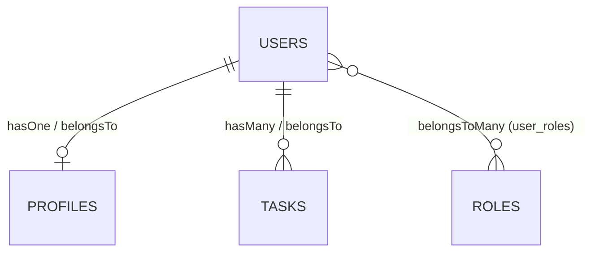

# Módulo 03 — Sequelize: persistencia de datos con un ORM

---

## 1. Conceptos principales

### 1.1 Persistencia de datos y bases de datos relacionales

La **persistencia de datos** es la capacidad de un sistema para conservar información **más allá de la ejecución del proceso**. Un array en memoria desaparece al reiniciar el servidor; un archivo JSON persiste, pero no escala (no soporta concurrencia, ni consultas, ni integridad). La solución profesional es una **base de datos**.

Una **base de datos relacional** (MySQL, PostgreSQL, SQLite, SQL Server) organiza la información en:

| Concepto | Definición | Ejemplo |
|---|---|---|
| **Tabla** | Representa una **entidad**. | `users` |
| **Fila / registro** | Una **instancia** de esa entidad. | El usuario con id 3 |
| **Columna** | Un **atributo** con un tipo de dato. | `email VARCHAR(100)` |
| **Primary Key (PK)** | Identificador único de cada fila. | `id` |
| **Foreign Key (FK)** | Columna que **referencia** la PK de otra tabla: así se crean las relaciones. | `tasks.user_id → users.id` |
| **Restricción (constraint)** | Regla que la base de datos hace cumplir. | `NOT NULL`, `UNIQUE` |

Se manipulan con **SQL** mediante cuatro operaciones básicas (**CRUD**): `INSERT` (Create), `SELECT` (Read), `UPDATE` (Update), `DELETE` (Delete).

### 1.2 Qué es un ORM y qué es Sequelize

Un **ORM (Object-Relational Mapping)** traduce entre dos mundos: **tablas y filas** (base de datos) ↔ **clases y objetos** (JavaScript). En lugar de escribir SQL a mano, se llama a métodos de JavaScript y el ORM genera el SQL.

```js
// Con SQL
// SELECT * FROM users WHERE email = 'ada@mail.com' LIMIT 1;

// Con Sequelize
const user = await UserModel.findOne({ where: { email: 'ada@mail.com' } });
```

**Sequelize** es un ORM para Node.js basado en **Promesas**, compatible con MySQL, PostgreSQL, SQLite, MariaDB y SQL Server. Sus funciones principales:

1. **Modelos:** definen la estructura de cada tabla.
2. **Consultas:** API de métodos para CRUD y consultas complejas.
3. **Asociaciones:** definen relaciones entre modelos (1:1, 1:N, N:M).
4. **Validaciones:** reglas sobre los datos antes de insertarlos.
5. **Migraciones:** cambios versionados y reversibles en la estructura de la base de datos.

| Capa | Responsabilidad |
|---|---|
| **MySQL** | Motor que **almacena** los datos y ejecuta SQL. |
| **mysql2** | **Driver**: abre la conexión de red entre Node y MySQL. Sequelize lo necesita instalado. |
| **Sequelize** | **ORM**: traduce métodos JS a SQL y filas a objetos. |

Ventajas: menos SQL repetitivo, misma API para distintos motores, validaciones y relaciones declarativas, protección contra **inyección SQL** (los valores se envían parametrizados). Desventajas: curva de aprendizaje, cierta pérdida de rendimiento en consultas complejas, y el riesgo de "no saber qué SQL se está ejecutando" (por eso conviene activar `logging` mientras se aprende).

### 1.3 Instalación y conexión

```bash
npm install sequelize mysql2 dotenv
```

```env
DB_HOST=localhost
DB_PORT=3306
DB_NAME=curso_sequelize
DB_USER=root
DB_PASSWORD=
```

```js
// src/config/database.js
import 'dotenv/config';
import { Sequelize } from 'sequelize';

export const sequelize = new Sequelize(
  process.env.DB_NAME,
  process.env.DB_USER,
  process.env.DB_PASSWORD,
  {
    host: process.env.DB_HOST,
    port: process.env.DB_PORT,
    dialect: 'mysql',
    logging: false, // true (o console.log) para ver el SQL generado
  }
);

export const connectDB = async () => {
  try {
    await sequelize.authenticate();   // prueba la conexión
    await sequelize.sync();           // crea las tablas que no existan
    console.log('Conexión a la base de datos establecida');
  } catch (error) {
    console.error('Error al conectar con la base de datos:', error.message);
    process.exit(1);
  }
};
```

> La base de datos (`CREATE DATABASE curso_sequelize;`) se crea **una vez** a mano. Las **tablas** las crea Sequelize.

| Método | Qué hace | Cuándo usarlo |
|---|---|---|
| `sync()` | Crea las tablas que **no existen**. No modifica las existentes. | Desarrollo normal. |
| `sync({ alter: true })` | Intenta **ajustar** las tablas a los modelos. | Desarrollo, con cuidado. |
| `sync({ force: true })` | **Borra** las tablas y las vuelve a crear. **Se pierden todos los datos.** | Scripts de pruebas/seed. Nunca en producción. |

En producción se usan **migraciones** en lugar de `sync`.

### 1.4 Modelos

Un **modelo** es la representación en JS de una tabla. Se define con `sequelize.define(nombre, atributos, opciones)`:

```js
// src/models/user.model.js
import { DataTypes } from 'sequelize';
import { sequelize } from '../config/database.js';

export const UserModel = sequelize.define(
  'User',
  {
    // id INTEGER AUTO_INCREMENT PRIMARY KEY se crea automáticamente
    username: {
      type: DataTypes.STRING(50),
      allowNull: false,
      unique: true,
    },
    email: {
      type: DataTypes.STRING(100),
      allowNull: false,
      unique: true,
      validate: { isEmail: true },
    },
    age: {
      type: DataTypes.INTEGER,
      validate: { min: 0, max: 120 },
    },
    is_active: {
      type: DataTypes.BOOLEAN,
      defaultValue: true,
    },
  },
  {
    tableName: 'users',
    timestamps: true,   // agrega createdAt y updatedAt
  }
);
```

**Tipos de datos frecuentes:** `STRING(n)` (VARCHAR), `TEXT`, `INTEGER`, `DECIMAL(10, 2)` (dinero: **nunca** `FLOAT`), `BOOLEAN`, `DATE`, `DATEONLY`, `ENUM('a', 'b')`.

**Restricción vs validación:**

| | **Restricción** (`allowNull`, `unique`) | **Validación** (`validate: {...}`) |
|---|---|---|
| Dónde se aplica | En la **base de datos** (forma parte de la tabla). | En **Sequelize**, antes de enviar el SQL. |
| Error que lanza | `SequelizeUniqueConstraintError`, etc. | `SequelizeValidationError`. |

### 1.5 Consultas (CRUD)

Todos los métodos devuelven **Promesas**: siempre se usan con `await` y dentro de `try/catch`.

| Operación | Método | Devuelve |
|---|---|---|
| Crear | `Model.create({ ... })` | La instancia creada. |
| Leer todos | `Model.findAll({ where, attributes, order, limit })` | Array (vacío si no hay resultados). |
| Leer por PK | `Model.findByPk(id)` | Instancia o **`null`**. |
| Leer uno | `Model.findOne({ where })` | Instancia o **`null`**. |
| Contar | `Model.count({ where })` | Número. |
| Actualizar (masivo) | `Model.update({ campo }, { where })` | `[filasAfectadas]`. |
| Actualizar (instancia) | `instancia.update({ campo })` | La instancia actualizada. |
| Eliminar (masivo) | `Model.destroy({ where })` | Número de filas eliminadas. |
| Eliminar (instancia) | `instancia.destroy()` | — |

```js
import { Op } from 'sequelize';

const adultos = await UserModel.findAll({
  where: { age: { [Op.gte]: 18 }, is_active: true },
  attributes: ['id', 'username'],     // solo estas columnas
  order: [['username', 'ASC']],
  limit: 10,
});

const resultado = await UserModel.findAll({
  where: { username: { [Op.like]: '%ada%' } },
});
```

Operadores (`Op`): `eq`, `ne`, `gt`, `gte`, `lt`, `lte`, `like`, `in`, `between`, `or`, `and`.

**Instancia vs objeto plano:** `findAll` devuelve **instancias de modelo** (con métodos como `.update()`, `.destroy()`). Para ver solo los datos: `instancia.toJSON()` o `console.log(instancia.dataValues)`.

### 1.6 Asociaciones (relaciones)

Sequelize ofrece cuatro métodos. Cada uno indica **dónde se ubica la FK** y **qué métodos auxiliares** se generan.

| Método | Significado | Ejemplo | Dónde queda la FK |
|---|---|---|---|
| `A.hasOne(B)` | A **tiene un** B. | User tiene un Profile. | En **B** (`profiles.user_id`). |
| `B.belongsTo(A)` | B **pertenece a** A. | Profile pertenece a User. | En **B** (`profiles.user_id`). |
| `A.hasMany(B)` | A **tiene muchos** B. | User tiene muchas Tasks. | En **B** (`tasks.user_id`). |
| `A.belongsToMany(B, { through })` | Muchos A con muchos B. | User ↔ Role. | En una **tabla intermedia** (`user_roles`). |

**Reglas para recordar:**
- `hasOne` + `belongsTo` = **1:1** → la FK va donde dice `belongsTo`.
- `hasMany` + `belongsTo` = **1:N** → la FK va donde dice `belongsTo`.
- `belongsToMany` + `belongsToMany` = **N:M** → necesita **tabla intermedia**.



**Las relaciones se definen en un archivo central**, después de definir todos los modelos. Si cada modelo importara a otro para relacionarse, se producirían **dependencias circulares**.

```js
// src/models/index.js
import { UserModel } from './user.model.js';
import { ProfileModel } from './profile.model.js';
import { TaskModel } from './task.model.js';
import { RoleModel } from './role.model.js';
import { UserRoleModel } from './userRole.model.js';

// 1:1
UserModel.hasOne(ProfileModel, { foreignKey: 'user_id', as: 'profile' });
ProfileModel.belongsTo(UserModel, { foreignKey: 'user_id', as: 'user' });

// 1:N
UserModel.hasMany(TaskModel, { foreignKey: 'user_id', as: 'tasks' });
TaskModel.belongsTo(UserModel, { foreignKey: 'user_id', as: 'user' });

// N:M
UserModel.belongsToMany(RoleModel, { through: UserRoleModel, foreignKey: 'user_id', as: 'roles' });
RoleModel.belongsToMany(UserModel, { through: UserRoleModel, foreignKey: 'role_id', as: 'users' });

export { UserModel, ProfileModel, TaskModel, RoleModel, UserRoleModel };
```

Convenciones del curso:
- `foreignKey` en **snake_case** y minúsculas (`user_id`, `role_id`).
- `as` (**alias**) siempre definido y **usado igual** en todas las consultas.
- Relaciones declaradas **en pares**: Sequelize solo reconoce la relación desde el modelo donde se define. Sin el par, no se puede consultar en sentido inverso.

**Restricciones referenciales por defecto:** en 1:1 y 1:N, `ON DELETE SET NULL` y `ON UPDATE CASCADE`; en N:M, `ON DELETE CASCADE` y `ON UPDATE CASCADE`. Se modifican con `onDelete: 'CASCADE' | 'RESTRICT' | 'SET NULL'`.

### 1.7 Eager loading (carga anticipada)

Obtiene los datos relacionados **en la misma consulta** (un `JOIN`) con `include`:

```js
const users = await UserModel.findAll({
  attributes: ['id', 'username'],
  include: [
    { model: TaskModel, as: 'tasks', attributes: ['id', 'title'] },
    { model: ProfileModel, as: 'profile', attributes: ['bio'] },
    { model: RoleModel, as: 'roles', attributes: ['name'], through: { attributes: [] } },
  ],
});
```

- `attributes` en cada nivel: devolver **solo lo esencial** (nunca contraseñas ni datos innecesarios).
- `through: { attributes: [] }` oculta las columnas de la tabla intermedia en relaciones N:M.

**Métodos auxiliares (mixins)** que Sequelize genera según el alias:

| Relación | Métodos generados (alias `tasks` / `roles` / `profile`) |
|---|---|
| `hasMany` | `user.getTasks()`, `user.createTask()`, `user.countTasks()` |
| `belongsToMany` | `user.getRoles()`, `user.addRole(role)`, `user.setRoles([...])`, `user.removeRole(role)` |
| `hasOne` / `belongsTo` | `user.getProfile()`, `user.setProfile(profile)` |

### 1.8 Errores comunes

| Error | Causa | Solución |
|---|---|---|
| `Please install mysql2 package manually` | Falta el driver. | `npm install mysql2`. |
| `Access denied for user` / `Unknown database` | Credenciales o nombre de BD incorrectos en `.env`. | Verificar `.env` y crear la base de datos. |
| Se imprime `Promise { <pending> }` | Falta `await`. | Todo método de Sequelize se espera con `await`. |
| `TypeError: Cannot read properties of null` | `findByPk` / `findOne` devolvió `null` y se usó el resultado igual. | Verificar existencia antes de usar: `if (!user) ...`. |
| `SequelizeEagerLoadingError: X is associated to Y using an alias` | El `as` del `include` no coincide con el de la asociación (o falta la asociación). | Usar exactamente el mismo alias. |
| `SequelizeUniqueConstraintError` | Valor duplicado en una columna `unique`. | Verificar unicidad antes de crear, o manejar el error. |
| Los datos desaparecen en cada ejecución | `sync({ force: true })` en el flujo normal. | Usar `force` solo en scripts de seed. |
| `ReferenceError: Cannot access 'X' before initialization` | Asociaciones definidas dentro de los archivos de modelos (imports circulares). | Centralizar las asociaciones en `models/index.js`. |
| Tabla intermedia sin `user_id` / `role_id` | Se olvidó el par de `belongsToMany` o el `foreignKey` del segundo. | Declarar ambos `belongsToMany` con su `foreignKey`. |

### 1.9 Cómo construir la lógica de persistencia

1. **Modelar antes de programar:** listar entidades, atributos y tipos. Dibujar las relaciones (¿uno o muchos de cada lado?).
2. **Decidir dónde va la FK:** del lado "muchos" en 1:N; del lado "dependiente" en 1:1; en tabla intermedia en N:M.
3. **Definir modelos sin relaciones** → **asociar en un único archivo** → **sincronizar**.
4. **Toda operación es asíncrona:** `async/await` + `try/catch`.
5. **Validar existencia** (`null`) antes de actualizar, eliminar o relacionar.
6. **Consultar solo lo necesario:** `attributes` en cada nivel del `include`.

---

## 2. Ejercicio fácil — "Mi primer CRUD con Sequelize"

**Qué vas a practicar:** conexión a MySQL, definir un modelo y las 4 operaciones CRUD. Todavía **sin servidor**: todo se ejecuta con scripts.

### Preparación

```bash
mkdir inventario && cd inventario
npm init -y
npm install sequelize mysql2 dotenv
```

En MySQL: `CREATE DATABASE inventario_db;`. Agregá `"type": "module"` al `package.json`.

### Consigna

1. Creá `.env` con los datos de conexión y `src/config/database.js` con la instancia de `sequelize` y la función `connectDB`.
2. Creá `src/models/product.model.js` con el modelo `Product` (tabla `products`):

| Campo | Tipo | Reglas |
|---|---|---|
| `name` | `STRING(100)` | Obligatorio, único. |
| `price` | `DECIMAL(10, 2)` | Obligatorio, mínimo `0`. |
| `stock` | `INTEGER` | Por defecto `0`, mínimo `0`. |
| `category` | `STRING(50)` | Obligatorio. |

3. Creá `src/crud.js` que, en orden:
   1. Conecte y sincronice con `sync({ force: true })` (esto es un script de práctica).
   2. Cree 4 productos (al menos 2 de la misma categoría).
   3. Muestre todos los productos (solo `name` y `price`).
   4. Busque el producto con id `2` y muestre su nombre.
   5. Actualice el stock del producto con id `1` a `50`.
   6. Elimine el producto con id `4`.
   7. Muestre cuántos productos quedan.
   8. Cierre la conexión con `sequelize.close()`.

### Pistas

- `price` de tipo `DECIMAL` vuelve como **string** desde MySQL (`"1500.00"`). Es normal.
- Para ver los datos limpios: `productos.map((p) => p.toJSON())`.

### Cómo probarlo

Agregá estas verificaciones al final de `crud.js` (antes de cerrar la conexión):

```js
const total = await ProductModel.count();
console.assert(total === 3, `Se esperaban 3 productos y hay ${total}`);

const p1 = await ProductModel.findByPk(1);
console.assert(p1.stock === 50, 'El stock del producto 1 debería ser 50');

const p4 = await ProductModel.findByPk(4);
console.assert(p4 === null, 'El producto 4 debería estar eliminado');

try {
  await ProductModel.create({ name: 'Precio negativo', price: -10, category: 'Test' });
  console.assert(false, 'Debería haber fallado por precio negativo');
} catch (error) {
  console.assert(error.name === 'SequelizeValidationError', 'Se esperaba un error de validación');
}
```

Verificación extra: abrí MySQL Workbench / phpMyAdmin y comprobá que la tabla `products` tenga 3 filas y las columnas `createdAt` y `updatedAt`.

---

## 3. Ejercicio medio — "Usuarios, perfiles y tareas (1:1 y 1:N)"

**Qué vas a practicar:** varios modelos, archivo central de asociaciones, eager loading y métodos auxiliares.

### Consigna

Proyecto `gestor-tareas/` con esta estructura:

```
src/
├── config/database.js
├── models/
│   ├── user.model.js
│   ├── profile.model.js
│   ├── task.model.js
│   └── index.js        → asociaciones
├── seed.js             → carga datos de prueba
└── queries.js          → consultas
```

**Modelos:**

| Modelo | Campos |
|---|---|
| `User` (`users`) | `username` (único, obligatorio), `email` (único, obligatorio, `isEmail`) |
| `Profile` (`profiles`) | `first_name`, `last_name` (obligatorios), `bio` (`TEXT`, opcional) |
| `Task` (`tasks`) | `title` (obligatorio, entre 3 y 100 caracteres con `validate: { len: [3, 100] }`), `is_completed` (`BOOLEAN`, por defecto `false`) |

**Relaciones** (en `models/index.js`, declaradas en pares):
- Un `User` tiene un `Profile` (alias `profile` / `user`).
- Un `User` tiene muchas `Task` (alias `tasks` / `user`). Al eliminar un usuario, se eliminan sus tareas (`onDelete: 'CASCADE'`).
- Las FK se llaman `user_id`.

**`seed.js`** (usa `sync({ force: true })`):
- 3 usuarios, cada uno con su perfil.
- 6 tareas en total: el usuario 1 con 3, el usuario 2 con 3, el usuario 3 **sin tareas**.
- Al menos 2 tareas completadas.
- Usá al menos una vez el método auxiliar `user.createTask({...})`.

**`queries.js`** — implementá y mostrá por consola:

1. Todos los usuarios con su perfil (solo `first_name` y `last_name`) y sus tareas (solo `title` e `is_completed`).
2. Una tarea por id incluyendo el `username` de su dueño.
3. Los usuarios con la **cantidad** de tareas de cada uno (usando `countTasks()`).
4. Solo las tareas **pendientes** de un usuario dado, usando `getTasks({ where: ... })`.
5. Eliminar al usuario 2 y verificar que sus tareas también se eliminaron.

### Reglas

- Ningún archivo de modelo importa a otro modelo.
- `seed.js` y `queries.js` importan los modelos **desde `models/index.js`** (para que las asociaciones estén cargadas).
- Todo dentro de funciones `async` con `try/catch`.

### Cómo probarlo

Ejecutá `node src/seed.js` y luego `node src/queries.js`. Agregá al final de `queries.js`:

```js
const usuarios = await UserModel.findAll({ include: [{ model: TaskModel, as: 'tasks' }] });
const sinTareas = usuarios.find((u) => u.tasks.length === 0);
console.assert(sinTareas !== undefined, 'Debe existir un usuario sin tareas');

const tarea = await TaskModel.findByPk(1, { include: [{ model: UserModel, as: 'user' }] });
console.assert(tarea.user !== null, 'La tarea debe incluir a su usuario');

const tareasHuerfanas = await TaskModel.count({ where: { user_id: 2 } });
console.assert(tareasHuerfanas === 0, 'Las tareas del usuario 2 debían eliminarse en cascada');

const perfil = await ProfileModel.findOne({ where: { user_id: 1 } });
console.assert(perfil !== null, 'El usuario 1 debe tener perfil');
```

Comprobá además en la base de datos que `profiles` y `tasks` tienen la columna `user_id`.

---

## 4. Ejercicio difícil — "Inscripciones: muchos a muchos con datos propios"

**Qué vas a practicar:** relación N:M con tabla intermedia que **tiene atributos propios**, índices únicos compuestos, consultas con agregación y manejo de errores de restricción.

### Contexto

Un instituto necesita registrar qué estudiantes cursan qué materias y con qué nota. Un estudiante cursa **muchas** materias; una materia tiene **muchos** estudiantes. La inscripción guarda datos propios: la **nota final** y la **fecha de inscripción**.

### Consigna

**Modelos:**

| Modelo | Campos |
|---|---|
| `Student` (`students`) | `full_name` (obligatorio), `dni` (único, obligatorio, exactamente 8 dígitos numéricos) |
| `Course` (`courses`) | `name` (único), `max_students` (`INTEGER`, mínimo 1) |
| `Enrollment` (`enrollments`) | `grade` (`DECIMAL(4, 2)`, opcional, entre 1 y 10), `enrolled_at` (`DATEONLY`, por defecto la fecha actual) |
| `Teacher` (`teachers`) | `full_name` |

**Relaciones:**
1. `Student` ↔ `Course` es **N:M** a través de `Enrollment` (alias `courses` / `students`, FK `student_id` y `course_id`).
2. `Teacher` 1:N `Course`: un docente dicta muchas materias; cada materia tiene un docente (FK `teacher_id`, alias `courses` / `teacher`). **No se puede eliminar** un docente que tenga materias (`onDelete: 'RESTRICT'`).
3. Además del N:M, definí `Enrollment.belongsTo(Student)` y `Enrollment.belongsTo(Course)` para poder consultar la tabla intermedia directamente.
4. En `Enrollment`, agregá un **índice único compuesto** sobre `student_id` + `course_id` para que un estudiante no pueda inscribirse dos veces a la misma materia:
   ```js
   { tableName: 'enrollments', indexes: [{ unique: true, fields: ['student_id', 'course_id'] }] }
   ```

**Servicios** (`src/services/enrollment.service.js`) — funciones `async` exportadas:

1. `enroll(studentId, courseId)`:
   - Lanza `Error('Estudiante no encontrado')` / `Error('Materia no encontrada')` si alguno no existe.
   - Lanza `Error('Cupo completo')` si la materia ya tiene `max_students` inscriptos.
   - Lanza `Error('El estudiante ya está inscripto')` si se repite la inscripción (atrapá el `SequelizeUniqueConstraintError` y traducilo).
2. `setGrade(studentId, courseId, grade)`: actualiza la nota de una inscripción existente.
3. `getCourseReport(courseId)`: devuelve
   ```js
   { course: 'Programación', teacher: 'Ana Pérez', students: [{ full_name, grade }], average: 7.5 }
   ```
   El promedio solo considera notas **no nulas** y se redondea a 2 decimales. Los alumnos se ordenan por nota descendente. **No** se exponen columnas de la tabla intermedia que no sean `grade`.
4. `getStudentHistory(dni)`: materias del estudiante con su nota y el nombre del docente (include anidado: `Student → Course → Teacher`).

### Pistas

- Para contar inscriptos: `await EnrollmentModel.count({ where: { course_id: courseId } })`.
- En un include N:M, los datos de la tabla intermedia aparecen bajo el nombre del modelo intermedio: `student.Enrollment.grade`. Con `through: { attributes: ['grade'] }` elegís cuáles mostrar.
- Include anidado: `include: [{ model: CourseModel, as: 'courses', include: [{ model: TeacherModel, as: 'teacher' }] }]`.
- Los `DECIMAL` llegan desde MySQL como **string** (`"8.00"`): convertilos con `Number()` antes de calcular el promedio y devolvé `grade` como número en el reporte.

### Desafío extra (opcional)

Implementá `transferStudent(studentId, fromCourseId, toCourseId)` usando una **transacción** (`sequelize.transaction()`): si la inscripción a la nueva materia falla (por ejemplo, por cupo), la baja de la materia original **se deshace**.

### Cómo probarlo

Creá `src/test.js` que cargue datos con `sync({ force: true })` (2 docentes, 3 materias, una con `max_students: 2`, 4 estudiantes) y verifique:

```js
await enroll(1, 1);
await enroll(2, 1);

await expectError(() => enroll(3, 1), 'Cupo completo');
await expectError(() => enroll(1, 1), 'El estudiante ya está inscripto');
await expectError(() => enroll(99, 2), 'Estudiante no encontrado');

await setGrade(1, 1, 8);
await setGrade(2, 1, 6.5);
const report = await getCourseReport(1);
console.assert(report.average === 7.25, `Promedio esperado 7.25, obtenido ${report.average}`);
console.assert(report.students[0].grade >= report.students[1].grade, 'Debe ordenarse por nota descendente');

try {
  await TeacherModel.destroy({ where: { id: 1 } });
  console.assert(false, 'No debería poder eliminarse un docente con materias');
} catch (error) {
  console.assert(error.name === 'SequelizeForeignKeyConstraintError', 'Se esperaba error de FK');
}

console.log('Tests finalizados');
```

Donde `expectError` es una función auxiliar que vos escribís:

```js
const expectError = async (fn, mensajeEsperado) => {
  try {
    await fn();
    console.assert(false, `Se esperaba el error: ${mensajeEsperado}`);
  } catch (error) {
    console.assert(error.message === mensajeEsperado, `Esperado "${mensajeEsperado}", recibido "${error.message}"`);
  }
};
```

**Criterio de aprobación:** todos los `console.assert` pasan sin mensajes y en la base de datos existe el índice único en `enrollments`.
