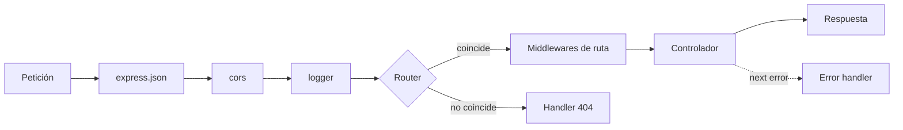

# Módulo 04 — Express: APIs REST sobre Node.js

---

## 1. Conceptos principales

### 1.1 Estrategias de renderizado: SSR y CSR

Antes de construir un servidor hay que definir **quién genera el HTML** que ve el usuario:

| | **Server-Side Rendering (SSR)** | **Client-Side Rendering (CSR)** |
|---|---|---|
| Quién arma el HTML | El **servidor**, antes de enviarlo. | El **navegador**, ejecutando JavaScript. |
| Qué envía el servidor | Una página **completa**. | Un HTML mínimo + JS + **datos (JSON)** vía API. |
| Carga inicial | Más rápida. | Más lenta (debe descargar y ejecutar JS). |
| Interactividad | Menor: cada cambio suele requerir una nueva petición de página. | Mayor: actualiza partes de la página sin recargar. |
| SEO | Mejor (el contenido ya está en el HTML). | Peor (el contenido depende de JS). |
| Carga del servidor | Mayor (renderiza en cada petición). | Menor (solo entrega datos). |
| Ideal para | Sitios de noticias, catálogos, blogs. | Paneles, apps muy interactivas, tiempo real. |

En este curso construimos **APIs REST** que devuelven **JSON**: el servidor no genera HTML, sino que provee datos a un cliente (CSR con `fetch`, una app mobile, otro servidor).

### 1.2 Qué es Express y por qué existe

**Express** es un **framework minimalista** para construir servidores HTTP sobre Node.js. No reemplaza al módulo `http`: lo **envuelve** y resuelve lo que en el módulo 01 hacíamos a mano.

| Tarea | Con `http` nativo | Con Express |
|---|---|---|
| Distinguir rutas y métodos | `if (req.method === 'GET' && req.url === ...)` | `app.get('/ruta', handler)` |
| Parámetros dinámicos | Partir `req.url` a mano. | `req.params.id` |
| Query string | Parsear la URL. | `req.query.page` |
| Body JSON | Acumular *chunks* y `JSON.parse`. | `app.use(express.json())` → `req.body` |
| Responder JSON | `writeHead` + `JSON.stringify` + `end`. | `res.status(200).json(data)` |
| Reutilizar lógica entre rutas | Manual. | **Middlewares**. |

```bash
npm install express cors dotenv
```

```js
// src/app.js
import 'dotenv/config';
import express from 'express';

const app = express();
const PORT = process.env.PORT ?? 3000;

app.use(express.json());

app.get('/api/saludo', (req, res) => {
  res.status(200).json({ message: 'Hola desde Express' });
});

app.listen(PORT, () => console.log(`Servidor en http://localhost:${PORT}`));
```

### 1.3 Anatomía de una petición: `req` y `res`

| Propiedad de `req` | Origen | Ejemplo de URL / envío | Valor |
|---|---|---|---|
| `req.params` | Segmentos dinámicos de la ruta. | `GET /api/users/7` con ruta `/api/users/:id` | `{ id: '7' }` |
| `req.query` | Query string (filtros, paginación). | `GET /api/users?role=admin&page=2` | `{ role: 'admin', page: '2' }` |
| `req.body` | Cuerpo de la petición (POST, PUT, PATCH). | JSON `{ "name": "Ada" }` | `{ name: 'Ada' }` |
| `req.headers` | Encabezados HTTP. | `Content-Type: application/json` | `{ 'content-type': ... }` |

> `req.params` y `req.query` **siempre son strings**. `'7' === 7` es `false`.

| Método de `res` | Uso |
|---|---|
| `res.status(code)` | Define el código de estado (se encadena). |
| `res.json(data)` | Envía JSON y finaliza la respuesta. |
| `res.send(texto)` | Envía texto/HTML y finaliza. |
| `res.sendStatus(204)` | Envía solo el código. |

**Regla de oro:** cada petición recibe **exactamente una** respuesta. Responder dos veces produce `Error [ERR_HTTP_HEADERS_SENT]`. Se previene con `return res.status(...).json(...)`.

### 1.4 REST y códigos de estado HTTP

**REST** es un estilo de arquitectura: los **recursos** se identifican con URLs en **plural** y la **acción** la define el **método HTTP**.

| Método | Ruta | Acción | Status de éxito |
|---|---|---|---|
| `GET` | `/api/books` | Listar todos. | `200 OK` |
| `GET` | `/api/books/:id` | Obtener uno. | `200 OK` |
| `POST` | `/api/books` | Crear. | `201 Created` |
| `PUT` | `/api/books/:id` | Reemplazar / actualizar. | `200 OK` |
| `PATCH` | `/api/books/:id` | Actualizar parcialmente. | `200 OK` |
| `DELETE` | `/api/books/:id` | Eliminar. | `200 OK` (con mensaje) o `204 No Content` |

| Status | Significado | Cuándo usarlo |
|---|---|---|
| `400 Bad Request` | La petición es inválida. | Faltan campos, formato incorrecto. |
| `401 Unauthorized` | No autenticado. | Falta token o credenciales. (módulo 07) |
| `403 Forbidden` | Autenticado pero sin permiso. | Un usuario común intenta acción de admin. (módulo 06/07) |
| `404 Not Found` | El recurso no existe. | `findByPk` devolvió `null`. |
| `409 Conflict` | Conflicto con el estado actual. | Email ya registrado (alternativa a `400`). |
| `500 Internal Server Error` | Error inesperado del servidor. | El `catch` de un controlador. |

### 1.5 Middlewares: el pipeline de Express

Un **middleware** es una función `(req, res, next)` que se ejecuta **en el recorrido** de la petición, antes de llegar al controlador. Puede:
- Modificar `req` o `res` (ej: `express.json()` crea `req.body`).
- **Cortar** la cadena respondiendo (ej: datos inválidos → `400`).
- **Continuar** llamando a `next()`.



```js
// Middleware propio: registra cada petición
const logger = (req, res, next) => {
  console.log(`${new Date().toISOString()} ${req.method} ${req.originalUrl}`);
  next(); // sin esto la petición queda colgada
};
app.use(logger);
```

**El orden importa:** Express ejecuta middlewares y rutas **en el orden en que se registran**.

```js
app.use(express.json());                // 1. parsear body (antes de las rutas)
app.use('/api', router);                // 2. rutas
app.use((req, res) => {                 // 3. 404: ninguna ruta coincidió
  res.status(404).json({ message: 'Ruta no encontrada' });
});
app.use((err, req, res, next) => {      // 4. manejador de errores (4 parámetros)
  console.error(err);
  res.status(500).json({ message: 'Error interno del servidor' });
});
```

### 1.6 `Router` y arquitectura en capas

`express.Router()` crea un "mini app" de rutas que se monta con un prefijo. El proyecto se organiza por **responsabilidad**:

```
src/
├── config/database.js          → conexión Sequelize
├── models/                     → modelos + index.js (asociaciones)
├── controllers/                → lógica de cada endpoint (req → respuesta)
├── routes/                     → define URL + método → controlador
│   └── index.js                → router principal que agrupa los demás
└── app.js                      → configura Express y levanta el servidor
```

```js
// src/routes/book.routes.js
import { Router } from 'express';
import { getAllBooks, getBookById, createBook } from '../controllers/book.controllers.js';

export const bookRoutes = Router();

bookRoutes.get('/books', getAllBooks);
bookRoutes.get('/books/:id', getBookById);
bookRoutes.post('/books', createBook);
```

```js
// src/controllers/book.controllers.js
import { BookModel } from '../models/index.js';

export const getBookById = async (req, res) => {
  try {
    const book = await BookModel.findByPk(req.params.id);
    if (!book) {
      return res.status(404).json({ message: 'Libro no encontrado' });
    }
    return res.status(200).json(book);
  } catch (error) {
    console.error(error);
    return res.status(500).json({ message: 'Error interno del servidor' });
  }
};
```

```js
// src/app.js
import 'dotenv/config';
import express from 'express';
import cors from 'cors';
import { connectDB } from './config/database.js';
import { bookRoutes } from './routes/book.routes.js';

const app = express();
app.use(cors());
app.use(express.json());
app.use('/api', bookRoutes);

await connectDB();
app.listen(process.env.PORT, () => console.log(`Servidor en puerto ${process.env.PORT}`));
```

| Capa | Conoce `req`/`res` | Conoce la base de datos | Responsabilidad |
|---|---|---|---|
| **Route** | No (solo los pasa). | No. | Mapear URL + método → controlador. |
| **Middleware** | Sí. | A veces. | Tareas transversales (validar, autenticar, registrar). |
| **Controller** | Sí. | Sí (vía modelos). | Orquestar: leer entrada, consultar, responder. |
| **Model** | No. | Sí. | Estructura y acceso a datos. |

### 1.7 CORS

El navegador bloquea por seguridad las peticiones `fetch` entre **orígenes distintos** (otro protocolo, dominio o puerto): un frontend en `http://localhost:5173` no puede consumir `http://localhost:3000` salvo que el servidor lo autorice. El middleware `cors` agrega los headers que lo permiten. **CORS lo aplica el navegador**: Postman o Thunder Client no se ven afectados.

### 1.8 Errores comunes

| Error | Causa | Solución |
|---|---|---|
| `req.body` es `undefined` | Falta `app.use(express.json())` o se registró **después** de las rutas. | Registrarlo antes de las rutas. |
| `Cannot GET /api/books` | Ruta mal escrita, prefijo duplicado (`/api/api/books`) o router no montado. | Revisar `app.use('/api', ...)` y las rutas del router. |
| `ERR_HTTP_HEADERS_SENT` | Dos respuestas en la misma petición. | `return res...` en cada rama. |
| La petición queda "cargando" | Un middleware no llama a `next()` ni responde. | Toda rama debe responder o llamar a `next()`. |
| `/books/search` cae en `/books/:id` | Rutas dinámicas declaradas antes que las fijas. | Declarar las rutas **fijas primero**. |
| `findByPk('abc')` no falla pero devuelve `null` o error SQL | No se validó que el id sea número. | Validar el formato (módulo 05 lo automatiza). |
| Error de CORS en el navegador | Falta `app.use(cors())`. | Instalar y configurar `cors`. |
| El servidor responde `500` y se exponen detalles internos | Se envió `error` completo al cliente. | `console.error(error)` interno + mensaje genérico al cliente. |

### 1.9 Cómo construir la lógica de un endpoint

1. **Contrato primero:** método, ruta, qué recibe (params / query / body) y qué devuelve en cada caso (status + body).
2. **Ruta:** registrarla en el router correspondiente.
3. **Controlador**, siempre con la misma secuencia dentro de `try/catch`:
   1. Extraer datos de `req`.
   2. Validar (formato, obligatorios).
   3. Verificar existencia / unicidad en la base de datos.
   4. Ejecutar la operación.
   5. Responder con el status correcto.
4. **Probar cada caso del contrato**, no solo el "camino feliz".

---

## 2. Ejercicio fácil — "API de películas en memoria"

**Qué vas a practicar:** crear un servidor Express, rutas, `req.params`, `req.query`, `req.body` y códigos de estado. Todavía **sin base de datos**.

### Consigna

1. Proyecto nuevo con `"type": "module"`, `express` instalado y el script `"dev": "node --watch src/app.js"`.
2. En `src/data/movies.js` exportá un array con 5 películas `{ id, title, year, genre }`.
3. Implementá en `src/app.js`:

| Método | Ruta | Comportamiento |
|---|---|---|
| `GET` | `/api/movies` | `200` + todas las películas. Si llega `?genre=drama`, filtra por género (sin importar mayúsculas). |
| `GET` | `/api/movies/:id` | `200` + la película, o `404` + `{ "message": "Película no encontrada" }`. |
| `POST` | `/api/movies` | Valida que lleguen `title`, `year` y `genre`. Si falta alguno: `400`. Si está todo: la agrega con un id nuevo y responde `201` + la película creada. |
| `DELETE` | `/api/movies/:id` | `200` + `{ "message": "Película eliminada" }` o `404`. |

4. Agregá al final un middleware que responda `404` + `{ "message": "Ruta no encontrada" }` para cualquier otra ruta.

### Pistas

- Convertí el id: `const id = Number(req.params.id);`.
- Para eliminar de un array: `findIndex` + `splice`.

### Cómo probarlo

| # | Petición | Status | Verificar |
|---|---|---|---|
| 1 | `GET /api/movies` | `200` | 5 películas |
| 2 | `GET /api/movies?genre=DRAMA` | `200` | Solo dramas |
| 3 | `GET /api/movies/2` | `200` | Película 2 |
| 4 | `GET /api/movies/99` | `404` | Mensaje de error |
| 5 | `POST /api/movies` `{"title":"Coco","year":2017,"genre":"animación"}` | `201` | Tiene `id` |
| 6 | `POST /api/movies` `{"title":"Sin año"}` | `400` | Mensaje de error |
| 7 | `DELETE /api/movies/1` | `200` | Mensaje de éxito |
| 8 | `GET /api/movies/1` | `404` | Ya no existe |
| 9 | `GET /api/peliculas` | `404` | `Ruta no encontrada` |

---

## 3. Ejercicio medio — "API de biblioteca con Express + Sequelize"

**Qué vas a practicar:** integrar Express con Sequelize, arquitectura en carpetas, `try/catch` en controladores, validaciones manuales de existencia y unicidad, filtros con query.

### Consigna

Estructura obligatoria: `src/config`, `src/models`, `src/routes`, `src/controllers`, `src/app.js`. Solo ESM.

**Modelo `Book`** (`books`):

| Campo | Tipo | Reglas |
|---|---|---|
| `title` | `STRING(150)` | Obligatorio. |
| `isbn` | `STRING(13)` | Obligatorio, **único**. |
| `author` | `STRING(100)` | Obligatorio. |
| `published_year` | `INTEGER` | Obligatorio. |
| `available` | `BOOLEAN` | Por defecto `true`. |

**Endpoints:**

| Método | Ruta | Éxito | Errores |
|---|---|---|---|
| `GET` | `/api/books` | `200` + array | `500` |
| `GET` | `/api/books/:id` | `200` + libro | `404`, `500` |
| `POST` | `/api/books` | `201` + `{ message, data }` | `400` (faltan campos o ISBN repetido), `500` |
| `PUT` | `/api/books/:id` | `200` + `{ message, data }` | `404`, `400` (ISBN repetido en **otro** libro), `500` |
| `DELETE` | `/api/books/:id` | `200` + `{ message }` | `404`, `500` |

**Filtros en `GET /api/books`** (combinables):
- `?author=borges` → autor que **contenga** el texto (`Op.like`).
- `?available=true` → solo disponibles (ojo: llega como **string** `'true'`).
- `?from=1950&to=2000` → publicados en ese rango (`Op.between`).

### Reglas

- Validaciones **manuales** dentro de los controladores (en el módulo 05 las vas a reemplazar por express-validator).
- Al crear: verificar que el ISBN no exista (`findOne`). Al editar: verificar que no exista en **otro** libro (`id` distinto, `Op.ne`).
- Antes de editar o eliminar: verificar que el libro exista.
- Mensajes claros de éxito y error en cada operación.
- Al cliente nunca se le envía el objeto `error`; se registra con `console.error`.

### Cómo probarlo

| # | Petición | Status |
|---|---|---|
| 1 | `POST /api/books` con libro válido | `201` |
| 2 | `POST /api/books` con el **mismo ISBN** | `400` |
| 3 | `POST /api/books` sin `title` | `400` |
| 4 | `GET /api/books` | `200` |
| 5 | `GET /api/books?author=BOR` | `200`, solo coincidencias |
| 6 | `GET /api/books?from=1900&to=1950&available=true` | `200`, filtros combinados |
| 7 | `PUT /api/books/1` cambiando `title` | `200` |
| 8 | `PUT /api/books/1` con el ISBN del libro 2 | `400` |
| 9 | `PUT /api/books/1` con **su propio** ISBN | `200` (no es duplicado) |
| 10 | `DELETE /api/books/999` | `404` |
| 11 | `DELETE /api/books/1` | `200` |

Detené MySQL y hacé `GET /api/books`: el servidor debe responder `500` con un mensaje genérico, **sin caerse**.

---

## 4. Ejercicio difícil — "API de gestión de tareas con relaciones"

**Qué vas a practicar:** Express + Sequelize con relaciones 1:1, 1:N y N:M, eager loading con atributos esenciales, middlewares propios, manejador global de errores y paginación.

### Consigna

**Modelos y relaciones** (asociaciones en `src/models/index.js`):

| Modelo | Campos | Relaciones |
|---|---|---|
| `User` | `name`, `email` (único), `password` | 1:1 `Profile` · 1:N `Task` |
| `Profile` | `bio`, `avatar_url`, `user_id` | pertenece a `User` |
| `Task` | `title`, `description`, `is_completed`, `user_id` | pertenece a `User` · N:M `Tag` |
| `Tag` | `name` (único) | N:M `Task` a través de `TaskTag` (`task_tags`) |

**Endpoints:**

| Método | Ruta | Detalle |
|---|---|---|
| `POST` | `/api/users` | Crea usuario. Email único → `400` si se repite. |
| `GET` | `/api/users` | Usuarios con su perfil y sus tareas. **Nunca** devolver `password`. |
| `GET` | `/api/users/:id` | Un usuario con perfil y tareas. `404` si no existe. |
| `POST` | `/api/profiles` | Crea perfil para `user_id`. `404` si el usuario no existe; `400` si **ya tiene** perfil. |
| `POST` | `/api/tasks` | Crea tarea. **No se puede crear sin `user_id` válido** (`400` si falta, `404` si no existe). Acepta opcionalmente `tag_ids: [1, 2]` y las asocia. |
| `GET` | `/api/tasks` | Tareas con el usuario (`id`, `name`) y etiquetas (`name`, sin columnas de `task_tags`). Paginadas. |
| `GET` | `/api/tasks/:id` | Una tarea con usuario y etiquetas. |
| `POST` | `/api/tags` | Crea etiqueta. Nombre único. |
| `GET` | `/api/tags` | Etiquetas con la **cantidad** de tareas asociadas. |

**Paginación** en `GET /api/tasks?page=2&limit=5`:

```json
{
  "data": [ ... ],
  "meta": { "page": 2, "limit": 5, "total": 23, "totalPages": 5 }
}
```

- Valores por defecto: `page=1`, `limit=10`. `limit` máximo `50`.
- Usá `findAndCountAll({ limit, offset, distinct: true, ... })` con `offset = (page - 1) * limit`.
- Si `page` o `limit` no son enteros positivos: `400`.

**Middlewares obligatorios** (`src/middlewares/`):
1. `logger.js`: registra método, ruta, status final y **duración en ms** de cada petición. (Pista: guardá `Date.now()` al entrar y usá `res.on('finish', () => { ... })`.)
2. `notFound.js`: `404` para rutas inexistentes.
3. `errorHandler.js`: manejador global `(err, req, res, next)`. Los controladores, en su `catch`, llaman a `next(error)` en lugar de responder `500` ellos mismos. El handler responde `500` con un mensaje genérico y registra el error.

### Reglas

- Las asociaciones de `tag_ids` se hacen con el método auxiliar `task.setTags(ids)` o `task.addTags(ids)`. Si algún id de etiqueta no existe: `400` indicando cuáles.
- `password` se excluye con `attributes: { exclude: ['password'] }` en **todas** las consultas de usuarios (incluidas las anidadas).
- Organización: un archivo de rutas y uno de controladores por recurso, y un `routes/index.js` que los agrupa.

### Cómo probarlo

Preparación: creá 2 usuarios, 1 perfil, 3 etiquetas y 12 tareas.

| # | Petición | Status | Verificar |
|---|---|---|---|
| 1 | `POST /api/tasks` sin `user_id` | `400` | |
| 2 | `POST /api/tasks` con `user_id: 999` | `404` | |
| 3 | `POST /api/tasks` con `tag_ids: [1, 99]` | `400` | El mensaje menciona el id `99` |
| 4 | `POST /api/tasks` con `user_id: 1, tag_ids: [1, 2]` | `201` | |
| 5 | `GET /api/tasks/:id` (la del paso 4) | `200` | Incluye `user` y 2 `tags`, sin `TaskTag` |
| 6 | `POST /api/profiles` para el usuario 1 (segunda vez) | `400` | |
| 7 | `GET /api/users/1` | `200` | Sin `password` en ningún nivel |
| 8 | `GET /api/tasks?page=2&limit=5` | `200` | `meta.totalPages === 3` (con 13 tareas) |
| 9 | `GET /api/tasks?page=0` | `400` | |
| 10 | `GET /api/tasks?limit=500` | `200` | Devuelve como máximo 50 |
| 11 | `GET /api/tags` | `200` | Cada etiqueta con su cantidad de tareas |
| 12 | `GET /api/nada` | `404` | |

Revisá la consola: cada petición debe quedar registrada con su status y duración, por ejemplo `GET /api/tasks?page=2&limit=5 200 - 14ms`.
