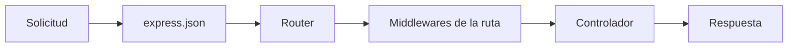

# Módulo 04 — Express: servidor, rutas y controladores

> Material del profesor: `material/TLPI-2025-UNIDAD-4-2.pptx` (SSR/CSR y laboratorio de servidor Express) y la consigna **Práctica — API REST con Node.js y Express** (raíz del repositorio).

---

## 1. Conceptos principales

### 1.1 SSR y CSR: quién arma la página

| | **Server-Side Rendering (SSR)** | **Client-Side Rendering (CSR)** |
|---|---|---|
| Quién genera el HTML | El **servidor**, antes de enviarlo. | El **navegador**, con JavaScript. |
| Qué envía el servidor | La página completa. | HTML básico + JavaScript + **datos**. |
| Carga inicial | Más rápida. | Más lenta. |
| Interactividad | Menor (cada cambio pide una página nueva). | Mayor (actualiza sin recargar). |
| SEO | Mejor. | Peor. |
| Ideal para | Noticias, catálogos. | Apps muy interactivas. |

En los trabajos prácticos se construye una **API REST**: el servidor **no genera HTML**, solo responde **datos en JSON** para que un cliente (CSR con `fetch`, Postman, una app) los use.

### 1.2 Qué es Express

**Express** es un **framework minimalista** para crear servidores sobre Node.js. No reemplaza a Node: usa su módulo `http` por debajo y simplifica lo que a mano es tedioso.

| Tarea | Con `http` de Node (módulo 01) | Con Express |
|---|---|---|
| Definir una ruta | `if (req.method === 'GET' && req.url === ...)` | `router.get('/ruta', controlador)` |
| Leer un parámetro de la URL | Cortar `req.url` a mano. | `req.params.id` |
| Leer el body JSON | Juntar los datos y `JSON.parse`. | `app.use(express.json())` → `req.body` |
| Responder JSON | `writeHead` + `JSON.stringify` + `end` | `res.status(200).json(data)` |

```bash
npm install express
```

### 1.3 `app.js`: configurar y arrancar

`app.js` **solo** se encarga de configurar la aplicación y montar las rutas:

```js
// app.js
import express from 'express';
import 'dotenv/config';
import { personajesRoutes } from './src/routes/personajes.routes.js';

const app = express();
const PORT = process.env.PORT || 3000;

app.use(express.json());           // convierte el body JSON en req.body
app.use('/api', personajesRoutes); // monta las rutas bajo el prefijo /api

app.listen(PORT, () => {
  console.log(`Servidor corriendo en http://localhost:${PORT}`);
});
```

### 1.4 La solicitud (`req`) y la respuesta (`res`)

| Propiedad | De dónde sale | Ejemplo | Valor |
|---|---|---|---|
| `req.params` | Partes variables de la ruta (`:id`). | `GET /api/personajes/3` | `{ id: '3' }` |
| `req.body` | Cuerpo de la solicitud (POST, PUT). | `{ "nombre": "Ana" }` | `{ nombre: 'Ana' }` |
| `req.query` | Lo que va después del `?`. | `GET /api/personajes?orden=asc` | `{ orden: 'asc' }` |

> `req.params` y `req.query` **siempre son strings**: `'3' === 3` es `false`. Para comparar con un id numérico: `Number(req.params.id)`.

| Método de `res` | Uso |
|---|---|
| `res.status(código)` | Define el código de estado (se encadena). |
| `res.json(datos)` | Envía JSON y termina la respuesta. |

**Regla:** cada solicitud recibe **exactamente una** respuesta. Por eso se escribe `return res.status(...).json(...)`: el `return` corta la función y evita responder dos veces.

### 1.5 Métodos HTTP y códigos de estado

| Método | Ruta | Acción | Código de éxito |
|---|---|---|---|
| `GET` | `/api/personajes` | Obtener todos. | `200 OK` |
| `GET` | `/api/personajes/:id` | Obtener uno. | `200 OK` |
| `POST` | `/api/personajes` | Crear. | `201 Created` |
| `PUT` | `/api/personajes/:id` | Modificar. | `200 OK` |
| `DELETE` | `/api/personajes/:id` | Eliminar. | `200 OK` |

| Código | Significado | Cuándo |
|---|---|---|
| `400 Bad Request` | Datos inválidos. | Falta un campo, el id no es un número, el body está vacío. |
| `404 Not Found` | No existe. | El personaje con ese id no está. |
| `500 Internal Server Error` | Error inesperado. | Falla la base de datos (el `catch`). |
| `401` / `403` | No autenticado / sin permiso. | Módulo 07. |

### 1.6 Middlewares

Un **middleware** es una función `(req, res, next)` que se ejecuta **en el camino** de la solicitud, **antes** de llegar al controlador. Puede modificar `req`, responder y cortar, o seguir con `next()`.



- `express.json()` es un middleware: crea `req.body`.
- Se registran con `app.use(...)` y **en orden**: `express.json()` va **antes** de las rutas.
- También se pueden poner en una ruta específica, entre la URL y el controlador. Así se usarán en los próximos módulos:

```js
router.post('/articles', authMiddleware, validaciones, validate, createArticle);
//                       módulo 07       módulo 05    módulo 05  controlador
```

### 1.7 Estructura: rutas, controladores y datos

```
practica-express/
├── app.js                          → configura Express y monta las rutas
├── package.json                    → "type": "module"
└── src/
    ├── routes/personajes.routes.js       → URL + método → controlador
    ├── controllers/personajes.controllers.js → lógica de cada operación
    └── data/personajes.js                → fuente de datos (arreglo)
```

**Rutas** con `express.Router`:

```js
// src/routes/personajes.routes.js
import { Router } from 'express';
import { getAll, getById, create, update, remove } from '../controllers/personajes.controllers.js';

export const personajesRoutes = Router();

personajesRoutes.get('/personajes', getAll);
personajesRoutes.get('/personajes/:id', getById);
personajesRoutes.post('/personajes', create);
personajesRoutes.put('/personajes/:id', update);
personajesRoutes.delete('/personajes/:id', remove);
```

**Controladores:** cada función recibe `req` y `res`, valida, opera y responde.

```js
// src/controllers/personajes.controllers.js
import { personajes } from '../data/personajes.js';

export const getById = (req, res) => {
  const id = Number(req.params.id);

  if (Number.isNaN(id)) {
    return res.status(400).json({ message: 'El id debe ser un número' });
  }

  const personaje = personajes.find((p) => p.id === id);

  if (!personaje) {
    return res.status(404).json({ message: 'Personaje no encontrado' });
  }

  return res.status(200).json(personaje);
};
```

| Archivo | Conoce `req`/`res` | Conoce los datos | Responsabilidad |
|---|---|---|---|
| `app.js` | No. | No. | Configurar y montar. |
| Rutas | No. | No. | Unir URL + método con su controlador. |
| Controladores | **Sí**. | **Sí**. | Validar, operar y responder. |
| Datos / modelos | No. | **Sí**. | Guardar la información. |

### 1.8 Controladores con base de datos

Cuando los datos pasan de un arreglo a **Sequelize** (TP Integrador), cambian dos cosas: `src/data/` se reemplaza por `src/config/` + `src/models/`, y los controladores pasan a ser **`async`** con **`try/catch`**:

```js
// src/controllers/user.controllers.js
import { UserModel } from '../models/index.js';

export const getUserById = async (req, res) => {
  try {
    const user = await UserModel.findByPk(req.params.id);

    if (!user) {
      return res.status(404).json({ message: 'Usuario no encontrado' });
    }

    return res.status(200).json(user);
  } catch (error) {
    console.error(error);
    return res.status(500).json({ message: 'Error interno del servidor' });
  }
};
```

Y en `app.js` se conecta la base de datos **antes** de escuchar:

```js
import { connectDB } from './src/config/database.js';

await connectDB();
app.listen(PORT, () => console.log(`Servidor en puerto ${PORT}`));
```

### 1.9 CORS

El navegador bloquea las solicitudes `fetch` entre **orígenes distintos** (por ejemplo, un frontend en el puerto 5500 y la API en el 3000). El middleware **`cors`** autoriza esas solicitudes:

```js
import cors from 'cors';
app.use(cors());
```

Postman y Thunder Client **no** se ven afectados por CORS: solo el navegador.

### 1.10 Errores comunes

| Error | Causa | Solución |
|---|---|---|
| `req.body` es `undefined` | Falta `app.use(express.json())` o está después de las rutas. | Registrarlo antes de las rutas. |
| `Cannot GET /api/personajes` | Ruta mal escrita, router no montado o prefijo duplicado (`/api/api/...`). | Revisar `app.use('/api', ...)` y las rutas. |
| `ERR_HTTP_HEADERS_SENT` | Se respondió dos veces (falta un `return`). | `return res.status(...).json(...)`. |
| `find` nunca encuentra el id | Se compara el string `'3'` con el número `3`. | `Number(req.params.id)`. |
| La solicitud queda "cargando" | El controlador no responde en algún caso. | Toda rama debe tener su `res.status().json()`. |
| El servidor se cae con un error de base de datos | Falta `try/catch` en el controlador. | `try/catch` en **todos** los controladores. |

### 1.11 Dónde vas a usar esto en los trabajos prácticos

- **Práctica de Express:** `app.js` + `src/routes/` + `src/controllers/` + `src/data/`, CRUD completo con validaciones y códigos de estado.
- **TP Integrador:** la misma estructura, pero `src/data/` se reemplaza por `src/config/` y `src/models/` (Sequelize), y se suman middlewares (módulos 05 y 07).

---

## 2. Ejercicio fácil — "Mi primer servidor Express"

**Qué vas a practicar:** crear un servidor con Express, `express.json()`, rutas `GET`, `req.params` y códigos de estado.

**En el proyecto real:** es el `app.js` base con el que arranca la Práctica (rama `main`).

### Consigna

1. Proyecto nuevo con `npm init -y`, `"type": "module"` y `express` instalado.
2. Script `"dev": "node --watch app.js"`.
3. En `app.js` (todo en un solo archivo por ahora):
   - Un arreglo `peliculas` con 4 objetos `{ id, titulo, anio }`.
   - `app.use(express.json())`.
   - `GET /api/peliculas` → `200` con todas las películas.
   - `GET /api/peliculas/:id` →
     - `400` + `{ "message": "El id debe ser un número" }` si el id no es numérico.
     - `404` + `{ "message": "Película no encontrada" }` si no existe.
     - `200` + la película si existe.
   - El servidor escucha en el puerto `3000`.

### Cómo probarlo

Con `npm run dev`, en Thunder Client / Postman:

| # | Petición | Status | Respuesta |
|---|---|---|---|
| 1 | `GET /api/peliculas` | `200` | 4 películas |
| 2 | `GET /api/peliculas/2` | `200` | La película 2 |
| 3 | `GET /api/peliculas/99` | `404` | Mensaje de error |
| 4 | `GET /api/peliculas/abc` | `400` | Mensaje de error |

---

## 3. Ejercicio medio — "Rutas, controladores y datos separados"

**Qué vas a practicar:** separar el proyecto en `routes` (con `express.Router`), `controllers` y `data`, y completar el CRUD con `POST`, `PUT` y `DELETE` y sus validaciones.

**En el proyecto real:** es exactamente la estructura que pide la Práctica de Express (rama `feature/rutas-y-controladores`).

### Consigna

Tomá el ejercicio fácil y reorganizalo así:

```
src/
├── data/peliculas.js                   → export const peliculas = [...]
├── controllers/peliculas.controllers.js
└── routes/peliculas.routes.js
app.js                                  → solo configuración + montar rutas en /api
```

Endpoints:

| Método | Ruta | Éxito | Validaciones (responder `400` antes de operar) | `404` |
|---|---|---|---|---|
| `GET` | `/api/peliculas` | `200` + todas | — | — |
| `GET` | `/api/peliculas/:id` | `200` + la película | id numérico | Si no existe. |
| `POST` | `/api/peliculas` | `201` + la película creada (id generado automáticamente) | `titulo` y `anio` obligatorios y no vacíos | — |
| `PUT` | `/api/peliculas/:id` | `200` + la película actualizada | id numérico, body **no vacío**, los campos enviados **no vacíos** | Si no existe. |
| `DELETE` | `/api/peliculas/:id` | `200` + `{ "message": "Película eliminada" }` | id numérico | Si no existe. |

### Pistas

- Nuevo id: `Math.max(0, ...peliculas.map((p) => p.id)) + 1`.
- Body vacío: `!req.body || Object.keys(req.body).length === 0`. (En Express 5, si la solicitud llega **sin** body, `req.body` es `undefined`: por eso se revisa primero que exista.)
- Eliminar de un arreglo: `findIndex` + `splice`.

### Cómo probarlo

| # | Petición | Body | Status |
|---|---|---|---|
| 1 | `POST /api/peliculas` | `{ "titulo": "Coco", "anio": 2017 }` | `201` |
| 2 | `POST /api/peliculas` | `{ "titulo": "Sin año" }` | `400` |
| 3 | `POST /api/peliculas` | `{ "titulo": "", "anio": 2000 }` | `400` |
| 4 | `PUT /api/peliculas/1` | `{ "titulo": "Nuevo título" }` | `200` (el año no cambió) |
| 5 | `PUT /api/peliculas/1` | `{}` | `400` |
| 6 | `PUT /api/peliculas/1` | `{ "titulo": "" }` | `400` |
| 7 | `PUT /api/peliculas/99` | `{ "titulo": "X" }` | `404` |
| 8 | `DELETE /api/peliculas/abc` | — | `400` |
| 9 | `DELETE /api/peliculas/1` | — | `200` |
| 10 | `GET /api/peliculas/1` | — | `404` |

Revisión de estructura: `app.js` no tiene ninguna ruta adentro; los controladores no se repiten en las rutas.

---

## 4. Ejercicio difícil — "Del arreglo a la base de datos"

**Qué vas a practicar:** conectar Express con Sequelize. Los controladores pasan a ser `async`, usan los modelos y manejan errores con `try/catch`.

**En el proyecto real:** es el salto de la Práctica de Express al TP Integrador: `src/data/` desaparece y aparecen `src/config/` y `src/models/`.

### Consigna

Tomá el ejercicio medio y reemplazá el arreglo por MySQL:

```
src/
├── config/database.js          → sequelize + connectDB (módulo 03)
├── models/
│   ├── director.model.js
│   ├── pelicula.model.js
│   └── index.js                → relaciones
├── controllers/
│   ├── peliculas.controllers.js
│   └── directores.controllers.js
└── routes/
    ├── peliculas.routes.js
    └── directores.routes.js
app.js                          → conecta la base de datos y después escucha
```

**Modelos y relación:**

| Modelo | Campos |
|---|---|
| `Director` | `nombre` (`STRING(100)`, obligatorio, único) |
| `Pelicula` | `titulo` (`STRING(150)`, obligatorio, único), `anio` (`INTEGER`, obligatorio), `director_id` |

Un director **tiene muchas** películas (alias `peliculas` / `director`).

**Endpoints:**

| Método | Ruta | Detalle |
|---|---|---|
| `POST` | `/api/directores` | Crea un director. `400` si el nombre ya existe. |
| `GET` | `/api/directores` | Directores con sus películas (`titulo`, `anio`). |
| `GET` | `/api/peliculas` | Películas con su director (`nombre`). |
| `GET` | `/api/peliculas/:id` | Una película con su director. `404` si no existe. |
| `POST` | `/api/peliculas` | `400` si faltan campos o el título ya existe. `404` si `director_id` no existe. |
| `PUT` | `/api/peliculas/:id` | `404` si no existe. `400` si el nuevo título ya lo usa **otra** película. |
| `DELETE` | `/api/peliculas/:id` | `404` si no existe. |

### Reglas

- Todos los controladores son `async` y tienen `try/catch`. En el `catch`: `console.error(error)` y `500` con un mensaje genérico.
- Antes de editar o eliminar, verificá que el registro exista.
- Las validaciones siguen siendo **manuales** en el controlador (en el módulo 05 las vas a pasar a express-validator).
- Los modelos se importan desde `models/index.js`.

### Pistas

- Título repetido en otra película: buscá con `findOne({ where: { titulo } })` y compará el `id` encontrado con el de `req.params.id`.

### Cómo probarlo

| # | Petición | Status |
|---|---|---|
| 1 | `POST /api/directores` `{ "nombre": "Pixar" }` | `201` |
| 2 | `POST /api/directores` `{ "nombre": "Pixar" }` | `400` |
| 3 | `POST /api/peliculas` `{ "titulo": "Coco", "anio": 2017, "director_id": 1 }` | `201` |
| 4 | `POST /api/peliculas` con `director_id: 99` | `404` |
| 5 | `POST /api/peliculas` con el título `Coco` otra vez | `400` |
| 6 | `GET /api/peliculas` | `200`, cada película con `director` |
| 7 | `GET /api/directores` | `200`, cada director con `peliculas` |
| 8 | `PUT /api/peliculas/1` `{ "anio": 2018 }` | `200` |
| 9 | `PUT /api/peliculas/1` `{ "titulo": "Coco" }` (su propio título) | `200` |
| 10 | `DELETE /api/peliculas/99` | `404` |
| 11 | Reiniciá el servidor y `GET /api/peliculas` | `200`: los datos **siguen ahí** (persistencia) |
| 12 | Apagá MySQL y `GET /api/peliculas` | `500` y el servidor **no se cae** |
