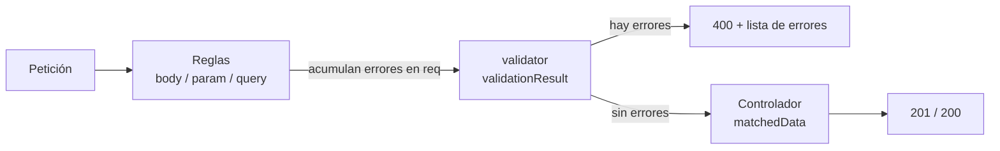

# Módulo 05 — Express Validator: integridad de datos en el servidor

---

## 1. Conceptos principales

### 1.1 Por qué validar en el servidor

Todo dato que llega al servidor es **entrada no confiable**. Aunque el frontend tenga un formulario con validaciones HTML, cualquiera puede enviar una petición directa con Postman, `curl` o un script, salteándose el navegador.

| | **Validación en el cliente** | **Validación en el servidor** |
|---|---|---|
| Objetivo | **Experiencia de usuario** (avisar rápido). | **Seguridad e integridad de datos**. |
| ¿Se puede saltear? | Sí, fácilmente. | No: es la última barrera antes de la base de datos. |
| ¿Es obligatoria? | Recomendada. | **Obligatoria**. |

Tres conceptos que guían esta capa:

- **Integridad de los datos:** precisión, coherencia y confiabilidad de lo que se almacena. Datos inválidos generan decisiones erróneas, errores en cascada y pérdida de confianza.
- **Validación:** **verificar** si el dato cumple una regla. No lo modifica: lo **acepta o lo rechaza** (¿es un email?, ¿tiene 8 caracteres?).
- **Sanitización (saneamiento):** **transformar** el dato a una forma segura o normalizada (`trim()` quita espacios, `toInt()` convierte a número, `normalizeEmail()` normaliza el email, `escape()` neutraliza HTML para prevenir **XSS**).

**Mantenimiento simplificado:** si las validaciones están dispersas como `if` dentro de cada controlador (como en el módulo 04), el código se repite y es difícil de mantener. express-validator **centraliza y estandariza** esa lógica.

### 1.2 Middlewares como mecanismo de validación

Recordatorio del módulo 04: un **middleware** es una función `(req, res, next)` que se ejecuta durante el recorrido de la petición, antes del controlador. express-validator aprovecha exactamente ese mecanismo: **cada regla de validación es un middleware**.



Punto clave: **las reglas NO cortan la petición por sí solas**. Solo registran errores dentro de `req`. Hace falta un middleware que lea esos errores y decida responder `400`.

### 1.3 Instalación y funciones principales

```bash
npm install express-validator
```

| Función | Qué valida | Ejemplo |
|---|---|---|
| `body('campo')` | `req.body` | `body('email').isEmail()` |
| `param('campo')` | `req.params` | `param('id').isInt({ min: 1 })` |
| `query('campo')` | `req.query` | `query('page').optional().isInt({ min: 1 })` |
| `validationResult(req)` | Obtiene los errores acumulados. | `validationResult(req).isEmpty()` |
| `matchedData(req)` | Obtiene **solo** los datos validados. | `const data = matchedData(req)` |
| `checkSchema({...})` | Define reglas como objeto. | Alternativa a los arrays. |

### 1.4 Cadena de validación (validation chain)

Las reglas se **encadenan**. Cada validador puede tener su propio mensaje con `.withMessage()`:

```js
import { body } from 'express-validator';

body('email')
  .trim()                                                // sanitizador
  .notEmpty().withMessage('El email es obligatorio')     // validador + mensaje
  .bail()                                                // si falló lo anterior, no sigue
  .isEmail().withMessage('El email no es válido')
  .normalizeEmail();                                     // sanitizador
```

| Validadores frecuentes | Sanitizadores frecuentes |
|---|---|
| `notEmpty()`, `isLength({ min, max })` | `trim()` |
| `isEmail()`, `isURL()` | `toInt()`, `toFloat()`, `toBoolean()` |
| `isInt({ min, max })`, `isFloat({ min })` | `toLowerCase()`, `toUpperCase()` |
| `isBoolean()`, `isDate()`, `isISO8601()` | `normalizeEmail()` |
| `isIn(['admin', 'user'])` | `escape()` |
| `isArray({ min: 1 })`, `isAlpha()`, `matches(/regex/)` | |
| `optional()` → valida solo si el campo **está presente** | |

`.bail()` evita mensajes en cascada: si el email está vacío, no tiene sentido decir además que "no es un email válido".

### 1.5 Middleware reutilizable de errores

En lugar de repetir `validationResult` en cada controlador, se centraliza en `src/middlewares/validator.js`:

```js
import { validationResult } from 'express-validator';

export const validator = (req, res, next) => {
  const errors = validationResult(req);
  if (!errors.isEmpty()) {
    return res.status(400).json({ errors: errors.mapped() });
  }
  next();
};
```

| Formato de errores | Resultado |
|---|---|
| `errors.array()` | `[{ type, msg, path, location, value }]` — un elemento por error. |
| `errors.mapped()` | `{ email: { msg, ... }, password: { msg, ... } }` — un error por campo. |
| `errors.formatWith(fn).array()` | Formato personalizado. |

### 1.6 Organización: validaciones en arrays separados

```js
// src/middlewares/validations/user.validations.js
import { body } from 'express-validator';

export const createUserValidations = [
  body('email')
    .trim()
    .notEmpty().withMessage('El email es obligatorio').bail()
    .isEmail().withMessage('El email no es válido'),
  body('password')
    .notEmpty().withMessage('La contraseña es obligatoria').bail()
    .isLength({ min: 8 }).withMessage('La contraseña debe tener al menos 8 caracteres'),
];
```

```js
// src/routes/user.routes.js
userRoutes.post('/users', createUserValidations, validator, createUser);
```

El orden en la ruta es siempre: **reglas → `validator` → controlador**.

Alternativa con `checkSchema` (misma funcionalidad, distinta forma; el array se recomienda por el autocompletado):

```js
export const createUserSchema = checkSchema({
  email: {
    notEmpty: { errorMessage: 'El email es obligatorio' },
    isEmail: { errorMessage: 'El email no es válido' },
  },
});
```

### 1.7 `matchedData()`: solo lo que fue validado

`req.body` contiene **todo** lo que envió el cliente, incluidos campos que nunca validaste. `matchedData(req)` devuelve **solo** los campos que tienen reglas, **ya sanitizados**.

```js
// El cliente envía:
{ "email": "ada@mail.com", "password": "12345678", "role": "admin" }

// Con validaciones solo para email y password:
matchedData(req)  // → { email: 'ada@mail.com', password: '12345678' }
```

Si el controlador hiciera `UserModel.create(req.body)`, el cliente podría asignarse `role: 'admin'` (**Mass Assignment**). Con `matchedData` ese campo se descarta.

### 1.8 Validaciones personalizadas: `.custom()`

Cuando ningún validador predefinido alcanza (reglas de negocio, consultas a la base de datos):

- Recibe `(value, { req })`.
- **Válido:** devolver `true` (o no lanzar nada en una función `async`).
- **Inválido:** `throw new Error('mensaje')` (o devolver una promesa rechazada).

```js
// Unicidad: el email no debe existir
body('email').custom(async (email) => {
  const user = await UserModel.findOne({ where: { email } });
  if (user) throw new Error('El email ya está registrado');
  return true;
});

// Existencia: el id de params debe existir
param('id')
  .isInt({ min: 1 }).withMessage('El id debe ser un entero positivo').bail()
  .custom(async (id) => {
    const user = await UserModel.findByPk(id);
    if (!user) throw new Error('Usuario no encontrado');
    return true;
  });

// Comparación entre campos
body('confirmPassword').custom((value, { req }) => {
  if (value !== req.body.password) throw new Error('Las contraseñas no coinciden');
  return true;
});
```

> Si un `custom` de existencia rechaza, el `validator` responde `400`. Algunos equipos prefieren `404` para "recurso inexistente"; en ese caso esa verificación se deja en el controlador. Lo importante es ser **consistente** en todo el proyecto.

### 1.9 Validar arrays y objetos anidados

```js
body('tag_ids').optional().isArray({ min: 1 }).withMessage('tag_ids debe ser un array con al menos un elemento'),
body('tag_ids.*').isInt({ min: 1 }).withMessage('Cada tag_id debe ser un entero positivo'),
body('address.city').notEmpty().withMessage('La ciudad es obligatoria'),
```

### 1.10 Errores comunes

| Error | Causa | Solución |
|---|---|---|
| Las validaciones "no hacen nada" | Falta el middleware `validator` en la ruta. | Ruta: `reglas, validator, controlador`. |
| El `custom` nunca falla | Se usó `return false` en lugar de `throw`. | En `custom`, lanzar un `Error`. |
| El `custom` async siempre pasa | Falta `await` en la consulta. | `await Model.findOne(...)`. |
| Mensajes duplicados para un mismo campo | Falta `.bail()`. | Encadenar `.bail()` después de las validaciones críticas. |
| El controlador guarda campos no esperados | Usa `req.body`. | Usar `matchedData(req)`. |
| `isInt()` falla con `"5"` en body | No falla: valida strings numéricos. El problema suele ser `5.5` o `""`. | Usar `toInt()` para convertir luego de validar. |
| Unicidad falla al editar con el mismo valor | El `custom` encuentra el **mismo** registro. | Excluir el id actual: `where: { email, id: { [Op.ne]: req.params.id } }`. |
| Error `500` en la validación | La consulta del `custom` lanza un error de base de datos. | El `custom` también puede atrapar errores y lanzar un mensaje controlado. |

### 1.11 Cómo pensar las validaciones de un endpoint

Para **cada campo** que entra, preguntar en orden:

1. **Presencia:** ¿obligatorio u opcional (`optional()`)?
2. **Tipo:** ¿string, entero, booleano, fecha, array?
3. **Formato / rango:** longitud, mínimo/máximo, email, regex, valores permitidos (`isIn`).
4. **Sanitización:** ¿hay que recortar, convertir, normalizar?
5. **Reglas de negocio (`custom`):** ¿debe ser único?, ¿debe existir en otra tabla?, ¿depende de otro campo?

Y para **cada parámetro de ruta**: entero positivo + existencia.

---

## 2. Ejercicio fácil — "Formulario de contacto validado"

**Qué vas a practicar:** `body()`, encadenar validaciones, mensajes personalizados, el middleware `validator` y `matchedData`. **Sin base de datos.**

### Consigna

1. Proyecto Express (ESM) con `express` y `express-validator`.
2. Creá `src/middlewares/validator.js` (el middleware reutilizable de la teoría, usando `errors.mapped()`).
3. Creá `src/validations/contact.validations.js` con un array `contactValidations`:

| Campo | Reglas | Mensajes |
|---|---|---|
| `name` | Obligatorio, `trim`, entre 2 y 50 caracteres, solo letras y espacios. | `El nombre es obligatorio` / `El nombre debe tener entre 2 y 50 caracteres` / `El nombre solo puede contener letras` |
| `email` | Obligatorio, email válido, `normalizeEmail`. | `El email es obligatorio` / `El email no es válido` |
| `subject` | Debe ser uno de: `consulta`, `reclamo`, `sugerencia`. | `El asunto debe ser consulta, reclamo o sugerencia` |
| `message` | Obligatorio, `trim`, mínimo 10 caracteres. | `El mensaje debe tener al menos 10 caracteres` |
| `age` | **Opcional**. Si viene, entero entre 13 y 120. | `La edad debe ser un número entre 13 y 120` |

4. Ruta `POST /api/contact` → `contactValidations, validator, controller`. El controlador guarda en un array en memoria el resultado de `matchedData(req)` y responde `201` con `{ message: 'Mensaje recibido', data }`.
5. `GET /api/contact` devuelve los mensajes guardados.

### Pistas

- Solo letras y espacios (con tildes y ñ): `.matches(/^[a-zA-ZáéíóúÁÉÍÓÚñÑ\s]+$/)`.
- `isIn(['consulta', 'reclamo', 'sugerencia'])`.

### Cómo probarlo

| # | Body enviado a `POST /api/contact` | Status | Verificar |
|---|---|---|---|
| 1 | Todos los campos válidos | `201` | `data` no tiene campos extra |
| 2 | `{}` | `400` | Errores en `name`, `email`, `subject`, `message`; **no** en `age` |
| 3 | `name: "A"` | `400` | Error de longitud en `name` |
| 4 | `name: "Ada123"` | `400` | Error de letras en `name` |
| 5 | `email: "no-es-email"` | `400` | |
| 6 | `subject: "spam"` | `400` | |
| 7 | Válido + `age: 10` | `400` | |
| 8 | Válido sin `age` | `201` | |
| 9 | Válido + `"isAdmin": true` | `201` | `data` **no** incluye `isAdmin` |
| 10 | Válido con `name: "   Ada   "` | `201` | `data.name === "Ada"` |

---

## 3. Ejercicio medio — "Validando la API de biblioteca"

**Qué vas a practicar:** `param()`, `query()`, validaciones `custom` asíncronas contra la base de datos (existencia y unicidad) y reemplazar validaciones manuales.

### Punto de partida

El **ejercicio medio del módulo 04** (API de biblioteca con Express + Sequelize).

### Consigna

1. Instalá express-validator y creá `src/middlewares/validator.js`.
2. Creá `src/middlewares/validations/book.validations.js` con estos arrays:

**`getBookByIdValidations` / `deleteBookValidations`:**
- `param('id')`: entero positivo + `custom` que verifique que el libro **exista**.

**`createBookValidations`:**

| Campo | Reglas |
|---|---|
| `title` | Obligatorio, `trim`, entre 2 y 150 caracteres. |
| `isbn` | Obligatorio, exactamente 10 o 13 dígitos (`matches(/^(\d{10}\|\d{13})$/)`), `custom`: **único**. |
| `author` | Obligatorio, `trim`, mínimo 3 caracteres. |
| `published_year` | Obligatorio, entero, `custom`: **no puede ser mayor al año actual**. |
| `available` | Opcional, booleano. |

**`listBooksValidations`** (para `GET /api/books`):
- `query('from')` y `query('to')`: opcionales, enteros.
- `custom` en `to`: si vienen ambos, `from` no puede ser mayor que `to`.
- `query('available')`: opcional, booleano.

3. **Eliminá** de los controladores todas las validaciones manuales de formato, obligatoriedad, existencia por id y unicidad. Los controladores quedan con: `matchedData` → operación → respuesta.
4. Los controladores siguen teniendo `try/catch`.

### Reglas

- Cada recurso tiene su archivo de validaciones; las rutas importan los arrays.
- Respuestas: `201` crear · `200` consultas · `400` validación · `500` errores inesperados.
- Con `matchedData(req)` obtenés tanto los datos del body como los de params y query validados. Para separarlos: `matchedData(req, { locations: ['body'] })`.

### Cómo probarlo

| # | Petición | Status | Verificar |
|---|---|---|---|
| 1 | `GET /api/books/abc` | `400` | Error en `id` |
| 2 | `GET /api/books/-3` | `400` | |
| 3 | `GET /api/books/9999` | `400` | `Libro no encontrado` |
| 4 | `POST /api/books` con ISBN de 12 dígitos | `400` | |
| 5 | `POST /api/books` con ISBN ya existente | `400` | Mensaje de unicidad |
| 6 | `POST /api/books` con `published_year` del año próximo | `400` | |
| 7 | `POST /api/books` válido + `"id": 500` | `201` | El libro **no** se crea con id 500 |
| 8 | `GET /api/books?from=2000&to=1990` | `400` | |
| 9 | `GET /api/books?from=1990&to=2000` | `200` | |
| 10 | `DELETE /api/books/9999` | `400` | |

Revisión de código: ningún controlador debe contener `if (!title ...)` ni consultas de unicidad.

---

## 4. Ejercicio difícil — "Validaciones completas del sistema de tareas"

**Qué vas a practicar:** validaciones en todos los recursos de un proyecto con relaciones, arrays con comodín (`*`), unicidad en edición excluyendo el propio registro, validaciones cruzadas entre campos y un formato de errores propio.

### Punto de partida

El **ejercicio difícil del módulo 04** (users, profiles, tasks, tags).

### Consigna

**1. Estructura:**
```
src/middlewares/
├── validator.js
└── validations/
    ├── user.validations.js
    ├── profile.validations.js
    ├── task.validations.js
    ├── tag.validations.js
    └── common.validations.js   → reglas reutilizables
```

**2. Reglas reutilizables** en `common.validations.js`. Creá una **función que genere** la validación de existencia para cualquier modelo:

```js
export const idExists = (Model, label) =>
  param('id')
    .isInt({ min: 1 }).withMessage('El id debe ser un entero positivo').bail()
    .custom(async (id) => {
      // completar: lanzar `${label} no encontrado` si no existe
    });

// Uso: idExists(UserModel, 'Usuario')
```

Hacé lo mismo con `paginationValidations` (para `page` y `limit`, reemplazando la validación manual del módulo 04).

**3. Validaciones por recurso** (mínimo):

| Recurso | Reglas |
|---|---|
| **User** | `name`: obligatorio, 2-60 caracteres. `email`: obligatorio, válido, **único**. `password`: mínimo 8 caracteres, al menos una mayúscula y un número (`custom` o `matches`). `confirmPassword`: debe coincidir con `password`. |
| **User (PUT /api/users/:id)** | Todos los campos **opcionales** (`optional()`). `email`, si viene, único **excluyendo al propio usuario**. Si no llega **ningún** campo válido: `400` `Debe enviar al menos un campo para actualizar`. |
| **Profile** | `user_id`: entero, existe, y **todavía no tiene perfil**. `avatar_url`: opcional, `isURL()`. `bio`: opcional, máximo 300 caracteres. |
| **Task** | `title`: 3-100 caracteres. `user_id`: obligatorio, existe. `tag_ids`: opcional, array **sin repetidos** (`custom`), cada elemento entero positivo (`tag_ids.*`), y **todos** deben existir (un solo `custom` que consulte con `Op.in` e informe los ids inexistentes). `due_date`: opcional, fecha ISO 8601, **no anterior a hoy**. |
| **Tag** | `name`: obligatorio, `trim`, `toLowerCase`, solo letras y guiones, **único** (comparando ya en minúsculas). |

Agregá al modelo `Task` el campo `due_date` (`DATEONLY`, opcional) para la última regla.

**4. Formato de errores propio.** El `validator` debe responder siempre así:

```json
{
  "message": "Error de validación",
  "errors": {
    "email": "El email ya está registrado",
    "password": "La contraseña debe tener al menos 8 caracteres"
  }
}
```

Un solo mensaje por campo (el primero). Pista: `errors.mapped()` y transformar con `Object.entries` / `Object.fromEntries`.

**5. `matchedData` en todos los controladores** de creación y actualización. Ningún controlador lee `req.body` directamente.

### Cómo probarlo

| # | Petición | Status | `errors` debe contener |
|---|---|---|---|
| 1 | `POST /api/users` con `password: "abcdefgh"` | `400` | `password` (falta mayúscula/número) |
| 2 | `POST /api/users` con `confirmPassword` distinto | `400` | `confirmPassword` |
| 3 | `POST /api/users` con email existente en MAYÚSCULAS | `400` | `email` |
| 4 | `PUT /api/users/1` con `{}` | `400` | Mensaje "al menos un campo" |
| 5 | `PUT /api/users/1` con **su propio** email | `200` | — |
| 6 | `PUT /api/users/1` con el email del usuario 2 | `400` | `email` |
| 7 | `PUT /api/users/999` con `{ "name": "Ada" }` | `400` | `id` |
| 8 | `POST /api/profiles` para un usuario que ya tiene perfil | `400` | `user_id` |
| 9 | `POST /api/profiles` con `avatar_url: "no-url"` | `400` | `avatar_url` |
| 10 | `POST /api/tasks` con `tag_ids: [1, 1]` | `400` | `tag_ids` (repetidos) |
| 11 | `POST /api/tasks` con `tag_ids: [1, "x"]` | `400` | `tag_ids[1]` |
| 12 | `POST /api/tasks` con `tag_ids: [1, 98, 99]` | `400` | `tag_ids` mencionando `98, 99` |
| 13 | `POST /api/tasks` con `due_date` de ayer | `400` | `due_date` |
| 14 | `POST /api/tags` con `name: "Urgente"` y luego `"URGENTE"` | `201` y `400` | `name` en el segundo |
| 15 | `GET /api/tasks?page=abc` | `400` | `page` |
| 16 | `POST /api/tasks` completamente válido | `201` | — |

**Criterio de aprobación:** las 16 pruebas pasan, todas las respuestas `400` respetan el formato propio y ningún controlador contiene validaciones manuales.
