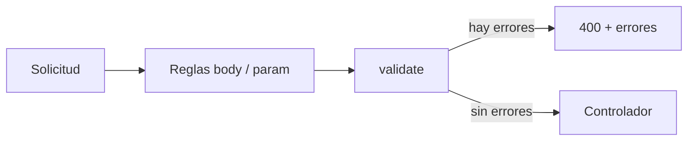

# Módulo 05 — Express Validator: validar los datos que llegan al servidor

> Material del profesor: `material/Express Validator (1).pdf`, `material/Práctica de Validaciones con Express Validator.pdf`

---

## 1. Conceptos principales

### 1.1 Por qué se validan los datos en el servidor

Los datos que llegan al servidor casi siempre terminan guardados en la base de datos. Por eso hay que tratarlos con cuidado:

- **Integridad de los datos:** precisión, coherencia y confiabilidad de la información. Datos incorrectos o manipulados generan errores, decisiones equivocadas y pérdida de confianza. Se garantiza **validando** las entradas antes de guardarlas.
- **Mantenimiento simplificado:** si las validaciones están repartidas como `if` dentro de cada controlador (como en el módulo 04), el código se repite y es difícil de mantener. **express-validator** las centraliza.

La validación del frontend (un `required` en un formulario) **no alcanza**: cualquiera puede enviar una solicitud directa con Postman salteándose el formulario. El servidor es la **última barrera** antes de la base de datos.

### 1.2 express-validator usa middlewares

Recordatorio del módulo 04: un **middleware** es una función `(req, res, next)` que se ejecuta antes del controlador. Se usa para validar datos, verificar autenticación, comprobar permisos o manejar errores. `next()` pasa al siguiente middleware o al controlador.

**express-validator** es una librería de validación para Express: cada regla es un middleware que se coloca **en la ruta**, antes del controlador.

**Ventajas:** seguridad (previene datos maliciosos), integridad de los datos, mejores mensajes de error para el usuario, mantenimiento simplificado, facilidad de uso y prevención de errores inesperados.

```bash
npm install express-validator
```

### 1.3 `body()`: validar el cuerpo de la solicitud

`body('campo')` valida un campo de `req.body`. Las validaciones se **encadenan** y cada una puede tener su mensaje con `.withMessage()`:

```js
import { body } from 'express-validator';

app.post(
  '/users',
  body('email')
    .notEmpty().withMessage('Email is required')
    .isEmail().withMessage('Email must be valid'),
  controller
);
```

Para validar **parámetros de la ruta** (`req.params`) se usa `param()` con la misma sintaxis:

```js
import { param } from 'express-validator';

param('id').isInt({ min: 1 }).withMessage('El id debe ser un entero positivo');
```

**Validadores que vas a usar en los trabajos prácticos:**

| Validador | Qué verifica |
|---|---|
| `notEmpty()` | Que no esté vacío. |
| `isLength({ min, max })` | Cantidad de caracteres. |
| `isEmail()` | Formato de email. |
| `isInt({ min })` | Número entero (con mínimo opcional). |
| `isAlphanumeric()` | Solo letras y números. |
| `isAlpha('es-ES')` | Solo letras (incluye tildes y ñ). |
| `isURL()` | Formato de URL. |
| `isIn(['user', 'admin'])` | Que sea uno de los valores permitidos. |
| `matches(/regex/)` | Que cumpla una expresión regular. |
| `custom(fn)` | Una regla propia (sección 1.7). |

### 1.4 `validationResult()` y el middleware `validate`

**Las reglas no cortan la solicitud por sí solas**: solo registran los errores dentro de `req`. Para leerlos se usa `validationResult(req)`. Como esa lógica se repetiría en todos los controladores, se escribe **una vez** en un middleware propio:

```js
// src/middlewares/validate.middleware.js
import { validationResult } from 'express-validator';

export const validate = (req, res, next) => {
  const errors = validationResult(req);

  if (!errors.isEmpty()) {
    return res.status(400).json(errors);
  }

  next();
};
```

Si hay errores, la respuesta es:

```json
{
  "errors": [
    { "type": "field", "msg": "Email is required", "path": "email", "location": "body" }
  ]
}
```

Orden en la ruta: **reglas → `validate` → controlador**.



### 1.5 Organizar las validaciones en arrays

Escribir todas las reglas dentro de la ruta la vuelve ilegible. Se extraen a un **array** en otro archivo:

```js
// src/middlewares/validations/user.validations.js
import { body } from 'express-validator';

export const createUserValidations = [
  body('email')
    .notEmpty().withMessage('Email is required')
    .isEmail().withMessage('Email must be valid'),
  body('password')
    .notEmpty().withMessage('Password is required')
    .isLength({ min: 8 }).withMessage('Password must be at least 8 characters'),
];
```

```js
// src/routes/user.routes.js
userRoutes.post('/users', createUserValidations, validate, createUser);
```

Existe una segunda forma, `checkSchema`, que define las reglas como un objeto:

```js
import { checkSchema } from 'express-validator';

export const createUserSchema = checkSchema({
  email: {
    notEmpty: { errorMessage: 'Email is required' },
    isEmail: { errorMessage: 'Email must be valid' },
  },
});
```

Ambas funcionan igual. Se **recomienda el array**, porque el autocompletado de VS Code funciona mejor con las funciones encadenadas.

### 1.6 `matchedData()`: solo los datos validados

`matchedData(req)` devuelve **únicamente** los campos que pasaron por alguna regla, y descarta todo lo demás.

```js
// El usuario envía:
{ "email": "user@example.com", "password": "mypassword123", "maliciousField": "hack attempt" }

// Con reglas solo para email y password:
matchedData(req); // { email: 'user@example.com', password: 'mypassword123' }
```

- **Seguridad:** datos no validados no llegan a la lógica ni a la base de datos.
- **Limpieza y consistencia:** la estructura de los datos es predecible.

```js
export const createUser = async (req, res) => {
  try {
    const data = matchedData(req);           // en lugar de req.body
    const user = await UserModel.create(data);
    return res.status(201).json({ message: 'Usuario creado', user });
  } catch (error) {
    console.error(error);
    return res.status(500).json({ message: 'Error interno del servidor' });
  }
};
```

`matchedData(req, { locations: ['body'] })` devuelve solo los datos del body (sin los de `param`).

### 1.7 Validaciones personalizadas con `.custom()`

Cuando ninguna validación predefinida alcanza:

- Recibe `(valor, { req })`.
- Si es válido: `return true`.
- Si no es válido: `throw new Error('mensaje')` (o `return Promise.reject('mensaje')`).

```js
// Unicidad: consultar la base de datos (async)
body('email').custom(async (email) => {
  const existingUser = await UserModel.findOne({ where: { email } });
  if (existingUser) {
    throw new Error('Email already in use');
  }
  return true;
});

// Existencia: el id de la ruta debe existir
param('id')
  .isInt({ min: 1 }).withMessage('El id debe ser un entero positivo')
  .custom(async (id) => {
    const user = await UserModel.findByPk(id);
    if (!user) {
      throw new Error('El usuario no existe');
    }
    return true;
  });

// Regla del negocio que usa otro campo de la solicitud
body('confirmPassword').custom((value, { req }) => {
  if (value !== req.body.password) {
    throw new Error('Las contraseñas no coinciden');
  }
  return true;
});
```

### 1.8 Otras formas de leer los errores

```js
const result = validationResult(req);

result.array();   // [{ type, msg, path, location }, ...]
result.mapped();  // { email: { msg, ... }, password: { msg, ... } }
result.formatWith((err) => `${err.path}: ${err.msg}`).array();
```

### 1.9 Errores comunes

| Error | Causa | Solución |
|---|---|---|
| Las validaciones "no hacen nada" | Falta `validate` en la ruta. | Ruta: `reglas, validate, controlador`. |
| Un `custom` nunca falla | Usa `return false` en lugar de lanzar un error. | `throw new Error('...')`. |
| Un `custom` async siempre pasa | Falta `await` en la consulta. | `await Model.findOne(...)`. |
| Se guardan campos que no se validaron | El controlador usa `req.body`. | Usar `matchedData(req)`. |
| Error `500` al validar | El modelo usado en el `custom` no está importado. | Importar el modelo en el archivo de validaciones. |

### 1.10 Dónde vas a usar esto en los trabajos prácticos

- `src/middlewares/validate.middleware.js`: el middleware que revisa los errores.
- `src/middlewares/validations/*.validations.js`: un archivo de reglas por recurso.
- Rutas: `router.post('/api/tags', createTagValidations, validate, createTag)`.
- Controladores: `matchedData(req)` en lugar de `req.body`.
- Reglas mínimas: **IDs** enteros positivos que existan, campos **obligatorios**, campos **únicos** y al menos una validación **custom** por modelo.

---

## 2. Ejercicio fácil — "Formulario de contacto validado"

**Qué vas a practicar:** `body()`, validaciones encadenadas con mensajes, el middleware `validate` y `matchedData()`. **Sin base de datos.**

**En el proyecto real:** son los archivos `validate.middleware.js` y `validations/*.validations.js` del TP.

### Consigna

1. Proyecto Express (`"type": "module"`) con `express` y `express-validator`.
2. `src/middlewares/validate.middleware.js` con el middleware de la teoría.
3. `src/middlewares/validations/contacto.validations.js` con el array `contactoValidations`:

| Campo | Reglas | Mensajes |
|---|---|---|
| `nombre` | Obligatorio, entre 2 y 50 caracteres. | `El nombre es obligatorio` / `El nombre debe tener entre 2 y 50 caracteres` |
| `email` | Obligatorio, email válido. | `El email es obligatorio` / `El email no es válido` |
| `mensaje` | Obligatorio, mínimo 10 caracteres. | `El mensaje es obligatorio` / `El mensaje debe tener al menos 10 caracteres` |

4. Ruta `POST /api/contactos` → `contactoValidations, validate, controlador`.
5. El controlador guarda `matchedData(req)` en un arreglo en memoria y responde `201` con `{ message: 'Mensaje recibido', data }`.
6. `GET /api/contactos` devuelve los mensajes guardados.

### Cómo probarlo

| # | Body enviado a `POST /api/contactos` | Status | Verificar |
|---|---|---|---|
| 1 | Los 3 campos válidos | `201` | |
| 2 | `{}` | `400` | Hay errores para los 3 campos (`path`: `nombre`, `email` y `mensaje`). Un mismo campo puede aparecer más de una vez: una por cada regla que no cumplió. |
| 3 | `nombre: "A"` (resto válido) | `400` | Error de longitud en `nombre` |
| 4 | `email: "no-es-email"` (resto válido) | `400` | |
| 5 | `mensaje: "corto"` (resto válido) | `400` | |
| 6 | Los 3 campos válidos + `"admin": true` | `201` | `data` **no** incluye `admin` |
| 7 | `GET /api/contactos` | `200` | Solo los mensajes válidos |

---

## 3. Ejercicio medio — "Validaciones con la base de datos"

**Qué vas a practicar:** `param()`, validaciones `custom` asíncronas de **existencia** y **unicidad**, y quitar las validaciones manuales de los controladores.

**En el proyecto real:** es lo que pide la práctica de validaciones y el TP: *"Validar IDs recibidas tanto en el body como por params (como mínimo que sean enteros y existan en la BD)"*.

### Punto de partida

El **ejercicio difícil del módulo 04** (películas y directores con Sequelize).

### Consigna

1. Instalá `express-validator` y creá `src/middlewares/validate.middleware.js`.
2. Creá `src/middlewares/validations/pelicula.validations.js`:

**`peliculaIdValidations`** (para `GET`, `PUT` y `DELETE` con `:id`):
- `param('id')`: entero positivo + `custom` que verifique que la película **exista**.

**`createPeliculaValidations`:**

| Campo | Reglas |
|---|---|
| `titulo` | Obligatorio, entre 1 y 150 caracteres, `custom`: **no puede existir** otra película con ese título. |
| `anio` | Obligatorio, entero, `custom`: entre 1888 y el año actual. |
| `director_id` | Obligatorio, entero positivo, `custom`: el director **debe existir**. |

3. Creá `src/middlewares/validations/director.validations.js` con `createDirectorValidations`: `nombre` obligatorio, 2-100 caracteres, único.
4. Aplicá los arrays en las rutas (`reglas, validate, controlador`).
5. **Borrá** de los controladores todas las validaciones manuales (campos vacíos, existencia, unicidad). Los controladores quedan así: `matchedData` → operación → respuesta, dentro de `try/catch`.

### Cómo probarlo

| # | Petición | Status | Verificar |
|---|---|---|---|
| 1 | `GET /api/peliculas/abc` | `400` | Error en `id` |
| 2 | `GET /api/peliculas/999` | `400` | `La película no existe` |
| 3 | `POST /api/peliculas` sin `titulo` | `400` | |
| 4 | `POST /api/peliculas` con un título existente | `400` | Mensaje de unicidad |
| 5 | `POST /api/peliculas` con `anio: 1500` | `400` | |
| 6 | `POST /api/peliculas` con `director_id: 99` | `400` | `El director no existe` |
| 7 | `POST /api/peliculas` válido + `"id": 500` | `201` | No se creó con id 500 |
| 8 | `POST /api/directores` con un nombre existente | `400` | |
| 9 | `DELETE /api/peliculas/999` | `400` | |

Revisión de código: ningún controlador tiene `if (!titulo)` ni consultas de unicidad o existencia.

---

## 4. Ejercicio difícil — "Validaciones de usuarios, etiquetas y relaciones"

**Qué vas a practicar:** las reglas exactas que pide el TP Integrador para usuarios y etiquetas, y validar una relación N:M (que los dos ids existan y que la combinación no se repita).

**En el proyecto real:** son `auth.validations.js` (registro), `tags.validations.js` y `article_tag.validations.js` del TP.

### Punto de partida

Los modelos del **ejercicio difícil del módulo 03** (`User`, `Profile`, `Post`, `Tag`, `PostTag`), ahora dentro de un proyecto Express con `src/routes`, `src/controllers` y `src/middlewares`.

### Consigna

Endpoints (los controladores solo crean el registro con `matchedData` y responden `201`):

| Método | Ruta | Qué crea |
|---|---|---|
| `POST` | `/api/users` | Un `User` y su `Profile` con los datos del body. |
| `POST` | `/api/tags` | Un `Tag`. |
| `POST` | `/api/posts` | Un `Post` para un usuario. |
| `POST` | `/api/posts-tags` | Una fila de `PostTag` (asocia una etiqueta a un post). |

**Validaciones:**

| Archivo | Campo | Reglas |
|---|---|---|
| `user.validations.js` | `username` | Obligatorio, 3-20 caracteres, alfanumérico, **único**. |
| | `email` | Obligatorio, formato válido, **único**. |
| | `password` | Mínimo 8 caracteres, al menos **una mayúscula, una minúscula y un número** (`matches`). |
| | `role` | Solo `user` o `admin` (`isIn`). |
| | `first_name`, `last_name` | 2-50 caracteres, solo letras (`isAlpha('es-ES')`). |
| `tag.validations.js` | `name` | Obligatorio, 2-30 caracteres, **sin espacios** (`custom` o `matches`), **único**. |
| `post.validations.js` | `title` | Obligatorio, 3-200 caracteres. |
| | `content` | Obligatorio, mínimo 50 caracteres. |
| | `user_id` | Entero positivo que **exista**. |
| `postTag.validations.js` | `post_id` | Entero positivo que **exista**. |
| | `tag_id` | Entero positivo que **exista**, y `custom`: esa etiqueta **no puede estar ya asociada** a ese post (usá `req.body.post_id` dentro del `custom`). |

> En este ejercicio la contraseña se guarda tal como llega: en el módulo 07 vas a agregar el **hash con bcrypt**. Acá solo importa validarla.

### Pistas

- Contraseña con mayúscula, minúscula y número: `.matches(/^(?=.*[a-z])(?=.*[A-Z])(?=.*\d)/)`.
- Sin espacios: `.matches(/^\S+$/)`.
- Para crear usuario y perfil con un solo body: `const { username, email, password, role, ...profileData } = matchedData(req);`.

### Cómo probarlo

| # | Petición | Status | `path` del error |
|---|---|---|---|
| 1 | `POST /api/users` válido | `201` | — |
| 2 | Mismo `username` | `400` | `username` |
| 3 | `username: "ana perez"` | `400` | `username` (no es alfanumérico) |
| 4 | `password: "abcdefgh"` | `400` | `password` |
| 5 | `role: "superadmin"` | `400` | `role` |
| 6 | `first_name: "Ana3"` | `400` | `first_name` |
| 7 | `POST /api/tags` `{ "name": "node js" }` | `400` | `name` (tiene espacio) |
| 8 | `POST /api/tags` `{ "name": "node" }` dos veces | `201` / `400` | `name` en el segundo |
| 9 | `POST /api/posts` con `content` de 20 caracteres | `400` | `content` |
| 10 | `POST /api/posts` con `user_id: 99` | `400` | `user_id` |
| 11 | `POST /api/posts-tags` `{ "post_id": 1, "tag_id": 1 }` | `201` | — |
| 12 | Repetir la petición 11 | `400` | `tag_id` |
| 13 | `POST /api/posts-tags` con `tag_id: 99` | `400` | `tag_id` |
