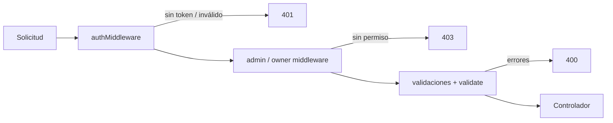

# Módulo 07 — Autenticación y autorización con JWT, cookies y bcrypt

> Material del profesor: `material/Autenticación y autorización de usuarios con JWT, sesiones y cookies (1).pdf`

---

## 1. Conceptos principales

### 1.1 Autenticación y autorización

| | **Autenticación** | **Autorización** |
|---|---|---|
| Definición | Verificar la **identidad** del usuario: que sea quien dice ser. | Determinar **qué recursos o acciones** puede usar un usuario ya autenticado. |
| Pregunta | **¿Quién sos?** | **¿Qué podés hacer?** |
| Cómo | El usuario presenta credenciales (usuario y contraseña) y el sistema las compara con lo guardado. | Según su **rol** (`admin` / `user`) o si es **dueño** del recurso. |
| Si falla | `401 Unauthorized` | `403 Forbidden` |

Métodos comunes de autenticación: usuario/contraseña, tokens, certificados digitales, biometría, autenticación de dos factores (2FA).

### 1.2 El problema: el servidor no recuerda

HTTP **no guarda estado**: cada solicitud llega sola, sin memoria de las anteriores. Después de un login correcto, la siguiente solicitud no dice quién es el usuario. Hace falta que el cliente envíe una **prueba de identidad** en cada solicitud, sin mandar la contraseña de nuevo.

- **Sesiones:** el servidor guarda la sesión y le da al cliente un identificador.
- **JWT (lo que se usa en el curso):** el servidor le da al cliente un **token firmado** con sus datos. El servidor no guarda nada: solo verifica la firma en cada solicitud.

El token se guarda en una **cookie**.

### 1.3 Cookies

Las **cookies** son pequeños archivos de texto que el **servidor envía al navegador**, que este **almacena y reenvía automáticamente** en las solicitudes siguientes.

| Atributo | Qué hace | Protege contra |
|---|---|---|
| `httpOnly: true` | JavaScript del navegador **no puede leerla**. | **XSS** (robo del token con un script). |
| `secure: true` | Solo se envía por **HTTPS**. (`false` en desarrollo local.) | Intercepción. |
| `sameSite: 'strict'` | Controla cuándo se envía en solicitudes desde otros sitios. | **CSRF**. |
| `maxAge` / `expires` | Cuándo expira (en milisegundos). | Sesiones eternas. |

### 1.4 JWT (JSON Web Token)

**JWT** es un estándar (RFC 7519) para transmitir información como un objeto JSON **firmado digitalmente**: la información se puede verificar y confiar porque está firmada.

Tiene **tres partes** codificadas en Base64 y separadas por puntos:

```
eyJhbGciOiJIUzI1NiJ9 . eyJpZCI6Mywicm9sZSI6InVzZXIifQ . Xf3k9a...
└───── HEADER ─────┘   └─────────── PAYLOAD ─────────┘   └ FIRMA ┘
```

| Parte | Contenido |
|---|---|
| **Header** | El algoritmo de firma. |
| **Payload** | Los datos del usuario (`id`, `username`, `role`) y la expiración. |
| **Firma** | Se calcula con el header, el payload y la clave secreta `JWT_SECRET`. |

> El payload está **codificado, no cifrado**: cualquiera puede leerlo. La firma **no oculta** los datos: garantiza que **nadie los modificó**. Si alguien cambia `"role":"user"` por `"role":"admin"`, la firma deja de coincidir y el token se rechaza. Por eso **nunca** se guarda la contraseña en el payload.

### 1.5 Contraseñas: hash con bcrypt

**Nunca** se guardan contraseñas en texto plano: si alguien accede a la base de datos, tendría todas las contraseñas.

| | **Hasheo** | **Encriptación** | **Codificación** |
|---|---|---|---|
| Dirección | **Unidireccional**: no se puede obtener el original. | Bidireccional, con clave. | Bidireccional, **sin** clave. |
| Uso | **Contraseñas**. | Datos que se necesita recuperar. | Transmitir datos en un formato estándar. |
| Ejemplos | bcrypt, SHA-256, Argon2 | AES, RSA | Base64, UTF-8 |

**bcrypt** es un algoritmo de hash pensado para contraseñas:
- Agrega un **salt** automático: la misma contraseña genera hashes distintos (evita ataques con *rainbow tables*).
- Es **lento a propósito** (dificulta la fuerza bruta).
- Su costo se ajusta con `saltRounds`: **entre 10 y 12** es lo recomendado.

`bcrypt` (en C++, más rápido) y `bcryptjs` (JavaScript puro, más fácil de instalar) tienen las mismas funciones. El TP Integrador pide `bcrypt`.

### 1.6 Instalación y variables de entorno

```bash
npm install jsonwebtoken cookie-parser bcrypt
```

```env
JWT_SECRET=una_clave_larga_y_dificil_de_adivinar
```

### 1.7 Helpers: `src/helpers/`

```js
// src/helpers/bcrypt.helper.js
import bcrypt from 'bcrypt';

export const hashPassword = async (password) => {
  const saltRounds = 10;
  return await bcrypt.hash(password, saltRounds);
};

export const comparePassword = async (password, hashedPassword) => {
  return await bcrypt.compare(password, hashedPassword);
};
```

```js
// src/helpers/jwt.helper.js
import jwt from 'jsonwebtoken';

export const generateToken = (payload) => {
  try {
    return jwt.sign(payload, process.env.JWT_SECRET, { expiresIn: '1h' });
  } catch (error) {
    throw new Error('Error generando el token: ' + error.message);
  }
};

export const verifyToken = (token) => {
  try {
    return jwt.verify(token, process.env.JWT_SECRET);
  } catch (error) {
    throw new Error('Error verificando el token: ' + error.message);
  }
};
```

- `generateToken()`: crea un JWT firmado con los datos del usuario.
- `verifyToken()`: verifica la firma y la expiración, y devuelve el payload. Si el token es inválido o expiró, lanza un error.

### 1.8 Configuración del servidor

```js
// app.js
import express from 'express';
import cors from 'cors';
import cookieParser from 'cookie-parser';

const app = express();

app.use(express.json());
app.use(cors({
  origin: 'http://localhost:5173',  // el frontend
  credentials: true,                // CRUCIAL: permite las cookies
}));
app.use(cookieParser());            // NECESARIO: crea req.cookies
```

### 1.9 Registro y login

```js
// src/controllers/auth.controllers.js
export const register = async (req, res) => {
  try {
    const { username, email, password, ...profileData } = matchedData(req);

    const hashedPassword = await hashPassword(password); // 1. hashear ANTES de guardar

    const user = await UserModel.create({ username, email, password: hashedPassword });
    await ProfileModel.create({ ...profileData, user_id: user.id });

    return res.status(201).json({ message: 'Usuario registrado exitosamente' });
  } catch (error) {
    console.error(error);
    return res.status(500).json({ message: 'Error al registrar usuario' });
  }
};

export const login = async (req, res) => {
  try {
    const { username, password } = matchedData(req);

    const user = await UserModel.findOne({ where: { username } }); // buscar SOLO por username
    if (!user) {
      return res.status(401).json({ message: 'Credenciales inválidas' });
    }

    const validPassword = await comparePassword(password, user.password);
    if (!validPassword) {
      return res.status(401).json({ message: 'Credenciales inválidas' });
    }

    const token = generateToken({ id: user.id, username: user.username, role: user.role });

    res.cookie('token', token, {
      httpOnly: true,
      maxAge: 1000 * 60 * 60, // 1 hora
    });

    return res.status(200).json({ message: 'Login exitoso' });
  } catch (error) {
    console.error(error);
    return res.status(500).json({ message: 'Error interno del servidor' });
  }
};
```

El mensaje es el **mismo** (`Credenciales inválidas`) si falla el usuario o la contraseña: así no se revela qué usuarios existen.

### 1.10 Middleware de autenticación y rutas protegidas

```js
// src/middlewares/auth.middleware.js
import { verifyToken } from '../helpers/jwt.helper.js';

export const authMiddleware = (req, res, next) => {
  try {
    const token = req.cookies.token;

    if (!token) {
      return res.status(401).json({ message: 'No autenticado' });
    }

    const decoded = verifyToken(token);
    req.user = decoded;   // { id, username, role, iat, exp }
    next();
  } catch (error) {
    return res.status(401).json({ message: 'Token inválido o expirado' });
  }
};
```

> En el material del profesor, el `catch` de este middleware responde `500`. Como un token inválido o vencido es **falta de autenticación**, acá se responde `401`, que es el código que el TP pide para ese caso.

```js
// src/routes/auth.routes.js
authRoutes.post('/auth/register', registerValidations, validate, register); // pública
authRoutes.post('/auth/login', loginValidations, validate, login);          // pública
authRoutes.get('/auth/profile', authMiddleware, profile);                   // protegida
authRoutes.post('/auth/logout', authMiddleware, logout);                    // protegida
```

```js
export const profile = (req, res) => {
  return res.status(200).json({ user: { id: req.user.id, username: req.user.username } });
};

export const logout = (req, res) => {
  res.clearCookie('token');  // elimina la cookie del navegador
  return res.status(200).json({ message: 'Logout exitoso' });
};
```

### 1.11 Middlewares de autorización

Una vez que `authMiddleware` cargó `req.user`, la **autorización** decide si puede seguir:

```js
// src/middlewares/admin.middleware.js
export const adminMiddleware = (req, res, next) => {
  if (req.user.role !== 'admin') {
    return res.status(403).json({ message: 'Se necesitan permisos de administrador' });
  }
  next();
};
```

```js
// src/middlewares/owner.middleware.js
import { ArticleModel } from '../models/index.js';

export const ownerMiddleware = async (req, res, next) => {
  try {
    const article = await ArticleModel.findByPk(req.params.id);

    if (!article) {
      return res.status(404).json({ message: 'Artículo no encontrado' });
    }

    if (article.user_id !== req.user.id && req.user.role !== 'admin') {
      return res.status(403).json({ message: 'No es el autor de este artículo' });
    }

    next();
  } catch (error) {
    console.error(error);
    return res.status(500).json({ message: 'Error interno del servidor' });
  }
};
```

**Orden en las rutas:** primero se identifica, después se autoriza, después se valida:

```js
router.get('/users', authMiddleware, adminMiddleware, getAllUsers);
router.put('/articles/:id', authMiddleware, ownerMiddleware, updateArticleValidations, validate, updateArticle);
```



**La identidad sale siempre de `req.user`**, nunca de un `user_id` enviado en el body: el cliente podría enviar el id de otra persona.

```js
export const createArticle = async (req, res) => {
  try {
    const data = matchedData(req);
    const article = await ArticleModel.create({ ...data, user_id: req.user.id });
    return res.status(201).json({ message: 'Artículo creado', article });
  } catch (error) {
    console.error(error);
    return res.status(500).json({ message: 'Error interno del servidor' });
  }
};
```

### 1.12 Frontend: enviar la cookie con `fetch`

Si un frontend consume la API, cada `fetch` debe incluir `credentials: 'include'` para recibir y enviar la cookie:

```js
await fetch('http://localhost:3000/api/auth/login', {
  method: 'POST',
  headers: { 'Content-Type': 'application/json' },
  credentials: 'include',
  body: JSON.stringify({ username, password }),
});
```

Del lado del servidor, `cors` debe tener `credentials: true` y el `origin` exacto del frontend.

### 1.13 Errores comunes

| Error | Causa | Solución |
|---|---|---|
| `npm install bcrypt` falla | `bcrypt` es nativo (C++) y a veces no compila en Windows. | Instalar `bcryptjs` e importar `bcryptjs`: las funciones son las mismas. |
| `req.cookies` es `undefined` | Falta `app.use(cookieParser())`. | Registrarlo antes de las rutas. |
| `secretOrPrivateKey must have a value` | `JWT_SECRET` no está en el `.env` o no se cargó `dotenv`. | Revisar el `.env` y `import 'dotenv/config'`. |
| El login siempre da `401` con la contraseña correcta | Se compara el texto con el hash usando `===`. | `comparePassword(password, user.password)`. |
| En la base de datos se ve la contraseña | No se hasheó antes de `create`. | `hashPassword` en el registro (y en el `PUT` si cambia). |
| `Cannot read properties of undefined (reading 'role')` en `adminMiddleware` | Se puso antes de `authMiddleware`. | Primero `authMiddleware`, después `adminMiddleware`. |
| Un usuario modifica artículos ajenos | Falta `ownerMiddleware` o se usa `req.body.user_id`. | `ownerMiddleware` + `req.user.id`. |
| Las respuestas muestran `password` | No se excluyó en la consulta. | `attributes: { exclude: ['password'] }`. |
| El navegador no guarda la cookie | Falta `credentials: 'include'` o `credentials: true` en `cors`. | Configurar ambos lados. |

### 1.14 Dónde vas a usar esto en los trabajos prácticos

- `src/helpers/jwt.helper.js` y `src/helpers/bcrypt.helper.js`.
- `src/middlewares/auth.middleware.js`, `admin.middleware.js` y `owner.middleware.js`.
- `POST /api/auth/register`, `POST /api/auth/login`, `GET /api/auth/profile`, `PUT /api/auth/profile`, `POST /api/auth/logout`.
- Cada ruta del TP con su nivel de acceso: *usuario autenticado* → `authMiddleware`; *solo admin* → `+ adminMiddleware`; *solo autor o admin* → `+ ownerMiddleware`.

---

## 2. Ejercicio fácil — "Los helpers: bcrypt y JWT"

**Qué vas a practicar:** las funciones de `bcrypt` y `jsonwebtoken` por separado, **sin servidor**, para entender qué hace cada una.

**En el proyecto real:** son los archivos `src/helpers/bcrypt.helper.js` y `src/helpers/jwt.helper.js` del TP.

### Consigna

1. Proyecto con `"type": "module"`, `bcrypt`, `jsonwebtoken` y `dotenv`. En `.env`: `JWT_SECRET` con al menos 32 caracteres.
2. Creá los dos helpers de la teoría en `src/helpers/`.
3. Creá `src/lab.js` y completá cada `TODO`:

```js
import 'dotenv/config';
import { hashPassword, comparePassword } from './helpers/bcrypt.helper.js';
import { generateToken, verifyToken } from './helpers/jwt.helper.js';

// ---------- bcrypt ----------
const hash1 = await hashPassword('Clave1234');
const hash2 = await hashPassword('Clave1234');

console.assert(hash1 !== 'Clave1234', 'El hash no puede ser igual a la contraseña');
// TODO: verificá que hash1 y hash2 sean DISTINTOS (por el salt)
// TODO: verificá que comparePassword('Clave1234', hash1) sea true
// TODO: verificá que comparePassword('otraClave', hash1) sea false

// ---------- JWT ----------
const token = generateToken({ id: 7, username: 'ana', role: 'user' });

console.assert(token.split('.').length === 3, 'El token debe tener 3 partes');
// TODO: verificá que verifyToken(token) devuelva un objeto con id === 7 y role === 'user'

// Token alterado: se cambia el primer carácter de la firma
const [header, payload, firma] = token.split('.');
const alterado = `${header}.${payload}.${firma.startsWith('A') ? 'B' : 'A'}${firma.slice(1)}`;
// TODO: verificá que verifyToken(alterado) LANCE un error (usá try/catch)

console.log('Laboratorio finalizado');
```

4. Al final de `lab.js`, respondé en un comentario: ¿por qué dos hashes de la **misma** contraseña son distintos, pero `comparePassword` igual da `true`?

### Cómo probarlo

`node src/lab.js` → solo debe aparecer `Laboratorio finalizado`. Cualquier `Assertion failed` indica un `TODO` incompleto o incorrecto.

---

## 3. Ejercicio medio — "Registro, login, perfil y logout"

**Qué vas a practicar:** el flujo completo de autenticación: hash al registrar, comparación al iniciar sesión, token en una cookie `httpOnly`, ruta protegida con `authMiddleware` y logout.

**En el proyecto real:** son las 5 rutas de `/api/auth` del TP Integrador.

### Punto de partida

El **ejercicio difícil del módulo 06** (`User`, `Profile`, `Post`, `Tag`, `PostTag`).

### Consigna

1. Instalá `jsonwebtoken`, `cookie-parser` y `bcrypt`. Agregá `JWT_SECRET` al `.env` y `cookieParser()` en `app.js`.
2. Copiá los helpers del ejercicio fácil y creá `src/middlewares/auth.middleware.js`.
3. Creá `src/routes/auth.routes.js` y `src/controllers/auth.controllers.js`:

| Método | Ruta | Acceso | Comportamiento |
|---|---|---|---|
| `POST` | `/api/auth/register` | Público | Valida (reglas del módulo 05), **hashea** la contraseña, crea `User` + `Profile`. `201`. |
| `POST` | `/api/auth/login` | Público | Busca por `username`, compara con `comparePassword`, genera el token con `{ id, username, role }` y lo envía en una cookie `token` con `httpOnly: true`. `200`. Si falla: `401` `Credenciales inválidas`. |
| `GET` | `/api/auth/profile` | Autenticado | Devuelve el perfil del usuario logueado (buscado con `req.user.id`), con los datos del usuario **sin** `password`. |
| `PUT` | `/api/auth/profile` | Autenticado | Actualiza el perfil **propio** (`first_name`, `last_name`, `biography`, opcionales). El id sale de `req.user`, no de la URL. |
| `POST` | `/api/auth/logout` | Autenticado | Borra la cookie con `res.clearCookie('token')`. `200`. |

4. Actualizá `POST /api/users` (del módulo 05) para que también **hashee** la contraseña.

### Cómo probarlo

En **Thunder Client** o **Postman**, las cookies se guardan solas después del login y se envían en las siguientes solicitudes al mismo servidor.

| # | Petición | Status | Verificar |
|---|---|---|---|
| 1 | `POST /api/auth/register` válido | `201` | En MySQL, `password` empieza con `$2b$` |
| 2 | Registrar otro usuario con la **misma** contraseña | `201` | En MySQL los dos hashes son **distintos** |
| 3 | `GET /api/auth/profile` sin haber hecho login | `401` | `No autenticado` |
| 4 | `POST /api/auth/login` con contraseña incorrecta | `401` | `Credenciales inválidas` |
| 5 | `POST /api/auth/login` con un usuario inexistente | `401` | **Mismo** mensaje que el #4 |
| 6 | `POST /api/auth/login` correcto | `200` | En la pestaña *Cookies* aparece `token` con `HttpOnly` |
| 7 | `GET /api/auth/profile` | `200` | Sin `password` |
| 8 | `PUT /api/auth/profile` `{ "biography": "Hola" }` | `200` | Se actualizó **el propio** perfil |
| 9 | `POST /api/auth/logout` | `200` | La cookie desaparece |
| 10 | `GET /api/auth/profile` | `401` | |

Con `curl`, guardá y enviá la cookie con un archivo: `-c cookies.txt` al hacer login y `-b cookies.txt` en las siguientes.

---

## 4. Ejercicio difícil — "Autorización: admin, autor y usuario autenticado"

**Qué vas a practicar:** proteger cada ruta según su nivel de acceso con `authMiddleware`, `adminMiddleware` y `ownerMiddleware`, y tomar la identidad siempre de `req.user`.

**En el proyecto real:** es la nota final del punto 6 del TP: *"Los middlewares deben aplicarse en todas las rutas del punto 4 [...] según el nivel de acceso indicado entre paréntesis (solo admin, usuario autenticado, solo autor, solo autor o admin)"*.

### Punto de partida

El **ejercicio medio** de este módulo.

### Consigna

1. Creá `src/middlewares/admin.middleware.js` y `src/middlewares/owner.middleware.js` (este último verifica que el **post** de `req.params.id` sea del usuario logueado, o que sea admin).
2. Aplicá los middlewares según esta tabla:

| Ruta | Nivel de acceso |
|---|---|
| `GET /api/users`, `PUT /api/users/:id`, `DELETE /api/users/:id` | Solo admin |
| `POST /api/tags`, `PUT /api/tags/:id` | Solo admin |
| `GET /api/tags` | Usuario autenticado |
| `POST /api/posts` | Usuario autenticado. El `user_id` es **siempre** `req.user.id` (si viene en el body, se ignora). |
| `GET /api/posts` | Usuario autenticado |
| `PUT /api/posts/:id`, `DELETE /api/posts/:id` | Solo autor o admin |
| `POST /api/posts-tags` | Solo el autor del post indicado en `post_id` |

3. Para `POST /api/posts-tags`, el post viene en el **body** (`post_id`), no en `params`. Resolvelo con una verificación en el controlador (o adaptando el `ownerMiddleware`), respondiendo `403` si el usuario no es el autor.
4. Quitá la regla de `user_id` de las validaciones de `POST /api/posts` (ya no viene del cliente).

### Pistas

- Para crear el primer admin: registrá un usuario y cambiá su `role` a `admin` directamente en MySQL.
- Usá **dos** pestañas o entornos en Thunder Client/Postman (uno logueado como admin y otro como usuario común) para no tener que hacer login a cada rato.

### Cómo probarlo

Usuarios: `admin` (rol admin), `ana` y `beto` (rol user). Ana tiene el post 1.

| # | Sesión | Petición | Status |
|---|---|---|---|
| 1 | Ninguna | `GET /api/tags` | `401` |
| 2 | ana | `GET /api/tags` | `200` |
| 3 | ana | `POST /api/tags` | `403` |
| 4 | admin | `POST /api/tags` | `201` |
| 5 | ana | `GET /api/users` | `403` |
| 6 | admin | `GET /api/users` | `200`, sin `password` |
| 7 | beto | `POST /api/posts` con `"user_id": 1` en el body | `201`, y el post es de **beto** |
| 8 | beto | `PUT /api/posts/1` (de ana) | `403` |
| 9 | ana | `PUT /api/posts/1` | `200` |
| 10 | admin | `PUT /api/posts/1` | `200` |
| 11 | beto | `POST /api/posts-tags` con `post_id: 1` | `403` |
| 12 | ana | `POST /api/posts-tags` con `post_id: 1` | `201` |
| 13 | beto | `DELETE /api/posts/999` | `404` |
| 14 | admin | `DELETE /api/users/<id de beto>` | `200` (eliminación lógica) |
