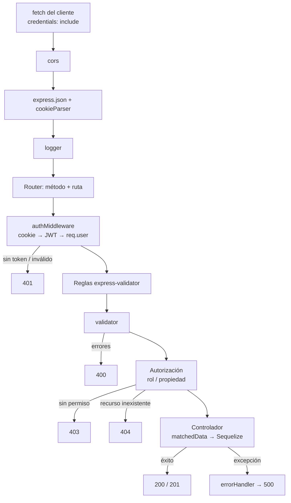
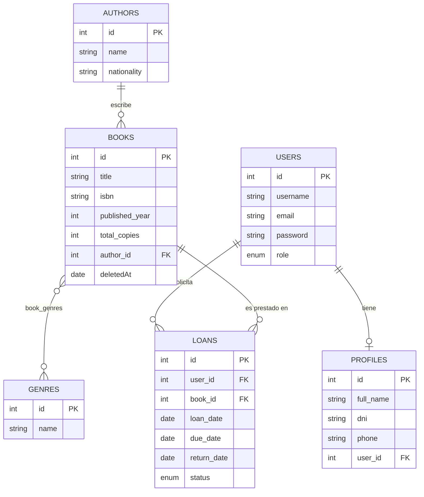
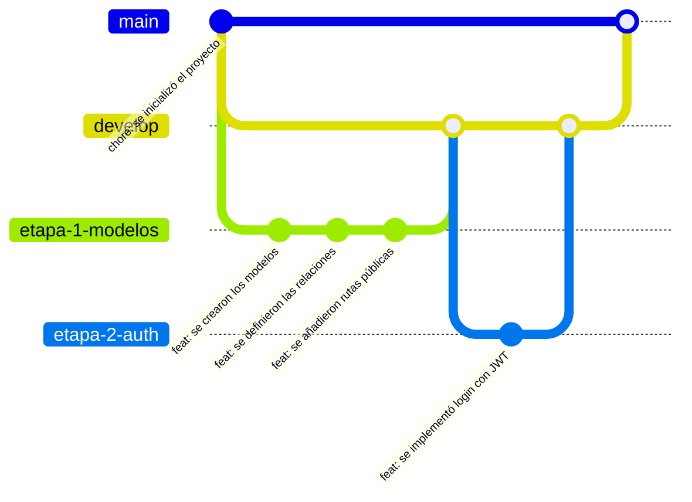

# Módulo 08 — Integrador final: Sistema de Gestión de Biblioteca

---

## 1. Conceptos principales

### 1.1 Mapa de responsabilidades: qué aporta cada tecnología

El integrador combina todo lo visto. La clave para no mezclar conceptos es saber **qué problema resuelve cada pieza** y **en qué capa vive**:

| Tecnología | Problema que resuelve | Capa / ubicación |
|---|---|---|
| **Node.js** | Ejecutar JavaScript en el servidor con I/O no bloqueante. | Runtime de todo el proyecto. |
| **ES Modules** | Organizar el código en módulos con `import`/`export`. | Todos los archivos. |
| **dotenv** | Separar configuración y secretos del código. | `.env` + `src/config/`. |
| **Sequelize** | Persistencia: modelos, relaciones y consultas sobre MySQL. | `src/models/`, `src/config/database.js`. |
| **Express** | Servidor HTTP: rutas, middlewares, `req`/`res`. | `src/app.js`, `src/routes/`, `src/controllers/`. |
| **express-validator** | Integridad de los datos de entrada (validación + sanitización). | `src/middlewares/validations/`, `validator.js`. |
| **paranoid** | Eliminación lógica y restauración. | Opciones de los modelos. |
| **bcryptjs** | Almacenar contraseñas como hash. | `src/helpers/bcrypt.helper.js`. |
| **jsonwebtoken + cookie-parser** | Autenticación stateless en cada petición. | `src/helpers/jwt.helper.js`, `auth.middleware.js`. |
| **Middlewares de autorización** | Decidir **qué** puede hacer el usuario autenticado. | `src/middlewares/authorization.middleware.js`. |
| **cors** | Permitir que el frontend (otro origen) consuma la API con cookies. | `src/app.js`. |
| **HTML / CSS / JS (fetch)** | Interfaz que consume la API (CSR). | `client/`. |

### 1.2 Ciclo de vida de una petición protegida



Cada **rectángulo** es una responsabilidad aislada. Si un bug aparece, el **status code** indica en qué etapa buscar: `401` → autenticación, `400` → validación, `403` → autorización, `404` → existencia, `500` → controlador o base de datos.

### 1.3 Arquitectura del proyecto

```
biblioteca/
├── .env / .env.example / .gitignore
├── package.json                 → "type": "module"
├── client/                      → frontend (CSR)
│   ├── index.html
│   ├── style.css
│   └── js/
│       ├── api.js               → apiFetch centralizado
│       └── app.js
└── src/
    ├── app.js                   → configuración de Express y arranque
    ├── config/database.js
    ├── models/
    │   ├── *.model.js           → modelos sin relaciones
    │   └── index.js             → asociaciones
    ├── routes/
    │   ├── *.routes.js
    │   └── index.js
    ├── controllers/
    ├── services/                → reglas de negocio complejas (préstamos)
    ├── helpers/                 → bcrypt, jwt
    ├── middlewares/
    │   ├── auth.middleware.js
    │   ├── authorization.middleware.js
    │   ├── validator.js
    │   ├── errorHandler.js
    │   └── validations/
    └── seed.js
```

**Controlador vs servicio:** cuando una operación tiene **reglas de negocio** que combinan varias entidades (un préstamo verifica stock, límite de préstamos del socio, estado del libro), esa lógica va a un **servicio** que no conoce `req`/`res`. El controlador solo traduce HTTP ↔ servicio. Así la regla se puede reutilizar y testear sin servidor.

### 1.4 Modelo de datos del dominio



| Relación | Tipo | FK | Alias |
|---|---|---|---|
| User — Profile | 1:1 | `profiles.user_id` | `profile` / `user` |
| Author — Book | 1:N | `books.author_id` | `books` / `author` |
| Book — Genre | N:M | `book_genres.book_id`, `book_genres.genre_id` | `genres` / `books` |
| User — Loan | 1:N | `loans.user_id` | `loans` / `user` |
| Book — Loan | 1:N | `loans.book_id` | `loans` / `book` |

`Loan` es una entidad propia (no una tabla intermedia pura) porque tiene **ciclo de vida**: se crea, vence, se devuelve.

### 1.5 Reglas de negocio del dominio

1. Roles: `member` (socio) y `librarian` (bibliotecario). Solo un `librarian` gestiona libros, autores, géneros y préstamos ajenos.
2. Un libro tiene `total_copies`. Las **copias disponibles** = `total_copies` − préstamos con `status: 'active'`. **No se almacena**: se **calcula** (evita datos inconsistentes).
3. Un socio puede tener **como máximo 3 préstamos activos** y **ninguno vencido** para pedir otro.
4. Un préstamo dura **14 días**. Está **vencido** si `status === 'active'` y `due_date < hoy`.
5. Los libros se eliminan **lógicamente**. No se puede eliminar un libro con préstamos activos.
6. Un socio solo ve **sus** préstamos; un bibliotecario ve todos.

### 1.6 Flujo de trabajo con Git

Siguiendo el esquema de las prácticas de la cátedra:



- Una rama por etapa, creada desde `develop`.
- Mínimo **3 commits** por etapa con prefijo convencional (`feat:`, `fix:`, `docs:`, `chore:`).
- Al terminar cada etapa: merge limpio `etapa → develop` y luego `develop → main`.

### 1.7 Errores de integración más frecuentes

| Síntoma | Causa probable |
|---|---|
| Todo devuelve `401` desde el navegador, pero funciona en Thunder Client | Falta `credentials: 'include'`, CORS mal configurado o `localhost` vs `127.0.0.1`. |
| `SequelizeEagerLoadingError` | Alias del `include` distinto al de `models/index.js`, o se importó el modelo directo del archivo y no desde `index.js`. |
| Un socio puede ver préstamos ajenos | La consulta no filtra por `req.user.id`. |
| El stock queda negativo con dos préstamos simultáneos | La verificación y la creación no están en la misma **transacción**. |
| `password` aparece en algún `include` | Falta `defaultScope` o `attributes` en un nivel anidado. |
| Libro eliminado aparece en préstamos | Correcto: el historial se conserva. Pero en el catálogo **no** debe aparecer. |

---

## 2. Ejercicio fácil — Etapa 1: "Catálogo público"

**Qué vas a practicar:** montar el proyecto completo desde cero con todas las capas, modelos, relaciones (1:1, 1:N, N:M), seed y rutas públicas con validación.

### Consigna

1. Rama `etapa-1-catalogo` desde `develop`.
2. Proyecto con la arquitectura de la sección 1.3 (sin `client/` todavía). Dependencias: `express`, `sequelize`, `mysql2`, `dotenv`, `cors`, `express-validator`.
3. Todos los modelos de la sección 1.4 con sus validaciones de modelo. `Book` con `paranoid: true`. `User.role` como `ENUM('member', 'librarian')`, por defecto `'member'`.
4. Todas las asociaciones en `models/index.js`, en pares, con alias de la tabla 1.4. Índice único compuesto en `book_genres`.
5. `src/seed.js` (con `sync({ force: true })`): 4 autores, 5 géneros, 10 libros (con 1 a 3 géneros cada uno), 1 bibliotecario y 3 socios con perfil. (Por ahora las contraseñas pueden quedar en texto plano: en la etapa 2 el seed las hasheará.)
6. Rutas **públicas**:

| Método | Ruta | Detalle |
|---|---|---|
| `GET` | `/api/books` | Libros con autor (`name`) y géneros (`name`, sin tabla intermedia). Filtros opcionales: `?genre=<nombre>`, `?author=<id>`, `?q=<texto en título>`. |
| `GET` | `/api/books/:id` | Libro con autor y géneros. |
| `GET` | `/api/authors` | Autores con la **cantidad** de libros. |
| `GET` | `/api/authors/:id` | Autor con sus libros (`id`, `title`). |
| `GET` | `/api/genres` | Géneros. |

7. Validaciones: `:id` entero positivo y existente; `author` entero; `q` mínimo 2 caracteres.
8. Middlewares `notFound` y `errorHandler` globales; controladores con `try/catch` que delegan con `next(error)`.

### Cómo probarlo

`node src/seed.js` y luego `npm run dev`.

| # | Petición | Status | Verificar |
|---|---|---|---|
| 1 | `GET /api/books` | `200` | 10 libros con `author` y `genres` |
| 2 | `GET /api/books?genre=fantasía` | `200` | Todos tienen ese género |
| 3 | `GET /api/books?q=a` | `400` | |
| 4 | `GET /api/books/1` | `200` | Sin `BookGenre` en `genres` |
| 5 | `GET /api/books/999` | `400` o `404` (según tu convención) | |
| 6 | `GET /api/authors` | `200` | Cada autor con su cantidad de libros |
| 7 | `GET /api/authors/1` | `200` | Lista de libros del autor |
| 8 | `GET /api/xyz` | `404` | |

Cerrá la etapa: 3+ commits, merge a `develop` y a `main`.

---

## 3. Ejercicio medio — Etapa 2: "Autenticación y gestión del catálogo"

**Qué vas a practicar:** registro/login con bcrypt y JWT en cookie, autorización por rol, CRUD protegido con validaciones de creación y actualización, y eliminación lógica.

### Consigna

1. Rama `etapa-2-auth` desde `develop`.
2. El seed ahora **hashea** las contraseñas.
3. **Autenticación:**

| Método | Ruta | Detalle |
|---|---|---|
| `POST` | `/api/auth/register` | Crea `User` + `Profile` (`full_name`, `dni` de 8 dígitos único, `phone` opcional) en una **transacción**. Siempre rol `member`. |
| `POST` | `/api/auth/login` | Cookie `httpOnly` con JWT `{ id, role }`. |
| `POST` | `/api/auth/logout` | Borra la cookie. |
| `GET` | `/api/auth/me` | Usuario con perfil, sin hash. |

4. **Gestión del catálogo** (solo `librarian`):

| Método | Ruta | Validaciones clave |
|---|---|---|
| `POST` | `/api/books` | `title`, `isbn` único (incluyendo eliminados), `published_year` ≤ año actual, `total_copies` ≥ 1, `author_id` existente, `genre_ids` array no vacío, sin repetidos, todos existentes. |
| `PUT` | `/api/books/:id` | Todo opcional + `matchedData`. `isbn` único excluyendo el propio. Si viene `genre_ids`, reemplaza los géneros (`setGenres`). |
| `DELETE` | `/api/books/:id` | Eliminación lógica. |
| `GET` | `/api/books/deleted` | Libros eliminados. |
| `PATCH` | `/api/books/:id/restore` | Restaura. |
| `POST` / `PUT` / `DELETE` | `/api/authors`, `/api/authors/:id` | No se puede eliminar un autor con libros (`400` con mensaje claro). |
| `POST` | `/api/genres` | Nombre único, guardado en minúsculas. |

5. Formato de errores de validación uniforme: `{ message, errors: { campo: mensaje } }`.

### Cómo probarlo

| # | Prueba | Status |
|---|---|---|
| 1 | `POST /api/books` sin cookie | `401` |
| 2 | `POST /api/books` con cookie de `member` | `403` |
| 3 | `POST /api/books` como `librarian` con `genre_ids: [1, 1]` | `400` |
| 4 | `POST /api/books` como `librarian` válido | `201` |
| 5 | `PUT /api/books/:id` con solo `{ "total_copies": 5 }` | `200`, lo demás intacto |
| 6 | `PUT /api/books/:id` con `genre_ids: [2]` | `200`, ahora tiene un solo género |
| 7 | `DELETE /api/books/:id` y `GET /api/books` | `200` / no aparece |
| 8 | `POST /api/books` con el ISBN del libro eliminado | `400` |
| 9 | `PATCH /api/books/:id/restore` | `200` y vuelve al catálogo |
| 10 | `DELETE /api/authors/1` (tiene libros) | `400` |
| 11 | `POST /api/auth/register` con `dni` repetido | `400` y **no** se creó el `User` (transacción) |
| 12 | `GET /api/auth/me` | `200`, con `profile`, sin `password` |

Cerrá la etapa: 3+ commits, merge a `develop` y a `main`.

---

## 4. Ejercicio difícil — Etapa 3: "Préstamos, reportes y cliente web"

**Qué vas a practicar:** reglas de negocio reales en una capa de servicios, transacciones, autorización por propiedad, valores calculados, reportes con agregación y un frontend completo que consume la API con cookies.

### Consigna — Préstamos (`src/services/loan.service.js`)

1. Rama `etapa-3-prestamos` desde `develop`.
2. Modelo `Loan`: `loan_date` (hoy), `due_date` (hoy + 14 días), `return_date` (null), `status` (`ENUM('active', 'returned')`).
3. Endpoints:

| Método | Ruta | Quién | Regla |
|---|---|---|---|
| `POST` | `/api/loans` | `member` (para sí mismo) o `librarian` (indicando `user_id`) | Ver reglas abajo. `201`. |
| `GET` | `/api/loans` | `member`: solo los suyos. `librarian`: todos, con filtros `?status=active\|returned\|overdue` y `?user_id=`. | Cada préstamo incluye libro (`title`), socio (`username`) y un campo calculado `is_overdue`. |
| `PATCH` | `/api/loans/:id/return` | `librarian` | Marca `returned` con `return_date` = hoy. `400` si ya estaba devuelto. |
| `GET` | `/api/books/:id/availability` | Público | `{ total_copies, active_loans, available }` |

**Reglas de `createLoan` (todas dentro de una transacción):**
- El libro existe y **no está eliminado**.
- Hay al menos **una copia disponible** (calculada).
- El socio tiene **menos de 3** préstamos activos.
- El socio **no tiene** préstamos vencidos.
- El socio **no tiene ya** un préstamo activo **del mismo libro**.
- Cada regla incumplida lanza un error con mensaje específico; el controlador lo traduce a `400`.

4. Un `member` que envía `user_id` en el body **se ignora**: siempre se usa `req.user.id`.
5. No se puede eliminar un libro con préstamos activos (`400`). Agregá esta regla al `DELETE /api/books/:id` de la etapa 2.

### Consigna — Reportes (solo `librarian`)

| Ruta | Respuesta |
|---|---|
| `GET /api/reports/top-books?limit=5` | Libros más prestados de la historia: `[{ id, title, author, total_loans }]`, ordenados desc. |
| `GET /api/reports/overdue` | Préstamos vencidos con socio (`username`, `full_name`, `phone`), libro y **días de atraso**. |
| `GET /api/reports/members/:id` | Resumen de un socio: total de préstamos, activos, vencidos, devueltos fuera de término. |

### Consigna — Cliente web (`client/`)

1. **Catálogo** público con buscador (`q`) y filtro por género; cada libro muestra disponibilidad.
2. **Login / registro / logout**.
3. **Socio:** botón **Pedir prestado** (solo si hay disponibilidad); sección **Mis préstamos** con los vencidos resaltados en rojo.
4. **Bibliotecario:** panel con préstamos activos y botón **Registrar devolución**; listado de vencidos; top 5 de libros.
5. Todos los errores de la API se muestran en pantalla con su mensaje.
6. `apiFetch` centralizado con `credentials: 'include'`; si recibe `401`, vuelve a la vista de login.
7. HTML semántico y CSS propio responsivo (debe verse bien a 375 px de ancho).

### Desafío extra (opcional)

- **Concurrencia:** simulá dos préstamos simultáneos del último ejemplar (`Promise.all` con dos `fetch`). Si ambos se crean, tu transacción no está bloqueando: investigá `transaction.LOCK.UPDATE` en la consulta del libro.
- **Tests automatizados** con el test runner nativo de Node (`node --test`) para `loan.service.js`.

### Cómo probarlo

Preparación: libro A con `total_copies: 1`, libro B con `total_copies: 5`. Socios `ana` y `beto`. Para simular un vencimiento, modificá a mano el `due_date` de un préstamo en la base de datos.

| # | Prueba | Status / resultado |
|---|---|---|
| 1 | ana pide el libro A | `201` |
| 2 | beto pide el libro A | `400` — sin copias disponibles |
| 3 | `GET /api/books/A/availability` | `{ total_copies: 1, active_loans: 1, available: 0 }` |
| 4 | ana pide el libro A otra vez | `400` — ya lo tiene |
| 5 | ana pide 2 libros más y luego un cuarto | `201`, `201`, `400` — límite de 3 |
| 6 | beto pide el libro B enviando `"user_id": <id de ana>` | `201`, el préstamo es de **beto** |
| 7 | Vencer a mano el préstamo de beto; beto pide otro libro | `400` — tiene préstamos vencidos |
| 8 | `GET /api/loans` como beto | Solo los suyos, uno con `is_overdue: true` |
| 9 | `GET /api/loans?status=overdue` como librarian | Solo vencidos |
| 10 | `PATCH /api/loans/:id/return` como beto | `403` |
| 11 | `PATCH /api/loans/:id/return` como librarian (préstamo del libro A) | `200`; disponibilidad de A vuelve a `1` |
| 12 | Repetir #11 | `400` — ya devuelto |
| 13 | `DELETE /api/books/B` con préstamos activos | `400` |
| 14 | `GET /api/reports/overdue` | El préstamo de beto con días de atraso > 0 |
| 15 | `GET /api/reports/top-books?limit=3` como member | `403` |
| 16 | Flujo completo en el navegador: registrarse → loguearse → pedir libro → ver "Mis préstamos" → logout | Sin errores en consola |
| 17 | Bibliotecario en el navegador registra la devolución | El catálogo actualiza la disponibilidad |

**Criterio de aprobación final:**
- Las 17 pruebas pasan y las de las etapas 1 y 2 siguen pasando (sin regresiones).
- Las reglas de préstamo viven en `loan.service.js`, no en el controlador.
- Ninguna respuesta expone contraseñas ni datos innecesarios.
- Historial de Git con las 3 ramas de etapa, 9+ commits convencionales y `main` sincronizada con `develop`.
