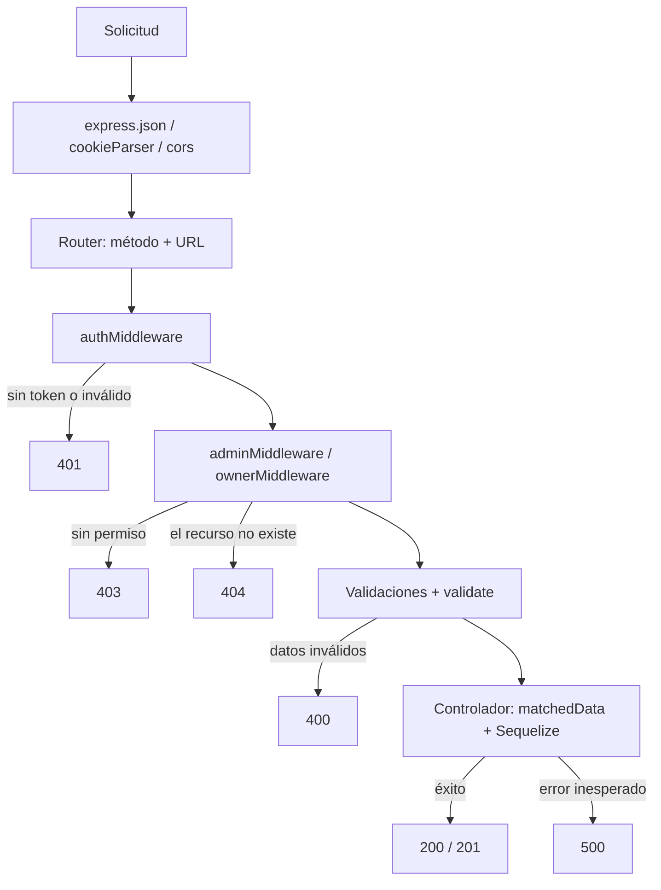
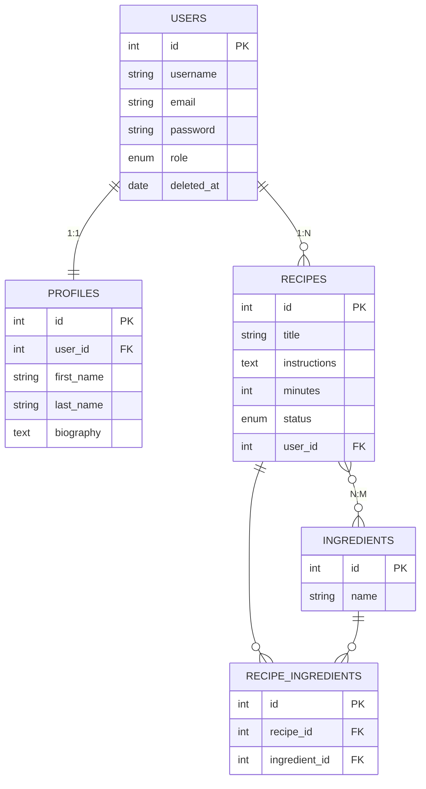
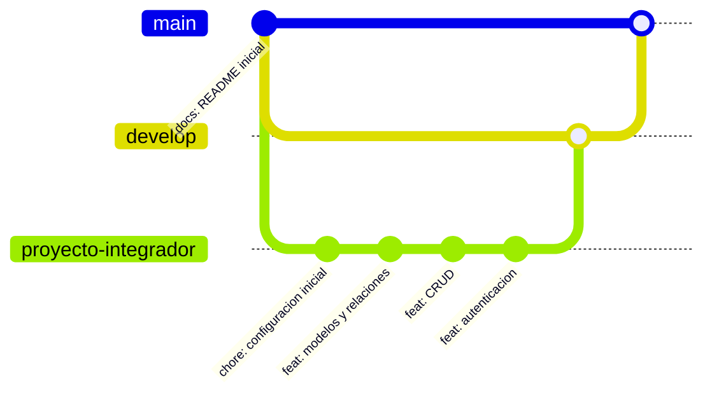

# Módulo 08 — Integrador final: Recetario con autenticación

> Ensayo general del **Trabajo Práctico Integrador I**: mismas tecnologías, misma estructura y mismos niveles de acceso, pero con otro dominio (recetas en lugar de artículos).

---

## 1. Conceptos principales

### 1.1 Qué aporta cada tecnología

| Tecnología | Qué resuelve | Módulo |
|---|---|---|
| **Node.js + npm** | Ejecutar JavaScript en el servidor e instalar dependencias. | 01 |
| **dotenv** | Leer la configuración (`.env`) sin escribirla en el código. | 01 |
| **ES Modules** | Conectar todos los archivos con `import` / `export`. | 02 |
| **Sequelize + mysql2** | Guardar los datos en MySQL: modelos, relaciones, consultas. | 03 |
| **Express** | Servidor: rutas, controladores, `req` / `res`, códigos de estado. | 04 |
| **express-validator** | Validar los datos que llegan antes de usarlos. | 05 |
| **`paranoid` + `optional()`** | Eliminación lógica y rutas de actualización. | 06 |
| **bcrypt** | Guardar las contraseñas como hash. | 07 |
| **jsonwebtoken + cookie-parser** | Saber quién hace cada solicitud (token en una cookie). | 07 |
| **Middlewares de autorización** | Decidir qué puede hacer cada usuario (admin / autor). | 07 |
| **cors** | Permitir que un frontend consuma la API. | 04 / 07 |

En `backend/README.md` está el mapa de **qué carpeta del proyecto corresponde a cada tecnología**.

### 1.2 Recorrido de una solicitud protegida



El **código de estado** indica en qué paso buscar un error: `401` → autenticación, `403` → autorización, `400` → validación, `404` → existencia, `500` → controlador o base de datos.

### 1.3 Estructura del proyecto

```
recetario/
├── .env / .env.example / .gitignore
├── package.json          → "type": "module", script "dev"
├── app.js                → middlewares globales, rutas, conexión y listen
└── src/
    ├── config/database.js
    ├── models/           → un archivo por modelo + index.js con relaciones
    ├── routes/           → un archivo por recurso
    ├── controllers/      → un archivo por recurso
    ├── middlewares/
    │   ├── auth.middleware.js
    │   ├── admin.middleware.js
    │   ├── owner.middleware.js
    │   ├── validate.middleware.js
    │   └── validations/  → un archivo de reglas por recurso
    └── helpers/
        ├── jwt.helper.js
        └── bcrypt.helper.js
```

### 1.4 Modelo de datos



| Relación | Tipo | Alias |
|---|---|---|
| User — Profile | 1:1 | `profile` / `user` |
| User — Recipe | 1:N | `recipes` / `author` |
| Recipe — Ingredient (a través de RecipeIngredient) | N:M | `ingredients` / `recipes` |

**Eliminación:** `User` lógica (`paranoid`). `Recipe → RecipeIngredient` en cascada (al eliminar una receta se eliminan sus asociaciones con ingredientes). `User → Profile` en cascada.

### 1.5 Flujo de Git (igual que el TP)



- Rama `main` con un README inicial → rama `develop` desde `main` → rama `proyecto-integrador` desde `develop`.
- Mínimo **10 commits** en `proyecto-integrador`, con mensajes claros (`feat:`, `fix:`, `docs:`, `chore:`).
- Al terminar: merge `proyecto-integrador → develop` y después `develop → main`.

### 1.6 Lista de control (criterios del TP)

- [ ] `try/catch` en todos los controladores.
- [ ] Carpetas `config`, `models`, `routes`, `controllers`, `middlewares`, `helpers`.
- [ ] Solo `import` / `export`.
- [ ] Validaciones con express-validator en todas las rutas que reciben datos o ids.
- [ ] Códigos `201`, `200`, `400`, `401`, `403`, `404`, `500` donde corresponde.
- [ ] Unicidad al crear **y** al editar. Existencia antes de editar o eliminar.
- [ ] JWT en cookie `httpOnly`; contraseñas con bcrypt; nunca se devuelve `password`.
- [ ] Relaciones 1:1, 1:N y N:M en los dos sentidos, con alias.
- [ ] Eliminación en cascada en al menos dos relaciones y eliminación lógica en al menos un modelo.

---

## 2. Ejercicio fácil — Etapa 1: "Proyecto, modelos y relaciones"

**Qué vas a practicar:** armar el proyecto desde cero y dejar la base de datos lista (módulos 01, 02 y 03).

### Consigna

1. Repositorio `recetario` con README en `main`, rama `develop` y rama `proyecto-integrador`.
2. `npm init`, `"type": "module"` e instalación de: `express sequelize mysql2 cors dotenv jsonwebtoken bcrypt cookie-parser express-validator`.
3. `.env` (`DB_HOST`, `DB_USER`, `DB_PASSWORD`, `DB_NAME`, `JWT_SECRET`, `PORT`), `.env.example` y `.gitignore`.
4. `src/config/database.js` y `app.js` con `express.json()`, `cookieParser()` y `cors()`, que conecte la base de datos antes de escuchar.
5. Modelos:

| Modelo | Campos |
|---|---|
| `User` | `username` (`STRING(20)`, único), `email` (`STRING(100)`, único), `password` (`STRING(255)`), `role` (`ENUM('user', 'admin')`, default `user`). `paranoid: true`. |
| `Profile` | `user_id` (único), `first_name`, `last_name` (`STRING(50)`), `biography` (`TEXT`, opcional) |
| `Recipe` | `title` (`STRING(150)`), `instructions` (`TEXT`), `minutes` (`INTEGER`), `status` (`ENUM('published', 'draft')`, default `published`), `user_id` |
| `Ingredient` | `name` (`STRING(40)`, único) |
| `RecipeIngredient` | `id`, `recipe_id`, `ingredient_id` + índice único sobre ambos |

6. Relaciones en `src/models/index.js` según la tabla 1.4, con cascada en `User → Profile` y en `Recipe → RecipeIngredient`.

### Cómo probarlo

- `npm run dev` muestra que la conexión se estableció.
- En MySQL existen las 5 tablas; `Profiles` tiene `user_id`, `Recipes` tiene `user_id`, `RecipeIngredients` tiene `recipe_id` e `ingredient_id`, y `Users` tiene la columna de eliminación lógica.
- Al menos **3 commits** en `proyecto-integrador`.

---

## 3. Ejercicio medio — Etapa 2: "CRUD con validaciones"

**Qué vas a practicar:** rutas, controladores y validaciones de todos los recursos (módulos 04, 05 y 06). **Todavía sin autenticación**: las rutas son públicas.

### Consigna

| Recurso | Endpoints |
|---|---|
| Users | `GET /api/users` (con perfil), `GET /api/users/:id` (con perfil y recetas), `POST /api/users` (crea usuario + perfil), `PUT /api/users/:id`, `DELETE /api/users/:id` (lógica) |
| Ingredients | `POST`, `GET`, `GET /:id` (con sus recetas), `PUT /:id`, `DELETE /:id` en `/api/ingredients` |
| Recipes | `POST /api/recipes` (con `user_id` en el body, por ahora), `GET /api/recipes` (solo `published`, con autor e ingredientes), `GET /api/recipes/:id`, `PUT /api/recipes/:id`, `DELETE /api/recipes/:id` |
| RecipeIngredients | `POST /api/recipes-ingredients` (asocia), `DELETE /api/recipes-ingredients/:id` (quita) |

**Validaciones:**

| Recurso | Reglas |
|---|---|
| User | `username` 3-20 alfanumérico único · `email` válido único · `password` 8+ con mayúscula, minúscula y número · `role` `user`/`admin` · `first_name`/`last_name` 2-50 solo letras · `biography` máx. 500 |
| Ingredient | `name` 2-40, sin espacios, único |
| Recipe | `title` 3-150 · `instructions` mín. 30 · `minutes` entero entre 1 y 600 · `status` `published`/`draft` · `user_id` existe |
| RecipeIngredient | `recipe_id` e `ingredient_id` existen · la combinación no se repite |
| Todas | ids de `params` enteros positivos que existan · en `PUT`, campos `optional()`, unicidad excluyendo el propio registro y `matchedData(req, { locations: ['body'] })` |

### Cómo probarlo

| # | Petición | Status |
|---|---|---|
| 1 | `POST /api/users` válido | `201` |
| 2 | `POST /api/users` con `username` repetido | `400` |
| 3 | `GET /api/users` | `200`, con `profile`, sin `password` |
| 4 | `POST /api/ingredients` `{ "name": "harina integral" }` | `400` |
| 5 | `POST /api/recipes` con `minutes: 0` | `400` |
| 6 | `POST /api/recipes-ingredients` válido y repetido | `201` / `400` |
| 7 | `GET /api/recipes` | `200`, con `author` e `ingredients` (sin columnas de la tabla intermedia) |
| 8 | `PUT /api/recipes/1` `{ "minutes": 45 }` | `200` |
| 9 | `PUT /api/ingredients/1` con el nombre de otro ingrediente | `400` |
| 10 | `DELETE /api/recipes/1` | `200`, y no quedan filas en `RecipeIngredients` con `recipe_id = 1` |
| 11 | `DELETE /api/users/1` y `GET /api/users` | `200` / el usuario 1 ya no aparece (pero sigue en MySQL) |

Al menos **3 commits más** en `proyecto-integrador`.

---

## 4. Ejercicio difícil — Etapa 3: "Autenticación y niveles de acceso"

**Qué vas a practicar:** cerrar el proyecto con bcrypt, JWT en cookie y los tres middlewares de acceso (módulo 07), aplicados a **todas** las rutas de la etapa 2.

### Consigna

1. Helpers `jwt.helper.js` y `bcrypt.helper.js`. Middlewares `auth`, `admin` y `owner` (el `ownerMiddleware` verifica la **receta**).
2. Rutas de autenticación:

| Ruta | Acceso |
|---|---|
| `POST /api/auth/register` (usuario + perfil, contraseña hasheada) | Público |
| `POST /api/auth/login` (token en cookie `httpOnly`) | Público |
| `GET /api/auth/profile` | Autenticado |
| `PUT /api/auth/profile` | Autenticado |
| `POST /api/auth/logout` | Autenticado |

3. Niveles de acceso para las rutas de la etapa 2:

| Rutas | Acceso |
|---|---|
| Todo `/api/users` | Solo admin (`POST` y `PUT` hashean la contraseña) |
| `POST`, `PUT`, `DELETE` de `/api/ingredients` y `GET /api/ingredients/:id` | Solo admin |
| `GET /api/ingredients` | Usuario autenticado |
| `POST /api/recipes` | Usuario autenticado. El autor es `req.user.id` (se quita `user_id` del body y de las validaciones). |
| `GET /api/recipes`, `GET /api/recipes/:id` | Usuario autenticado |
| `GET /api/recipes/user` | Usuario autenticado: solo **sus** recetas publicadas |
| `PUT /api/recipes/:id`, `DELETE /api/recipes/:id` | Solo autor o admin |
| `POST /api/recipes-ingredients`, `DELETE /api/recipes-ingredients/:id` | Solo el autor de la receta |

> Ojo con el orden de las rutas: `GET /api/recipes/user` debe declararse **antes** que `GET /api/recipes/:id`, si no Express interpreta `user` como un id.

### Cómo probarlo

Usuarios: `admin`, `ana` y `beto`. Ana es autora de la receta 1.

| # | Sesión | Petición | Status |
|---|---|---|---|
| 1 | Ninguna | `GET /api/recipes` | `401` |
| 2 | — | `POST /api/auth/register` | `201`, contraseña hasheada en MySQL |
| 3 | — | `POST /api/auth/login` incorrecto | `401` |
| 4 | ana | `GET /api/auth/profile` | `200`, sin `password` |
| 5 | ana | `GET /api/users` | `403` |
| 6 | admin | `GET /api/users` | `200` |
| 7 | ana | `POST /api/ingredients` | `403` |
| 8 | beto | `POST /api/recipes` con `"user_id": <id de ana>` | `201`, la receta es de **beto** |
| 9 | beto | `PUT /api/recipes/1` | `403` |
| 10 | admin | `PUT /api/recipes/1` | `200` |
| 11 | beto | `POST /api/recipes-ingredients` con `recipe_id: 1` | `403` |
| 12 | ana | `GET /api/recipes/user` | `200`, solo las de ana |
| 13 | ana | `POST /api/auth/logout` y luego `GET /api/recipes` | `200` / `401` |

**Criterio de cierre:** las pruebas de las tres etapas pasan, la lista de control 1.6 está completa, hay 10+ commits y `main` quedó sincronizada con `develop`.
