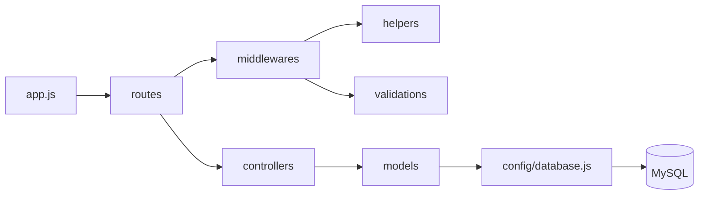

# Backend — Guía de estudio

Cada módulo corresponde a **un material del profesor** y enseña **una tecnología**. Cada `README.md` tiene la teoría y tres ejercicios (fácil, medio y difícil) que se encadenan: el medio y el difícil suelen partir del ejercicio anterior.

| Módulo | Tecnología | Material del profesor |
|---|---|---|
| [01-nodejs](01-nodejs/README.md) | Node.js, npm, módulos, `.env` | TLPI Unidad 4-1 |
| [02-es-modules](02-es-modules/README.md) | `import` / `export` | Requisito de las consignas |
| [03-sequelize](03-sequelize/README.md) | Sequelize + MySQL: modelos y relaciones | TLPI Unidad 4-3, Relaciones en Sequelize |
| [04-express](04-express/README.md) | Express: servidor, rutas, controladores | TLPI Unidad 4-2, Práctica API REST |
| [05-express-validator](05-express-validator/README.md) | Validaciones | Express Validator, Práctica de Validaciones |
| [06-eliminacion-logica-y-actualizaciones](06-eliminacion-logica-y-actualizaciones/README.md) | `paranoid`, cascada, `PUT` con `optional()` | Práctica de Eliminación Lógica y Actualizaciones |
| [07-autenticacion-y-autorizacion-jwt](07-autenticacion-y-autorizacion-jwt/README.md) | bcrypt, JWT, cookies, admin / owner | Autenticación y autorización con JWT, sesiones y cookies |
| [08-integrador-final](08-integrador-final/README.md) | Todo junto | Ensayo del TP Integrador I |

---

## Qué estudiar para cada consigna

### Práctica — API REST con Node.js y Express (personajes)

| Orden | Módulo | Qué necesitás de ese módulo |
|---|---|---|
| 1 | **01** | `npm init`, `package.json`, scripts, `.gitignore`. |
| 2 | **02** | `"type": "module"`, `export const personajes`, `import` con `.js`. Prohibido `require`. |
| 3 | **04** | Secciones 1.2 a 1.7 y los ejercicios **fácil** y **medio** (son la misma estructura que pide la práctica). |

No hace falta base de datos ni express-validator: las validaciones de la práctica se hacen a mano en el controlador.

### Trabajo Práctico Integrador I (blog con autenticación)

Todos los módulos, en orden: **01 → 02 → 03 → 04 → 05 → 06 → 07**, y el **08** como ensayo con otro dominio.

| Punto de la consigna del TP | Módulo |
|---|---|
| 1. Configuración inicial (npm, dependencias, `.env`, Express, CORS, cookie-parser) | 01, 02, 04 |
| 2. Modelos y relaciones (1:1, 1:N, N:M con `ArticleTag`, alias) | 03 |
| 3. Eliminación en cascada y lógica | 03 (sección 1.9) y 06 |
| 4. Controladores con CRUD completo | 04, 06 |
| 5. Validaciones con express-validator | 05, 06 |
| 6. Autenticación y autorización (helpers, middlewares, `/api/auth`) | 07 |
| Entrega con Git (ramas `main`, `develop`, `proyecto-integrador`) | 08 (sección 1.5) |

---

## Qué tecnología se encarga de cada carpeta

> **ES Modules no es una carpeta**: es la forma en que **todos** los archivos se conectan (`import` / `export`). Tampoco los middlewares son de ES Modules: son un concepto de **Express**.

| Carpeta / archivo | Qué es | Tecnología responsable |
|---|---|---|
| `package.json` | Manifiesto del proyecto: dependencias, scripts y `"type": "module"`. | **npm / Node.js** |
| `node_modules/` | Código de las dependencias instaladas. No se sube a Git. | **npm** |
| `.env` / `.env.example` | Configuración privada (`PORT`, `DB_*`, `JWT_SECRET`) y su plantilla sin valores. | **dotenv** → `process.env` de **Node.js** |
| `.gitignore` | Lo que Git no debe subir (`node_modules/`, `.env`). | **Git** |
| `app.js` | Crea el servidor, registra los middlewares globales (`express.json`, `cors`, `cookieParser`), monta las rutas, conecta la base de datos y empieza a escuchar. | **Express** (+ dotenv, cors, cookie-parser) |
| Base de datos (MySQL) | Donde **se guardan** los datos de forma persistente. No es una carpeta del proyecto: es un programa aparte. | **MySQL** (conectado con **mysql2**) |
| `src/config/database.js` | La **conexión** a la base de datos: instancia de Sequelize y función que la prueba y sincroniza. | **Sequelize** |
| `src/models/` | Un archivo por tabla (`sequelize.define`) + las relaciones (`hasOne`, `hasMany`, `belongsTo`, `belongsToMany`), `paranoid` y `onDelete`. | **Sequelize** |
| `src/data/` (solo en la Práctica de Express) | Un arreglo en memoria como fuente de datos. En el TP se reemplaza por `config/` + `models/`. | **JavaScript** (exportado con ES Modules) |
| `src/routes/` | Une **método + URL** con sus middlewares y su controlador (`Router`). | **Express** |
| `src/controllers/` | La lógica de cada endpoint: lee `req`, consulta la base de datos, responde con `res.status().json()`. | **Express** (`req`/`res`) + **Sequelize** (consultas) + **express-validator** (`matchedData`) |
| `src/middlewares/` | Funciones `(req, res, next)` que se ejecutan antes del controlador. | **Express** |
| `src/middlewares/validate.middleware.js` | Revisa si las reglas encontraron errores y responde `400`. | **express-validator** (`validationResult`) |
| `src/middlewares/validations/` | Las reglas de cada recurso (`body`, `param`, `custom`). | **express-validator** |
| `src/middlewares/auth.middleware.js` | Lee la cookie, verifica el token y guarda el usuario en `req.user` (`401` si falla). | **cookie-parser** + **jsonwebtoken** |
| `src/middlewares/admin.middleware.js` / `owner.middleware.js` | Deciden si el usuario autenticado tiene permiso (`403` si no). | **Express** (lógica propia) + **Sequelize** en `owner` (busca el recurso) |
| `src/helpers/jwt.helper.js` | `generateToken` y `verifyToken`. | **jsonwebtoken** |
| `src/helpers/bcrypt.helper.js` | `hashPassword` y `comparePassword`. | **bcrypt** |

### Cómo se conectan

